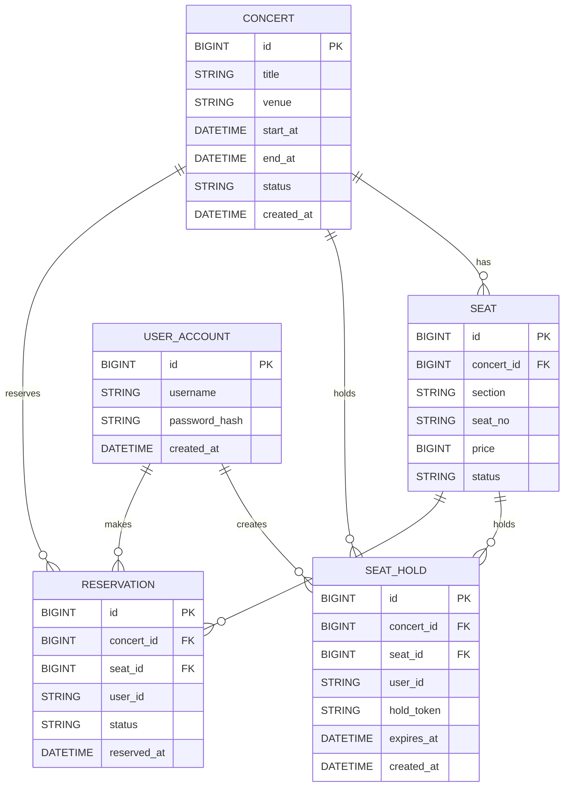

# Ticketing

肄섏꽌???덈ℓ 諛깆뿏??Spring Boot + JPA + MySQL + Redis)?€ 濡쒓렇??湲곕컲 ?꾨줎?몃? ?ы븿??MVP ?ㅼ펷?덊넠?낅땲??

## ?먮쫫??
```mermaid
flowchart TD
    A[釉뚮씪?곗?] -->|濡쒓렇???뚯썝媛€?? B[Spring Security]
    B -->|?몄쬆 ?깃났| C[?쒗뵆由??붾㈃]
    C -->|API ?붿껌| D[REST API]
    D --> E[?쒕퉬??
    E --> F[(MySQL)]
    E --> G[(Redis)]
    G -->|罹먯떆/?? E
    E --> H[?ㅼ?以꾨윭]
    H -->|留뚮즺 ?€???뺣━| F
```

## ?꾪궎?띿쿂

```mermaid
flowchart LR
    FE[?뺤쟻/?쒗뵆由??꾨줎?? --> API[Spring Boot API]
    API --> JPA[JPA/Hibernate]
    JPA --> DB[(MySQL)]
    API --> R[(Redis)]
    API --> S[?ㅼ?以꾨윭]
    S --> DB
```

### 二쇱슂 而댄룷?뚰듃
- **API/?쒕퉬??*: 肄섏꽌??醫뚯꽍 議고쉶, ?€?? ?덉빟 ?뺤젙
- **MySQL**: `concert`, `seat`, `seat_hold`, `reservation`, `user_account`
- **Redis**: 罹먯떆(肄섏꽌??醫뚯꽍), 醫뚯꽍 ?? ?€湲곗뿴 ?좏겙(?뺤옣)
- **?ㅼ?以꾨윭**: 留뚮즺???€???뺣━
- **蹂댁븞**: ??濡쒓렇??湲곕컲 ?몄쬆

## ERD(珥덉븞)



## ?ㅽ뻾 ?먮쫫 ?붿빟
1. 濡쒓렇???뚯썝媛€????`/app` ?묎렐
2. `/api/concerts`濡?肄섏꽌??紐⑸줉 議고쉶(罹먯떆 ?ъ슜)
3. `/api/concerts/{id}/seats`濡?醫뚯꽍 議고쉶(罹먯떆 ?ъ슜)
4. `/api/holds`濡?醫뚯꽍 ?€??Redis ???곸슜)
5. `/api/reservations`濡??덉빟 ?뺤젙
6. ?ㅼ?以꾨윭媛€ 留뚮즺???€?쒕? ?뺣━
