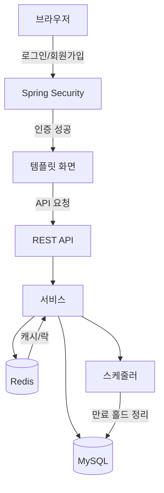
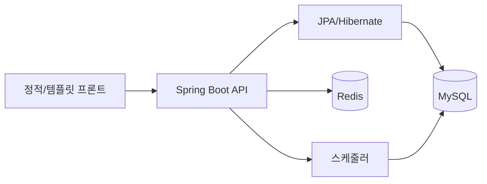
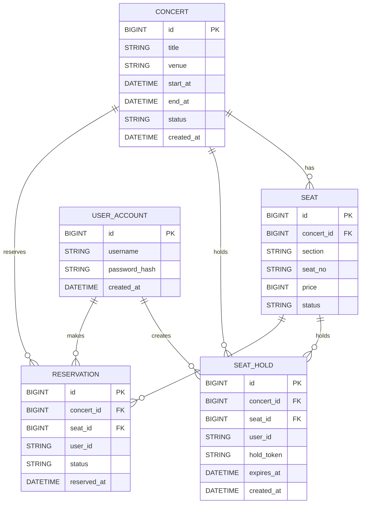

# Ticketing

콘서트 예매 백엔드(Spring Boot + JPA + MySQL + Redis)와 로그인 기반 프론트를 포함한 MVP 스켈레톤입니다.

## 흐름도

## 아키텍처

### 주요 컴포넌트
- **API/서비스**: 콘서트/좌석 조회, 홀드, 예약 확정
- **MySQL**: `concert`, `seat`, `seat_hold`, `reservation`, `user_account`
- **Redis**: 캐시(콘서트/좌석), 좌석 락, 대기열 토큰(확장)
- **스케줄러**: 만료된 홀드 정리
- **보안**: 폼 로그인 기반 인증

## ERD(초안)

## 실행 흐름 요약
1. 로그인/회원가입 후 `/app` 접근
2. `/api/concerts`로 콘서트 목록 조회(캐시 사용)
3. `/api/concerts/{id}/seats`로 좌석 조회(캐시 사용)
4. `/api/holds`로 좌석 홀드(Redis 락 적용)
5. `/api/reservations`로 예약 확정
6. 스케줄러가 만료된 홀드를 정리
