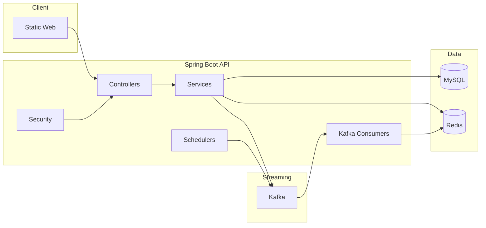
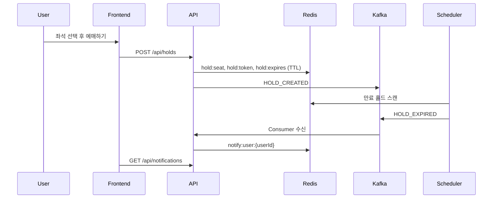
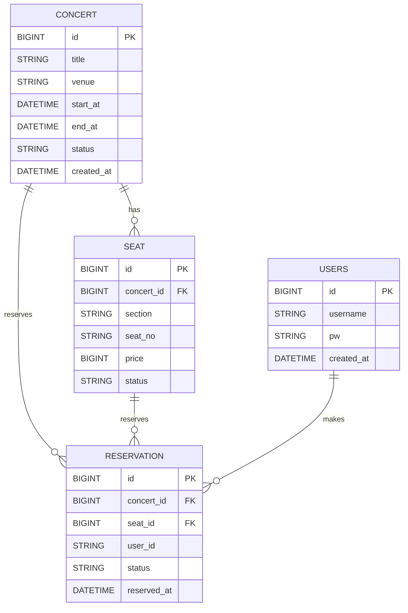

# Ticketing

콘서트 예매 백엔드(Spring Boot + JPA + MySQL + Redis + Kafka)와 로그인 기반 프론트를 포함한 MVP 스켈레톤입니다.

## 아키텍처



### 핵심 흐름 (Hold 만료 알림)



### 주요 컴포넌트
- **API/서비스**: 콘서트/좌석 조회, 홀드, 예약 확정
- **MySQL**: `concert`, `seat`, `reservation`, `users`
- **Redis**: 좌석 홀드 TTL, 분산 락, 좌석 상태 오버레이
- **Kafka**: 홀드 생성/해제/만료/예약 확정 이벤트 스트리밍
- **스케줄러**: 만료된 홀드 이벤트 발행
- **알림 소비자**: 만료 이벤트 수신 → 사용자 알림 저장(Redis)
- **보안**: 폼 로그인 기반 인증

## 환경 설정
프로젝트 루트의 `.env` 파일로 환경 변수를 관리합니다. (`.gitignore` 포함)

```env
# MySQL
DB_URL=jdbc:mysql://localhost:3306/ticketing?useSSL=false&serverTimezone=UTC
DB_USERNAME=root
DB_PASSWORD=

# Redis
REDIS_HOST=localhost
REDIS_PORT=6379

# Kafka
KAFKA_BOOTSTRAP_SERVERS=localhost:29092
KAFKA_CONSUMER_GROUP=ticketing-notification
```

## 실행 방법
### 인프라(Docker Compose 예시)
Kafka/Zookeeper/Redis/Kafka UI/RedisInsight는 Docker로 실행할 수 있습니다.

```yaml
version: "3.8"

services:
  zookeeper:
    image: confluentinc/cp-zookeeper:7.6.1
    environment:
      ZOOKEEPER_CLIENT_PORT: 2181
    ports:
      - "2181:2181"

  kafka:
    image: confluentinc/cp-kafka:7.6.1
    depends_on:
      - zookeeper
    ports:
      - "9092:9092"
      - "29092:29092"
    environment:
      KAFKA_BROKER_ID: 1
      KAFKA_ZOOKEEPER_CONNECT: zookeeper:2181
      KAFKA_LISTENERS: PLAINTEXT://0.0.0.0:9092,PLAINTEXT_HOST://0.0.0.0:29092
      KAFKA_ADVERTISED_LISTENERS: PLAINTEXT://kafka:9092,PLAINTEXT_HOST://localhost:29092
      KAFKA_LISTENER_SECURITY_PROTOCOL_MAP: PLAINTEXT:PLAINTEXT,PLAINTEXT_HOST:PLAINTEXT
      KAFKA_INTER_BROKER_LISTENER_NAME: PLAINTEXT
      KAFKA_OFFSETS_TOPIC_REPLICATION_FACTOR: 1

  kafka-ui:
    image: provectuslabs/kafka-ui:latest
    depends_on:
      - kafka
    ports:
      - "8081:8080"
    environment:
      KAFKA_CLUSTERS_0_NAME: local
      KAFKA_CLUSTERS_0_BOOTSTRAPSERVERS: kafka:9092

  redis:
    image: redis:7.2-alpine
    ports:
      - "6379:6379"

  redisinsight:
    image: redis/redisinsight:latest
    depends_on:
      - redis
    ports:
      - "5540:5540"
```

```bash
docker compose up -d
```

### 애플리케이션 실행
```bash
./gradlew bootRun
```

## 핵심 플로우
1. 로그인/회원가입 후 `/app` 접근
2. 콘서트 목록 조회: `GET /api/concerts`
3. 좌석 조회: `GET /api/concerts/{id}/seats` (DB 예약 + Redis 홀드 오버레이)
4. 홀드 생성: `POST /api/holds` (Redis TTL)
5. 예약 확정: `POST /api/reservations` (DB 기록 + Redis 홀드 제거)
6. 만료 홀드 스캔 → `HOLD_EXPIRED` 이벤트 발행
7. 알림 소비자가 이벤트 수신 → Redis 알림 저장

## Redis/Kafka 역할
- **Redis**
  - 홀드 TTL: `hold:seat:*`, `hold:token:*`, `hold:expires`
  - 분산 락: `lock:seat:{seatId}`
  - 좌석 상태 오버레이: DB의 `RESERVED` + Redis의 `HELD`
  - 알림 저장: `notify:user:{userId}`
- **Kafka**
  - 이벤트 스트림: `HOLD_CREATED`, `HOLD_CANCELED`, `HOLD_EXPIRED`, `RESERVATION_CONFIRMED`

## ERD(초안)



## 알림 API
- `GET /api/notifications` : 알림 목록 조회(최신순) + 미확인 개수 반환
- `DELETE /api/notifications` : 알림 목록 초기화(읽음 처리)

## Redis 키 구조
- 홀드: `hold:seat:{seatId}`, `hold:token:{holdToken}`, `hold:expires`
- 알림: `notify:user:{userId}` (최대 50개, TTL 7일)
- 대기열: `queue:rank`, `queue:token:{token}`
- 접속자: `active:users` (5분 윈도우)

## 대기열 시스템
- `GET /api/queue/ticket?userId=...` : 대기열 토큰 발급
- `GET /api/queue/status?token=...` : 대기 순번 조회
- `GET /api/queue/count` : 현재 대기 인원수 조회

## 메트릭스 API
- `GET /api/metrics` : 메인 지표 조회
  - `activeUsers`: 최근 5분간 활성 사용자 수 (Redis 기반)
  - `todayOpen`: 오늘 오픈 공연 수
  - `successRate`: 예약 성공률

## 활성 사용자 추적
로그인/로그아웃 시점에 Redis ZSet으로 실시간 접속자를 기록합니다.

## 프론트 예매 흐름
1. `/app.html`에서 콘서트 목록/지표/알림 폴링
2. `/concert.html?concertId=...` 좌석 선택 → 예매하기 클릭 → 홀드 생성
3. `/payment.html?concertId=...&seatId=...&holdToken=...`에서 결제(예약 확정)

## 콘서트 상세 지표 (UI 연동)
- **남은 좌석**: 해당 콘서트의 `AVAILABLE` 좌석 수를 클라이언트에서 계산해 표시
- **평균 대기**: `/api/queue/count`를 5초 폴링해 대기열 길이를 기반으로 추정치 표시
- **현재 가격대**: 좌석 클릭 시 선택 좌석의 가격을 표시
