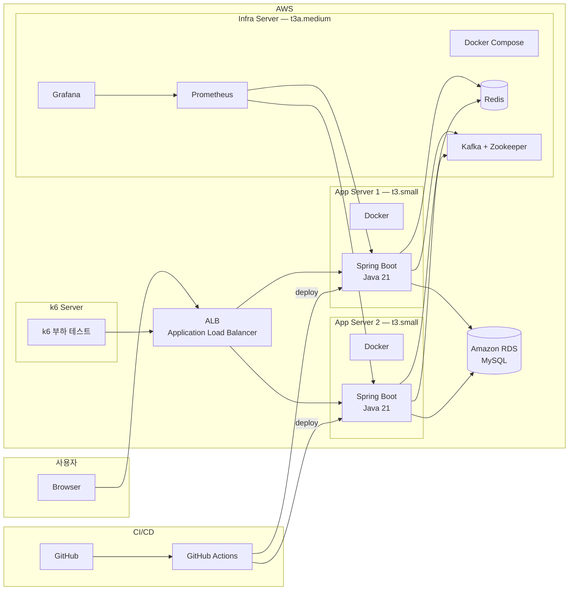
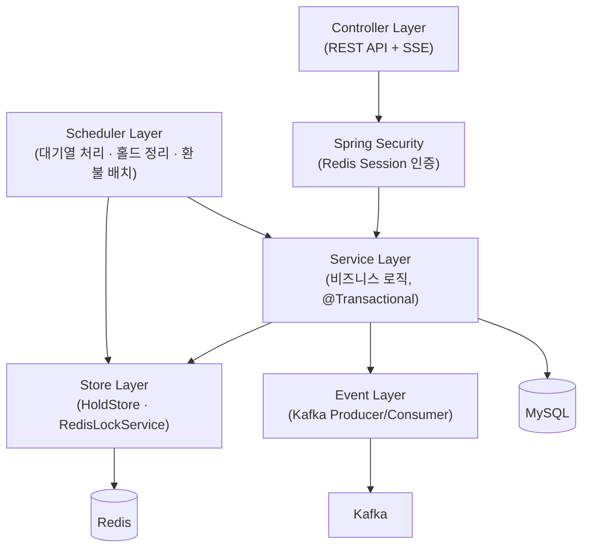
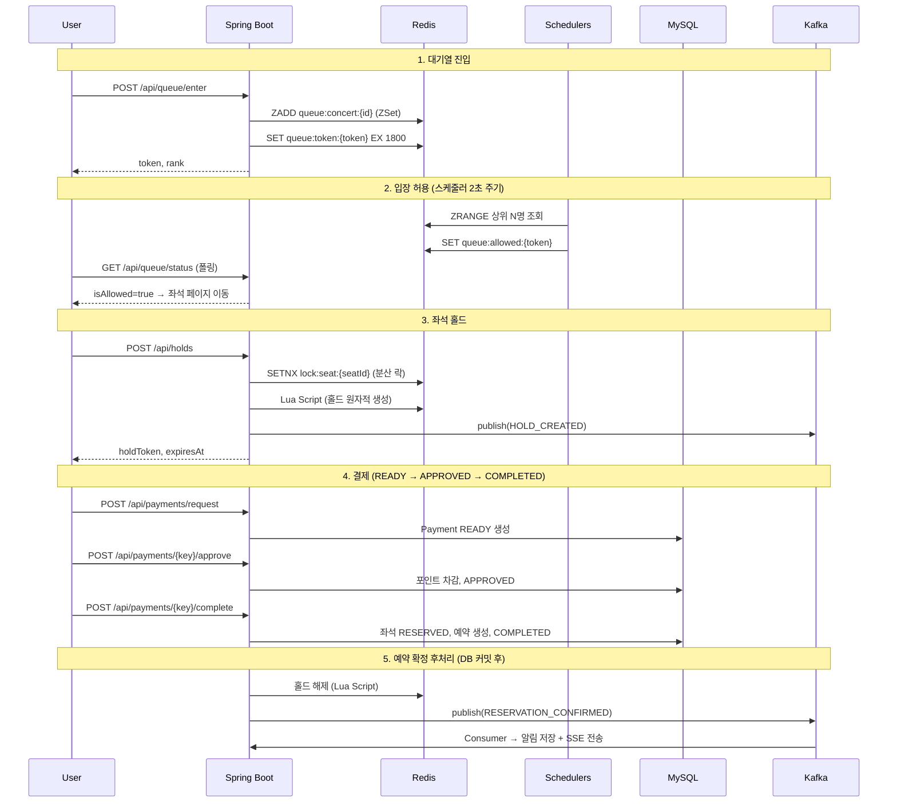
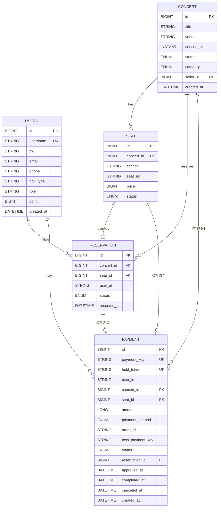

# 아키텍처

## 인프라 구성도

| 구성 요소 | 스펙 | 용도 |
|-----------|------|------|
| **App Server x2** | t3.small | Spring Boot 애플리케이션 (Docker) |
| **Infra Server** | t3a.medium | Redis, Kafka, Prometheus, Grafana (Docker Compose) |
| **RDS** | MySQL | 영구 데이터 (공연, 좌석, 예약, 결제, 사용자) |
| **ALB** | — | 트래픽 분산, 헬스체크 (`/actuator/health`) |
| **k6 Server** | — | 부하 테스트 실행 |
| **GitHub Actions** | — | main push → 빌드 → EC2 배포 |

## 애플리케이션 레이어 구조

| 레이어 | 역할 | 비고 |
|--------|------|------|
| **Security** | 세션 기반 인증/인가 | Redis 세션 저장 |
| **Controller** | REST API + SSE 엔드포인트 | `ApiResponse` 공통 래핑 |
| **Service** | 도메인 비즈니스 로직 | `@Transactional`, `@Cacheable` |
| **Store** | Redis 기반 홀드 저장소 + 분산 락 | Lua 스크립트 원자성 |
| **Scheduler** | 대기열·홀드·토큰 정리, 환불 배치 | 4종, 분산 락으로 중복 방지 |
| **Event** | Kafka Producer/Consumer | 알림·SSE 비동기 전달 |

## 핵심 예매 플로우 (End-to-End)

## 기술적 의사결정

| 기술 | 선택 이유 |
|------|----------|
| **Redis ZSet** (대기열) | RANK O(log N) 순번 조회, 타임스탬프 기준 자동 정렬 |
| **Redis 분산 락** | Lua 스크립트로 원자적 lock/unlock, 토큰 검증으로 안전한 해제 |
| **Kafka** | 이벤트 발행/소비 분리, Consumer Group 분산, 재처리 가능 |
| **SSE** | 서버→클라이언트 단방향 푸시, WebSocket보다 구현 간단, 자동 재연결 |
| **Lua 스크립트** (홀드) | 홀드 생성/해제 시 다중 키 원자적 연산 (EXISTS→SET→ZADD) |
| **AFTER_COMMIT 리스너** | DB 커밋 후 Redis 홀드 해제·Kafka 발행으로 롤백 시 불일치 방지 |
| **Google SMTP / Solapi** | 결제 완료 알림: 이메일(SMTP) 또는 SMS(Solapi), Kafka 비동기 처리 |

## ERD

## 확장성

| 항목 | 전략 |
|------|------|
| **세션/홀드/대기열/알림** | Redis 기반 → 앱 수평 확장 시 상태 공유 |
| **SSE 연결** | 인스턴스별 관리 → 로드밸런서 Sticky Session 필요 |
| **Kafka Consumer** | Consumer Group 자동 분산 |
| **스케줄러** | 다중 인스턴스 시 분산 락으로 중복 실행 방지 |
