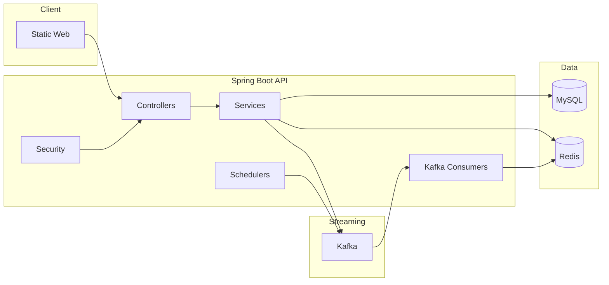
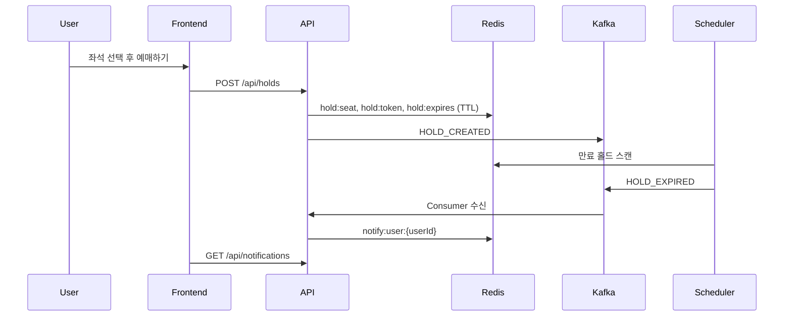
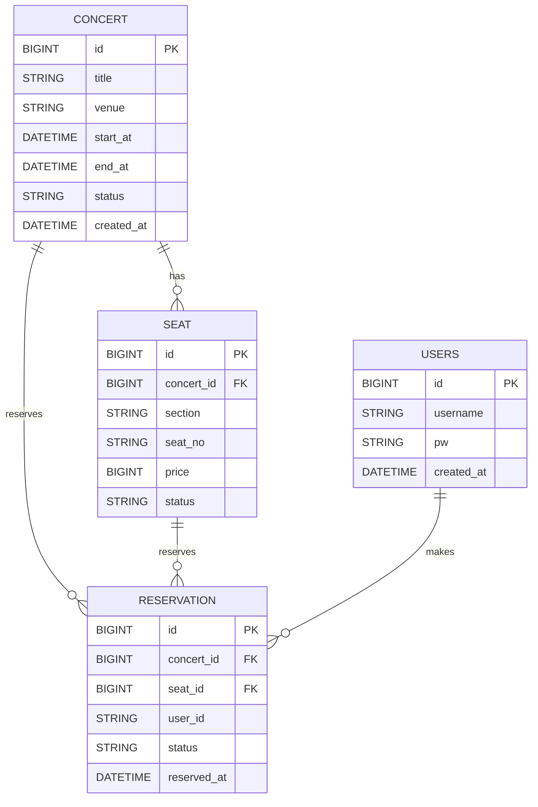

# 아키텍처 & 플로우

## 아키텍처 개요

## 핵심 흐름 (Hold 만료 알림)

## 핵심 플로우
1. 로그인/회원가입 후 `/app.html` 접근
2. 콘서트 목록 조회: `GET /api/concerts`
3. 좌석 조회: `GET /api/concerts/{id}/seats` (DB 예약 + Redis 홀드 오버레이)
4. 홀드 생성: `POST /api/holds` (Redis TTL)
5. 예약 확정: `POST /api/reservations` (DB 기록 + Redis 홀드 제거)
6. 만료 홀드 스캔 → `HOLD_EXPIRED` 이벤트 발행
7. 알림 소비자가 이벤트 수신 → Redis 알림 저장

## ERD(초안)

