# 아키텍처 & 플로우

## 시스템 아키텍처 개요

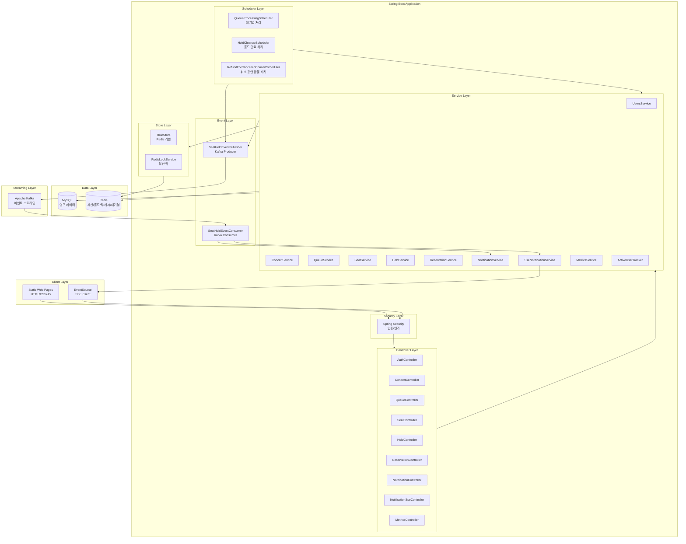

## 레이어별 상세 설명

### 1. Client Layer (프론트엔드)
- **Static Web Pages**: HTML/CSS/JavaScript로 구성된 정적 페이지
- **EventSource API**: SSE 클라이언트로 실시간 알림 수신
- **폴링 메커니즘**: 대기열 순번 조회 (2초), 알림 백업 (30초)

### 2. Security Layer
- **Spring Security**: 인증 및 인가 처리
- **세션 기반 인증**: Redis에 세션 저장
- **접근 제어**: URL 패턴별 권한 설정

### 3. Controller Layer
- **REST API**: JSON 기반 RESTful API 제공
- **SSE 엔드포인트**: `/api/notifications/stream`로 실시간 알림 스트림
- **공통 응답 래핑**: `ApiResponse`로 일관된 응답 구조

### 4. Service Layer
- **비즈니스 로직**: 도메인별 비즈니스 로직 처리
- **트랜잭션 관리**: `@Transactional`로 데이터 정합성 보장
- **캐싱**: `@Cacheable`로 성능 최적화

### 5. Store Layer
- **HoldStore**: Redis 기반 홀드 저장소 (Lua 스크립트로 원자성 보장)
- **RedisLockService**: 분산 락 구현 (Lua 스크립트로 토큰 검증)

### 6. Scheduler Layer
- **QueueProcessingScheduler**: 대기열 처리 (2초마다 상위 N명 입장 허용)
- **HoldCleanupScheduler**: 홀드 만료 처리 (60초마다 만료 홀드 스캔)
- **RefundForCancelledConcertScheduler**: 취소된 공연 환불 배치 (5분마다 CANCELLED 공연의 COMPLETED 결제 청크 환불)

### 7. Event Layer
- **SeatHoldEventPublisher**: Kafka로 이벤트 발행
- **SeatHoldEventConsumer**: Kafka에서 이벤트 수신 후 알림 처리

## 핵심 플로우 상세 설명

### 1. 대기열 진입 및 입장 허용 플로우

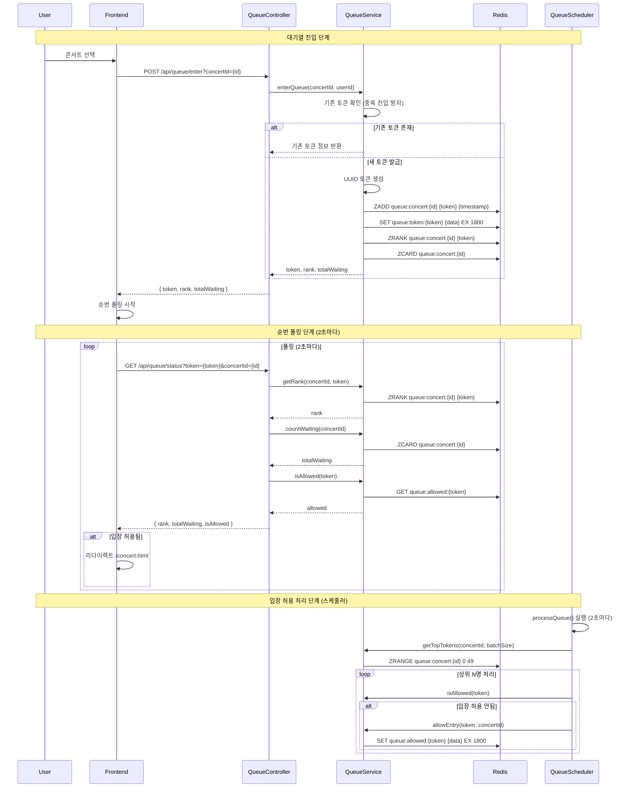

#### 대기열 패턴 B (유동 활성화)
- **GET /api/queue/required?concertId=...**: 현재 대기 인원이 `ticketing.queue.activation-threshold` 초과일 때만 `required: true` 반환.
- 클라이언트는 예매하기 클릭 시 이 API로 분기: `required=false`면 대기열 페이지 없이 바로 좌석 페이지(`/concert.html`)로, `required=true`면 대기열 페이지(`/queue.html`)로 이동.
- 설정: `application.properties`의 `ticketing.queue.activation-threshold`, `ticketing.queue.immediate-allow-threshold`.

#### 만료 토큰 정리 플로우
- 토큰 TTL(30분)이 만료되면 `queue:token:{token}` 키가 자동으로 사라집니다.
- 주기적으로 ZSet을 스캔하여 **토큰 키가 없는 멤버를 제거**합니다.
- ZSet 자체에는 TTL을 두지 않고, **정리 스케줄러**로 유령 대기열을 제거합니다.

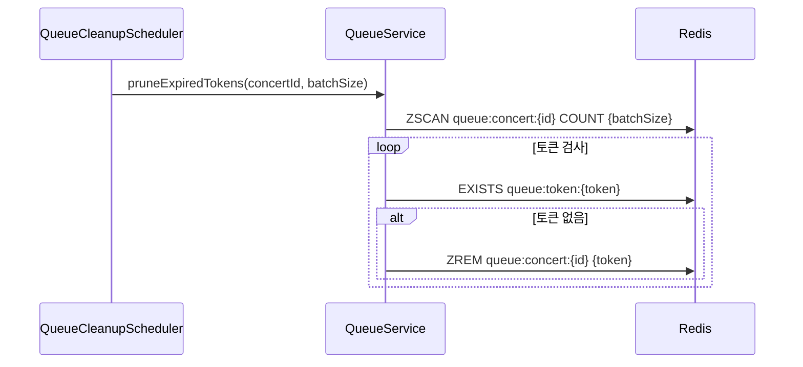

**핵심 포인트**:
- **중복 진입 방지**: 기존 토큰 확인으로 동일 사용자의 중복 진입 방지
- **O(log N) 성능**: ZSet의 RANK 연산으로 효율적인 순번 조회
- **배치 처리**: 스케줄러가 주기적으로 상위 N명을 일괄 처리하여 서버 부하 분산
- **토큰 TTL**: 30분 TTL로 자동 정리

### 2. 좌석 홀드 생성 및 만료 플로우

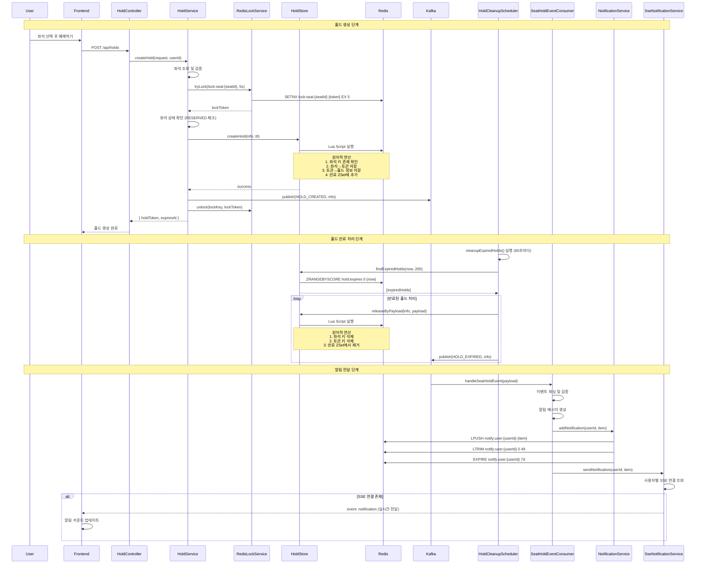

**핵심 포인트**:
- **분산 락**: 좌석 단위 락으로 동시성 제어
- **원자적 연산**: Lua 스크립트로 홀드 생성/해제의 원자성 보장
- **자동 만료**: Redis TTL + 스케줄러로 만료 처리 자동화
- **이벤트 기반**: Kafka로 비동기 이벤트 처리
- **실시간 알림**: SSE로 즉시 알림 전달

### 3. 예약 확정 플로우

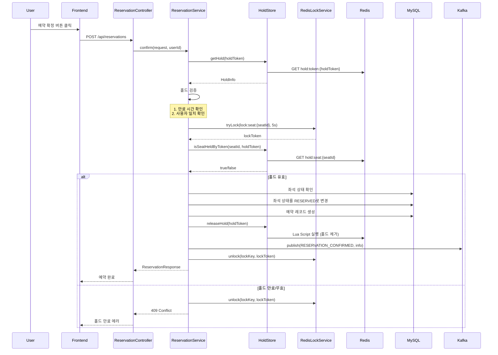

**핵심 포인트**:
- **홀드 검증**: 만료 시간 및 사용자 일치 확인
- **분산 락**: 예약 확정 시에도 락으로 동시성 제어
- **트랜잭션**: `@Transactional`로 DB 작업의 원자성 보장
- **홀드 해제**: 예약 확정 시 홀드 자동 해제

### 4. 취소된 공연 환불 배치 플로우

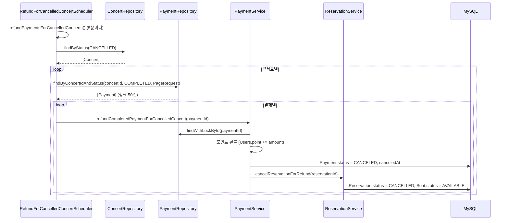

**핵심**: CANCELLED 공연의 COMPLETED 결제만 대상, 청크 페이징, 건별 트랜잭션·락, 실패 시 로그 후 계속 진행(멱등).

### 5. 실시간 알림 플로우 (SSE)

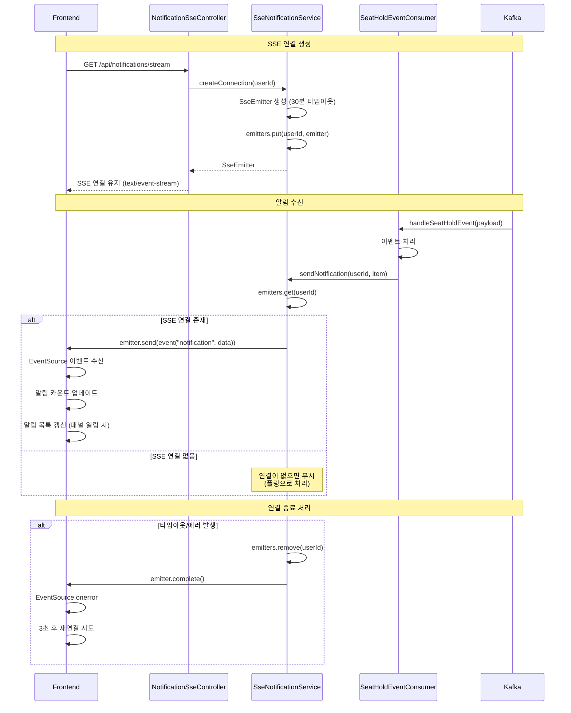

### 6. Mock 결제 플로우 (포인트 기반)

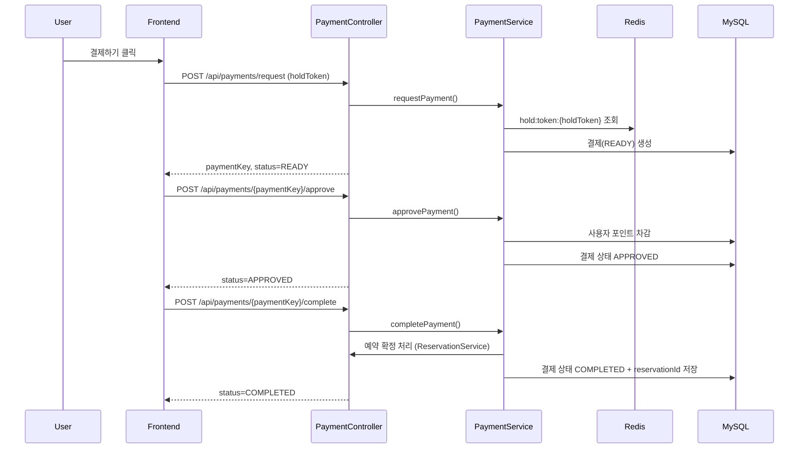

**핵심 포인트**:
- **연결 관리**: 사용자별 SSE 연결을 메모리에 저장
- **자동 재연결**: 연결 종료 시 클라이언트가 자동 재연결
- **폴링 백업**: SSE 연결 실패 시 폴링으로 대체

### 7. 결제 완료 및 이메일/SMS 알림 (Kafka 비동기 처리)

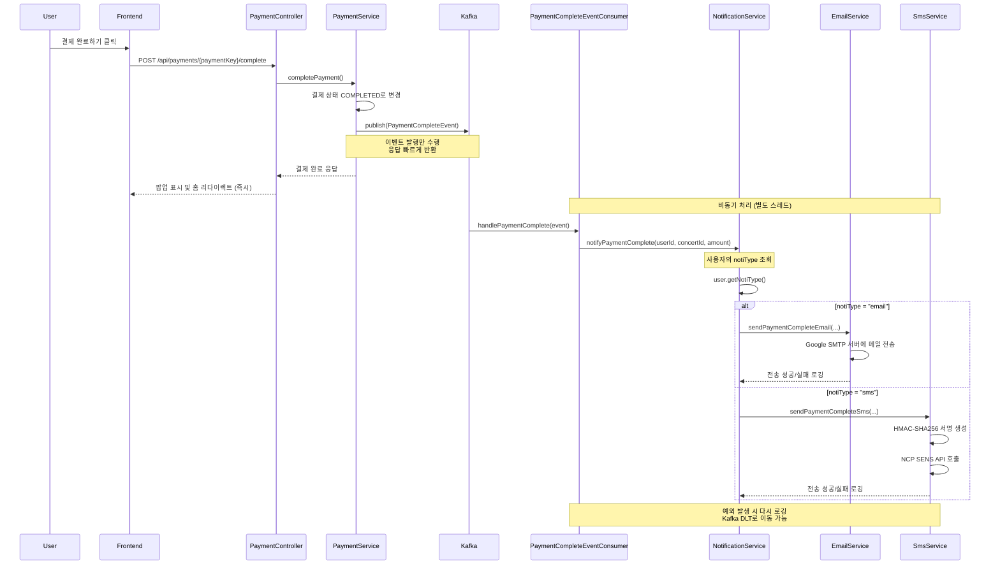

**핵심 아키텍처**:
- **비동기 처리**: 결제 완료 후 알림은 별도 처리 (응답 시간 단축)
- **도메인 분리**: PaymentService는 Kafka 이벤트만 발행 (알림 로직 없음)
- **라우팅**: NotificationService에서 notiType으로 EmailService 또는 SmsService 호출
- **에러 처리**: 알림 실패가 결제 프로세스를 방해하지 않음
- **재시도 가능**: Kafka의 Dead Letter Topic으로 실패 이벤트 재처리

## 전체 예매 플로우 (End-to-End)

### 단계별 상세 설명

#### 1. 로그인 및 콘서트 탐색
```
사용자 → 로그인 → Spring Security 인증 → Redis 세션 생성
     → /app.html 접근 → GET /api/concerts
     → ConcertService.listConcerts()
     → Redis 캐시 확인 → 캐시 미스 시 DB 조회 → Redis 캐시 저장
     → 콘서트 목록 반환
```

#### 2. 대기열 진입
```
사용자 → 콘서트 선택 → /queue.html?concertId={id}
     → POST /api/queue/enter?concertId={id}
     → QueueService.enterQueue()
     → Redis ZSet에 토큰 추가 (O(log N))
     → 토큰 정보 저장 (TTL 30분)
     → 순번 및 대기인원 수 반환
```

#### 3. 순번 대기 및 입장 허용
```
프론트엔드 → 2초마다 GET /api/queue/status 폴링
         → QueueService.getRank() (O(log N))
         → QueueService.countWaiting() (O(1))
         → QueueService.isAllowed() 확인

스케줄러 → 2초마다 QueueProcessingScheduler.processQueue()
        → 각 콘서트별로 상위 50명 조회
        → 입장 허용 상태 설정 (SET queue:allowed:{token})
        → 프론트엔드 폴링에서 입장 허용 감지
        → /concert.html로 자동 리다이렉트
```

#### 4. 좌석 선택 및 홀드 생성
```
사용자 → 좌석 선택 → POST /api/holds
     → HoldService.createHold()
     → RedisLockService.tryLock() (분산 락)
     → HoldStore.createHold() (Lua 스크립트로 원자적 연산)
     → Redis에 홀드 저장 (TTL 5분)
     → Kafka로 HOLD_CREATED 이벤트 발행
     → 락 해제
```

#### 5. 예약 확정
```
사용자 → 예약 확정 버튼 → POST /api/reservations
     → ReservationService.confirm()
     → 홀드 검증 (만료 시간, 사용자 일치)
     → 분산 락 획득
     → DB 트랜잭션 시작
     → 좌석 상태를 RESERVED로 변경
     → 예약 레코드 생성
     → HoldStore.releaseHold() (홀드 제거)
     → Kafka로 RESERVATION_CONFIRMED 이벤트 발행
     → 트랜잭션 커밋
     → 락 해제
```

#### 6. 홀드 만료 및 알림
```
스케줄러 → 60초마다 HoldCleanupScheduler.cleanupExpiredHolds()
        → HoldStore.findExpiredHolds() (ZSet 스캔)
        → 만료된 홀드 제거
        → Kafka로 HOLD_EXPIRED 이벤트 발행

Kafka Consumer → SeatHoldEventConsumer.handleSeatHoldEvent()
              → 알림 메시지 생성
              → NotificationService.addNotification() (Redis 저장)
              → SseNotificationService.sendNotification() (SSE 전송)

프론트엔드 → EventSource로 실시간 알림 수신
         → 알림 카운트 업데이트
         → 알림 목록 갱신
```

## 데이터 흐름 다이어그램

### 콘서트 목록 조회 (캐싱)

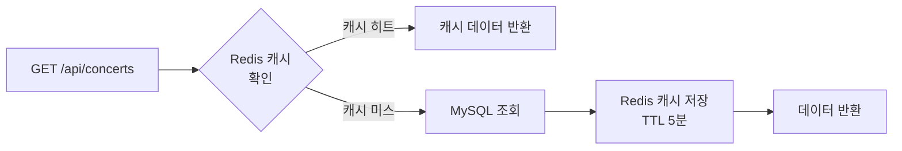

### 좌석 현황 조회 (DB + Redis 오버레이)

```mermaid
flowchart TB
    A[GET /api/concerts/{id}/seats] --> B[MySQL에서<br/>좌석 조회]
    B --> C[Redis에서<br/>홀드된 좌석 조회]
    C --> D[좌석 상태 오버레이]
    D --> E[AVAILABLE → HELD<br/>변환]
    E --> F[응답 반환]
```

## 성능 최적화 전략

### 1. Redis ZSet 활용
- **대기열 순번**: O(log N) RANK 연산
- **대기인원 수**: O(1) CARD 연산
- **상위 N명 조회**: O(log N + M) RANGE 연산

### 2. 캐싱 전략
- **콘서트 목록**: Redis 캐시 (5분 TTL)
- **카테고리 필터**: 클라이언트 메모리 캐시 (30초 TTL)

### 3. 배치 처리
- **대기열 처리**: 2초마다 상위 50명 일괄 처리
- **홀드 만료**: 60초마다 최대 200개 일괄 처리

### 4. 연결 풀링
- **Redis**: Lettuce 연결 풀 (최대 20개)
- **MySQL**: HikariCP 연결 풀 (기본 설정)

## 확장성 고려사항

### 수평 확장 가능한 컴포넌트
1. **세션**: Redis 기반으로 다중 인스턴스 간 공유
2. **홀드**: Redis 기반으로 다중 인스턴스 간 공유
3. **대기열**: Redis 기반으로 다중 인스턴스 간 공유
4. **알림**: Redis 기반으로 다중 인스턴스 간 공유

### 확장 시 고려사항
- **SSE 연결**: 인스턴스별로 관리되므로 로드밸런서에서 Sticky Session 필요
- **Kafka Consumer**: Consumer Group으로 자동 분산 처리
- **스케줄러**: 다중 인스턴스 실행 시 중복 실행 방지 필요 (분산 락 활용 가능)

## ERD (Entity Relationship Diagram)

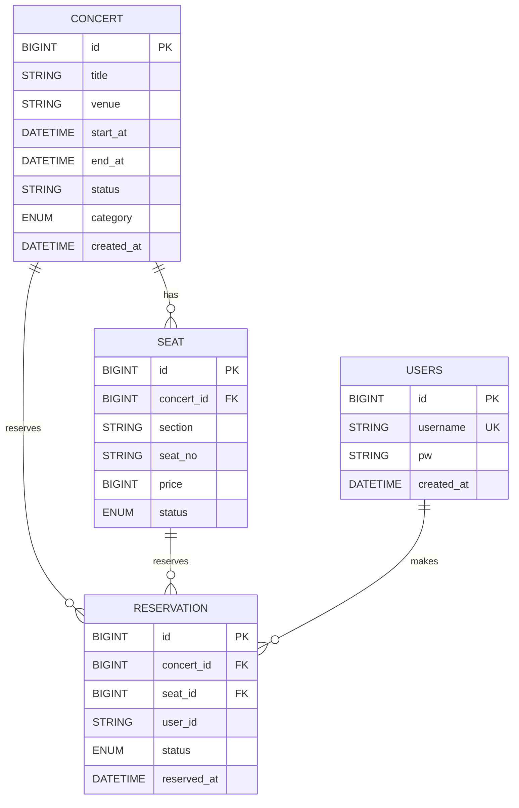

## 기술적 의사결정 (Technical Decisions)

### 1. Redis ZSet 선택 이유
- **순번 관리**: RANK 연산으로 효율적인 순번 조회
- **정렬**: 타임스탬프 기준 자동 정렬
- **성능**: O(log N) 연산으로 대규모 데이터 처리 가능

### 2. Kafka 선택 이유
- **비동기 처리**: 이벤트 발행과 소비의 분리
- **확장성**: Consumer Group으로 자동 분산 처리
- **내구성**: 이벤트 저장으로 재처리 가능

### 3. SSE 선택 이유
- **단방향 통신**: 서버 → 클라이언트 푸시에 적합
- **HTTP 기반**: WebSocket보다 구현이 간단
- **자동 재연결**: 브라우저가 자동으로 재연결 처리

### 4. 분산 락 구현
- **Lua 스크립트**: 원자적 연산 보장
- **토큰 검증**: 락 해제 시 토큰 일치 확인으로 안전성 확보
- **키·TTL 설정**: `lock:seat:{seatId}`, TTL은 `ticketing.lock.ttl-seconds`로 조정 ([docs/concurrency.md](concurrency.md))
- **TTL**: 락 획득 실패 시 자동 해제

### 5. 이메일 & SMS 알림 선택
- **Google SMTP (이메일)**: 안정적이고 설정이 간단, 전 세계 사용 가능
- **NCP SENS (SMS)**: 한국 최적화, 저렴한 비용, 빠른 전송

## 이메일 & SMS 구현 상세

### 1. 이메일 시스템 (Google SMTP)

#### 아키텍처
```
PaymentService (Kafka Event 발행)
       ↓
PaymentCompleteEventConsumer (Kafka 이벤트 수신)
       ↓
NotificationService (라우팅 로직)
       ↓
EmailService (Google SMTP 발송)
```

#### 구현 세부사항
- **Provider**: Google SMTP Server (smtp.gmail.com:587)
- **인증**: App Password (16자 자동 생성 비밀번호)
- **프로토콜**: STARTTLS (TLS 암호화)
- **타임아웃**: 5초 (연결, 전송)
- **메시지 포맷**: 결제 금액, 콘서트 정보 포함

#### 설정 (application.properties)
```properties
# 이메일 설정 (Google SMTP)
spring.mail.host=smtp.gmail.com
spring.mail.port=587
spring.mail.username=${MAIL_USERNAME}  # .env에서 주입
spring.mail.password=${MAIL_PASSWORD}  # .env에서 주입
spring.mail.properties.mail.smtp.auth=true
spring.mail.properties.mail.smtp.starttls.enable=true
spring.mail.properties.mail.smtp.starttls.required=true
spring.mail.properties.mail.smtp.connectiontimeout=5000
spring.mail.properties.mail.smtp.timeout=5000
spring.mail.properties.mail.smtp.writetimeout=5000
```

#### 사용 예시
```java
// PaymentCompleteEventConsumer에서
paymentNotificationService.notifyPaymentComplete(userId, concertId, amount);
    ↓
// NotificationService에서
if (user.getNotiType().equals("email")) {
    emailService.sendPaymentCompleteEmail(
        user.getEmail(),
        user.getUsername(),
        concert.getTitle(),
        payment.getAmount()
    );
}
```

#### 환경 설정
1. Gmail 계정 2단계 인증 활성화
2. [Google Account Security](https://myaccount.google.com/apppasswords) 에서 16자 앱 비밀번호 생성
3. `.env` 파일에 추가:
```env
MAIL_USERNAME=your-email@gmail.com
MAIL_PASSWORD=xxxx xxxx xxxx xxxx  # 16자 앱 비밀번호
```

### 2. SMS 시스템 (NCP SENS)

#### 아키텍처
```
PaymentService (Kafka Event 발행)
       ↓
PaymentCompleteEventConsumer (Kafka 이벤트 수신)
       ↓
NotificationService (라우팅 로직)
       ↓
SmsService (NCP SENS API 호출)
```

#### 구현 세부사항
- **Provider**: 네이버 클라우드 플랫폼 (NCP SENS)
- **인증**: HMAC-SHA256 서명 기반 (REST API)
- **엔드포인트**: `POST https://sens.apigw.ntruss.com/sms/v2/services/{serviceId}/messages`
- **전송 형식**: JSON
- **응답**: 메시지 ID 및 전송 상태 반환

#### API 요청 구조
```
Request Headers:
- x-ncp-apigw-timestamp: {타임스탬프 (밀리초)}
- x-ncp-iam-access-key: {접근 키}
- x-ncp-apigw-signature-v2: {HMAC-SHA256 서명}
- Content-Type: application/json

Request Body (JSON):
{
  "type": "SMS",
  "contentType": "COMM",
  "countryCode": "82",
  "from": "발신번호 (예: 01012345678)",
  "messages": [
    {
      "to": "수신번호 (예: 01087654321)"
    }
  ],
  "content": "메시지 내용"
}
```

#### HMAC-SHA256 서명 생성
```java
String message = "POST\n/sms/v2/services/{serviceId}/messages\n{timestamp}\n{accessKey}";
Mac mac = Mac.getInstance("HmacSHA256");
SecretKeySpec secretKey = new SecretKeySpec(secretKey.getBytes(), "HmacSHA256");
mac.init(secretKey);
byte[] signature = mac.doFinal(message.getBytes());
String encodedSignature = Base64.getEncoder().encodeToString(signature);
```

#### 설정 (application.properties)
```properties
# NCP SENS 설정 (.env에서 주입)
ncp.sens.service-id=${NCP_SENS_SERVICE_ID}
ncp.sens.access-key=${NCP_SENS_ACCESS_KEY}
ncp.sens.secret-key=${NCP_SENS_SECRET_KEY}
ncp.sens.from-number=${NCP_SENS_FROM_NUMBER}
ncp.sens.api-url=https://sens.apigw.ntruss.com
```

#### 환경 설정
1. NCP 콘솔에서 SENS 서비스 신청
2. API 인증키 발급 (Access Key, Secret Key)
3. 발신 번호 등록 (비용 발생할 수 있음)
4. `.env` 파일에 추가:
```env
NCP_SENS_SERVICE_ID=ncp-service-id
NCP_SENS_ACCESS_KEY=ncp-access-key
NCP_SENS_SECRET_KEY=ncp-secret-key
NCP_SENS_FROM_NUMBER=01012345678  # 회사 발신 전용 번호
```

#### 사용 예시
```java
// PaymentCompleteEventConsumer에서
paymentNotificationService.notifyPaymentComplete(userId, concertId, amount);
    ↓
// NotificationService에서
if (user.getNotiType().equals("sms")) {
    smsService.sendPaymentCompleteSms(
        user.getPhone(),
        user.getUsername(),
        concert.getTitle(),
        payment.getAmount()
    );
}
```

### 3. 알림 라우팅 (NotificationService)

```java
@Service
public class PaymentNotificationService {
    @Autowired
    private UsersRepository usersRepository;
    
    @Autowired
    private ConcertRepository concertRepository;
    
    @Autowired
    private EmailService emailService;
    
    @Autowired
    private SmsService smsService;
    
    // 사용자의 notiType에 따라 이메일 또는 SMS 전송
    public void notifyPaymentComplete(String userId, Long concertId, Long amount) {
        Users user = usersRepository.findByUserId(userId)
            .orElseThrow(() -> new RuntimeException("User not found"));
        
        Concert concert = concertRepository.findById(concertId)
            .orElseThrow(() -> new RuntimeException("Concert not found"));
        
        String notiType = user.getNotiType();  // "email" 또는 "sms"
        
        if ("email".equals(notiType)) {
            emailService.sendPaymentCompleteEmail(
                user.getEmail(),
                user.getUsername(),
                concert.getTitle(),
                amount
            );
        } else if ("sms".equals(notiType)) {
            smsService.sendPaymentCompleteSms(
                user.getPhone(),
                user.getUsername(),
                concert.getTitle(),
                amount
            );
        }
    }
}
```

### 4. 오류 처리 및 재시도

#### 시나리오별 처리
| 상황 | 처리 방식 |
|------|---------|
| 이메일/SMS 전송 실패 | 예외 로깅 후 Kafka 메시지 consumed |
| API 연결 타임아웃 | IOException 발생 → 스택 트레이스 로깅 |
| 사용자 정보 없음 | RuntimeException 발생 → 로그 기록 |
| notiType이 잘못됨 | 두 서비스 모두 호출 안 함 |

#### Kafka DLT (Dead Letter Topic) 설정 (선택사항)
```properties
# 프로덕션 환경에서 추천
spring.kafka.listener.error-handler=paymentCompleteErrorHandler
spring.kafka.listener.ack-mode=manual
```

---

[이전 기술적 의사결정 섹션]
