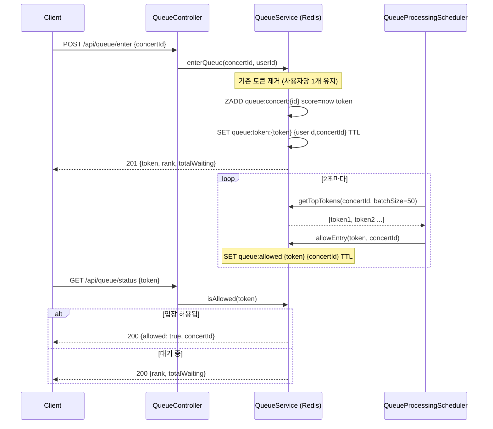
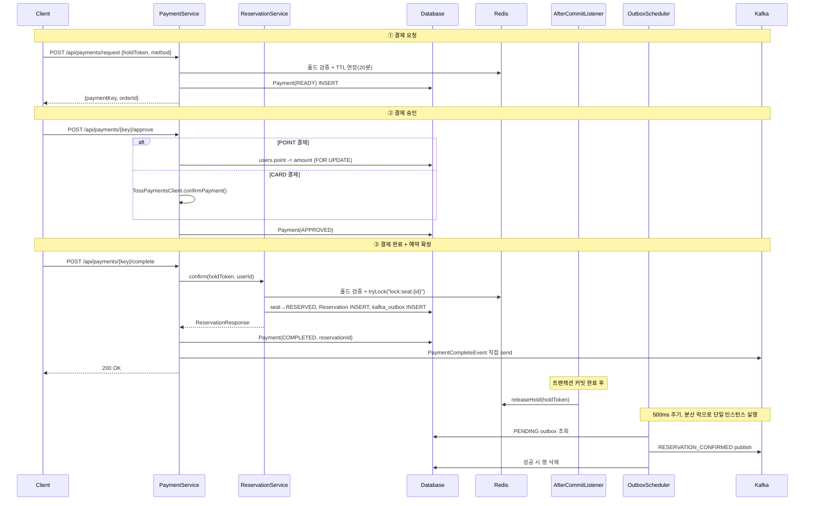
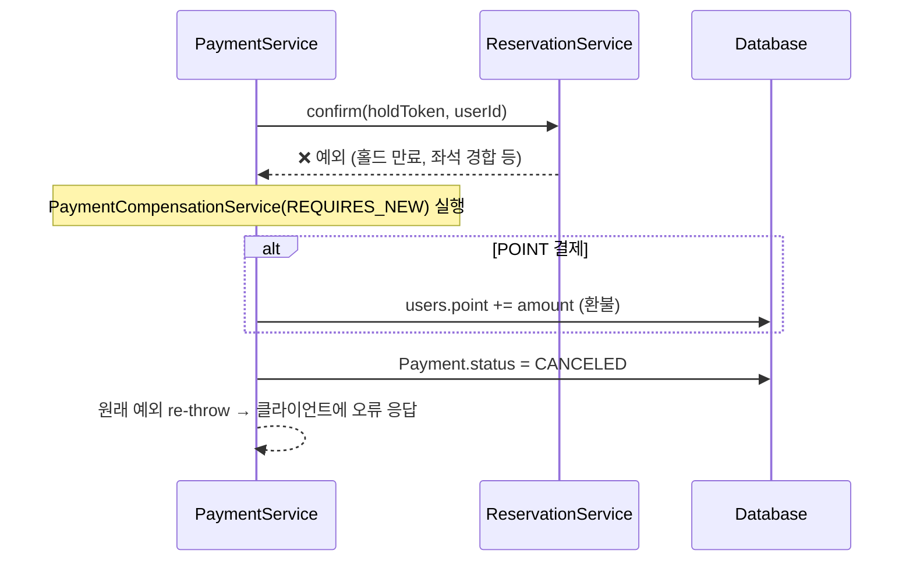
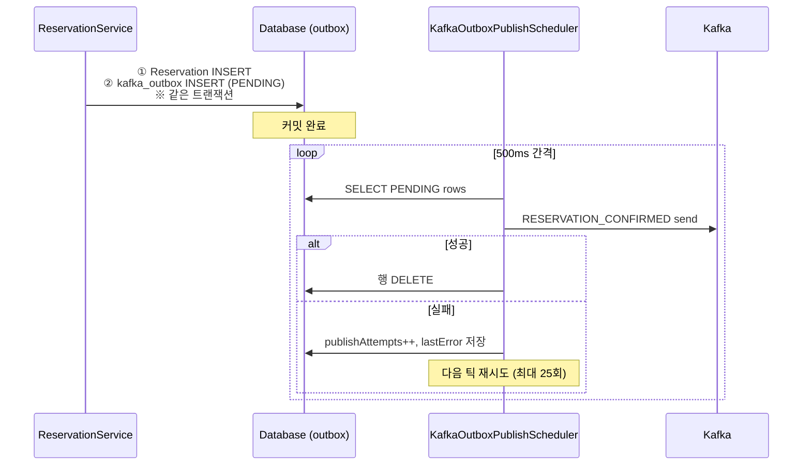
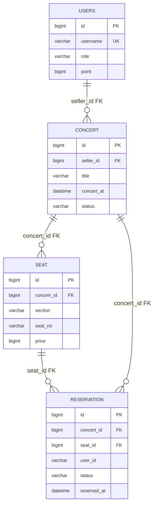

# 콘서트 티켓 예매 시스템 — 백엔드 포트폴리오

> **한 줄 요약**: 동시 수천 명 접속 환경에서 중복 예약 없이 선착순을 보장하는 콘서트 예매 백엔드.  
> Redis 분산 락·대기열·Kafka 이벤트·Transactional Outbox·Saga 보상 패턴까지 실무 수준의 설계를 직접 구현했습니다.

---

## 목차

1. [프로젝트 개요](#1-프로젝트-개요)
2. [기술 스택](#2-기술-스택)
3. [시스템 아키텍처](#3-시스템-아키텍처)
4. [핵심 기술 과제 & 해결책](#4-핵심-기술-과제--해결책)
   - [4-1. Redis 대기열 — 트래픽 완충](#4-1-redis-대기열--트래픽-완충)
   - [4-2. 좌석 선점 — 분산 락 + Lua 원자 연산](#4-2-좌석-선점--분산-락--lua-원자-연산)
   - [4-3. 결제 + 예약 확정 — Saga 보상 패턴](#4-3-결제--예약-확정--saga-보상-패턴)
   - [4-4. Transactional Outbox — 이벤트 유실 방지](#4-4-transactional-outbox--이벤트-유실-방지)
   - [4-5. 장애 대응 — 서킷브레이커·Rate Limit·멱등성](#4-5-장애-대응--서킷브레이커rate-limit멱등성)
5. [기술적 의사결정 (ADR)](#5-기술적-의사결정-adr)
6. [부하 테스트 결과](#6-부하-테스트-결과)
7. [관측성 — Prometheus · Grafana](#7-관측성--prometheus--grafana)
8. [DB 스키마 & Flyway](#8-db-스키마--flyway)
9. [인프라 구성](#9-인프라-구성)
10. [프로젝트 구조](#10-프로젝트-구조)

---

## 1. 프로젝트 개요

| 항목 | 내용 |
|------|------|
| **목적** | 대규모 트래픽 처리·좌석 동시 선점 제어·인프라 운영 경험을 포트폴리오로 증명 |
| **핵심 문제** | ① 동시 수천 명 접속 시 서버 포화 방지 ② 같은 좌석을 두 명이 동시에 잡는 경쟁 조건 제거 ③ 결제·예약 정합성 보장 |
| **인프라** | t3a.medium 1대(Redis/Kafka/Prometheus/Grafana) + t3.small 앱 서버 + t3.small k6 서버 |
| **부하 검증** | 동시 1,500 VU HTTP 에러율 0% (pool=30 + VT + 잔여석 캐시 + batch=50 구성) |

### 주요 구현 기능

- JWT Access/Refresh 인증 (토큰 탈취 감지 및 family 단위 폐기)
- Redis ZSet 기반 대기열 + 즉시 입장 임계값
- Redis 분산 락(SETNX + Lua) + Redis Lua 원자적 좌석 홀드
- 3단계 결제 플로우 (READY → APPROVED → COMPLETED), 포인트·카드(토스페이먼츠 샌드박스)
- Saga 보상 트랜잭션 (REQUIRES_NEW 분리 커밋)
- Transactional Outbox 패턴 (예약 확정 이벤트 유실 방지)
- Kafka 이벤트 드리븐 알림 (이메일·SMS·SSE)
- Resilience4j 서킷브레이커 + Rate Limit (Sliding Window)
- Prometheus 커스텀 메트릭 + Grafana Golden Signals 대시보드
- 멱등성 키 AOP (`@Idempotent`)
- 5종 배치 스케줄러 (대기열 처리·홀드 정리·outbox 발행·공연 취소 환불)

---

## 2. 기술 스택

| 구분 | 기술 | 선택 이유 |
|------|------|-----------|
| Language | **Java 21** | Virtual Thread(Loom)로 I/O 대기 스레드 비용 최소화 |
| Framework | **Spring Boot 3.4** | Security, Data JPA, Kafka, Cache 통합 |
| Database | **MySQL 8.0** | 예약·결제 영속 데이터, 비관적 락으로 정합성 확보 |
| Cache / Lock | **Redis 7** | 분산 락, 좌석 홀드, 대기열(ZSet), JWT 블랙리스트, 캐시 |
| Message Queue | **Apache Kafka** | 결제 알림·홀드 이벤트 비동기 처리, DLT 재처리 |
| Migration | **Flyway** | DB 스키마 버전 관리, 환경별 드리프트 방지 |
| Monitoring | **Prometheus + Grafana** | Golden Signals 기반 커스텀 대시보드 |
| Load Test | **k6** | Knee Point 측정, 스테이지 기반 시나리오 |
| API Docs | **SpringDoc (Swagger)** | OpenAPI 3.0 자동 문서화 |
| Resilience | **Resilience4j** | Redis 서킷브레이커 |
| PG 연동 | **토스페이먼츠** | 주문서형 위젯 샌드박스 |

---

## 3. 시스템 아키텍처

```
┌──────────────────────────────────────────────────────────────────┐
│                          Client (Browser)                        │
└──────────────────────────┬───────────────────────────────────────┘
                           │  HTTPS  (JWT Bearer + X-Refresh-Token)
                           ▼
               ┌───────────────────────┐
               │    ALB  (예정)         │
               └──────────┬────────────┘
              ┌───────────┴────────────┐
              ▼                        ▼
   ┌─────────────────────┐  ┌─────────────────────┐
   │   App Server #1      │  │   App Server #2      │
   │   t3.small           │  │   t3.small           │
   │   Spring Boot 3.4    │  │   Spring Boot 3.4    │
   │   Java 21 (Loom VT)  │  │   Java 21 (Loom VT)  │
   └──────────┬───────────┘  └──────────┬───────────┘
              └──────────────┬───────────┘
                             │
          ┌──────────────────┼─────────────────────┐
          ▼                  ▼                     ▼
  ┌──────────────┐  ┌──────────────────┐   ┌──────────────┐
  │  MySQL 8.0   │  │    Redis 7       │   │    Kafka     │
  │  · 예약/결제  │  │  · 분산 락        │   │  · 홀드 이벤트│
  │  · 아웃박스   │  │  · 좌석 홀드      │   │  · 결제 완료  │
  │              │  │  · 대기열 ZSet    │   │  · DLT 재처리 │
  └──────────────┘  │  · JWT 블랙리스트 │    └──────────────┘
                    │  · 잔여석 캐시    │
                    └──────────────────┘

          ┌──────────────┐  ┌──────────────┐
          │  Prometheus  │  │   Grafana    │
          └──────────────┘  └──────────────┘
          ※ 인프라 서버 (t3a.medium) 1대에서 운영
```

---

## 4. 핵심 기술 과제 & 해결책

### 4-1. Redis 대기열 — 트래픽 완충

**문제**: 공연 오픈 순간 수천 명이 동시에 몰릴 때 DB·앱 서버가 과부하됩니다.

**해결**: Redis ZSet 기반 대기열로 트래픽을 완충합니다. 스케줄러가 2초마다 상위 N명을 입장 허용합니다.



**설계 포인트**

| 항목 | 내용 |
|------|------|
| 자료구조 | ZSet — score=진입시각(ms), O(log N) rank 조회 |
| 토큰 TTL | `token-ttl-seconds` 설정값으로 비활성 토큰 자동 만료 |
| 즉시 입장 | `immediate-allow-threshold`(기본 30) 이하 대기 시 바로 허용, 대기열 우회 |
| 잔여석 캐시 | `GET /api/queue/status` 폴링의 DB COUNT 쿼리를 Redis 캐시(TTL 2초)로 대체 → DB 부하 급감 |
| 중복 방지 | 사용자당 콘서트별 토큰 1개 유지 (재진입 시 기존 토큰 제거 후 새 발급) |
| 다중 인스턴스 | 배치 스케줄러에 Redis 분산 락 적용 → 2대 앱 서버에서 중복 실행 방지 |

---

### 4-2. 좌석 선점 — 분산 락 + Lua 원자 연산

**문제**: 앱 서버 2대에서 동일 좌석에 대한 홀드 요청이 동시에 들어올 때 두 명이 모두 성공하면 안 됩니다.

**해결**: Redis SETNX 분산 락으로 좌석당 배타적 잠금을 획득한 뒤, Lua 스크립트로 홀드 데이터를 원자적으로 씁니다.


**핵심 구현 — Lua unlock 스크립트**

```lua
-- 토큰이 일치하는 경우에만 락 해제 (다른 소유자 락 오삭제 방지)
if redis.call('get', KEYS[1]) == ARGV[1] then
  return redis.call('del', KEYS[1])
else
  return 0
end
```

**동시성 시나리오별 결과**

| 시나리오 | 결과 |
|----------|------|
| 사용자 A·B가 동일 좌석 동시 요청 | A가 락 획득 → B는 재시도 후 429 또는 409 |
| A가 홀드 중 B가 같은 좌석 요청 | Lua `createHold` false → 409 |
| 락 TTL 만료 후 다른 소유자가 새 락 | 기존 Lua unlock은 토큰 불일치 → 0 반환, 새 락 안전 |
| 이미 DB에 RESERVED된 좌석 | 락 획득 후 상태 재검증 → 409 |

---

### 4-3. 결제 + 예약 확정 — Saga 보상 패턴

**문제**: 결제 승인 후 예약 확정이 실패하면 돈은 빠졌지만 좌석은 없는 불일치가 발생합니다.

**해결**: Saga 보상 트랜잭션 — 예약 확정 예외 시 보상을 `REQUIRES_NEW`로 분리 커밋해 승인 결제를 되돌립니다.



**보상 트랜잭션 (예약 확정 실패 시)**



**트랜잭션 경계 포인트**
- `completePayment`의 outer 트랜잭션이 롤백되어도 `REQUIRES_NEW` 보상은 독립 커밋
- DB 비관적 락(`SELECT ... FOR UPDATE`)으로 포인트 이중 차감 방지
- Reservation 생성 → kafka_outbox INSERT는 동일 트랜잭션 (Outbox 정합성 보장)

---

### 4-4. Transactional Outbox — 이벤트 유실 방지

**문제**: 예약 DB 커밋과 Kafka 발행이 분리되어 있으면 커밋 성공 후 Kafka 장애 시 이벤트가 유실됩니다.

**해결**: 예약 확정과 동일 트랜잭션에 `kafka_outbox` 행을 INSERT하고, 별도 스케줄러가 발행합니다.



| 상태 | 설명 |
|------|------|
| `PENDING` | 발행 대기 또는 재시도 중 |
| `FAILED` | `maxPublishAttempts`(25회) 초과 → 운영 수동 처리 |
| (삭제) | 발행 성공 |

---

### 4-5. 장애 대응 — 서킷브레이커·Rate Limit·멱등성

| 기능 | 구현 |
|------|------|
| **서킷브레이커** | Resilience4j `redisCircuitBreaker` — QueueService·HoldStore Redis 경로에 적용. OPEN 시 fast-fail + 안전한 fallback(빈 결과/false). 설정: 실패율 50%, OPEN 유지 30s |
| **Rate Limit** | Redis Sliding Window, 사용자당 1초 10 req 초과 시 429. `@RateLimit` AOP 선언형 적용 |
| **멱등성 키** | `Idempotency-Key` 헤더 + Redis TTL + `@Idempotent` AOP — 결제 API 중복 전송 시 캐시된 응답 반환 |

#### 정합성 실패 시나리오별 처리

| 시나리오 | 처리 방법 |
|----------|-----------|
| Kafka 일시 장애 | Outbox PENDING 유지 → 스케줄러 재시도 (최대 25회) |
| Kafka 장기 장애 | Outbox FAILED → 모니터링 알림 + 운영 수동 처리 |
| Redis `releaseHold` 실패 | DB 예약은 이미 커밋, Redis 홀드는 TTL까지 잔존 후 자동 만료 |
| 예약 확정 중 예외 | Saga 보상 트랜잭션(`REQUIRES_NEW`) — 포인트 환불 + 결제 CANCELED |
| 결제 API 중복 요청 | `Idempotency-Key` + AOP로 동일 응답 재사용 |
| Redis 장애 | Resilience4j `redisCircuitBreaker` fast-fail + fallback |
| 락 경합 과다 | Rate Limit (Sliding Window, 1초당 10 req/user) + 429 응답 |

---

## 5. 기술적 의사결정 (ADR)

### ADR-1. Redis SETNX 분산 락 (Redisson 미사용)

- **왜 Redis 락인가**: DB 비관적 락만 쓰면 모든 좌석 요청이 DB를 직접 경쟁해 느려집니다. Redis를 앞에 두어 경합을 최소화했습니다.
- **왜 Redisson을 안 썼는가**: 단일 Redis 인스턴스에서 Redlock은 과도한 복잡도입니다. UUID 토큰 + Lua 해제로 충분합니다.
- **TTL을 짧게**: 락 보유자가 죽어도 다음 요청이 빠르게 들어올 수 있도록 3초로 설정했습니다.
- **전제**: 현재 Redis 단일 인스턴스. Sentinel/Cluster 전환 시 라이브러리·전략 재검토 필요.

### ADR-2. Kafka 이벤트 드리븐

- 결제·알림은 외부 I/O(이메일, SMS)가 길어 결제 API 응답에 포함하기 부적절합니다.
- `acks=all`, `idempotence=true`, `retries=3` — 일시 장애에도 메시지를 보존합니다.
- `RESERVATION_CONFIRMED`는 Outbox 패턴으로 DB 정합성을 강화했습니다.
- 실패 메시지는 `*.DLT` Dead Letter Topic으로 분리해 수동 재처리합니다.

### ADR-3. DB 비관적 락 (결제·포인트)

- 금전 이중 차감 방지: `SELECT ... FOR UPDATE`로 Payment, Users 핵심 갱신 구간을 보호했습니다.
- 좌석 선점은 Redis 락 담당, 결제 정합성은 DB 락 담당으로 역할을 분리했습니다.

### ADR-4. 멱등성 키 (AOP)

- `Idempotency-Key` 헤더 + Redis TTL 저장 + `@Idempotent` AOP로 투명하게 처리했습니다.
- 컨트롤러에 어노테이션만 선언하면 되어 비즈니스 로직과 완전 분리됩니다.

### ADR-5. Java 21 Virtual Thread

- Tomcat 요청 스레드를 Virtual Thread로 전환 → Platform Thread 200개 상한 제거.
- I/O 대기(Redis/DB/Kafka) 중 OS 스레드를 점유하지 않아 동시 처리량이 향상됩니다.
- **실측 결과**: JVM live threads **~225개 → ~30개** 감소 (동일 부하 기준).
- 배제: 스케줄러 트리거 스레드, Netty/Kafka Producer 내부 — 제어 불가 영역.

---

## 6. 부하 테스트 결과

**도구**: k6, 시나리오: `queue-flow.js` (대기열 진입 → 순번 폴링 → 입장 허용 확인)  
**관측**: Prometheus + Grafana 6패널 (RPS·HTTP p95·DB active/pending·대기열 인원·JVM threads)

### 핵심 결과 (요약)

| 구성 | VU | k6 p95 | HTTP 에러율 | RPS (Grafana 피크) | 특이사항 |
|------|----|--------|-------------|-------------------|----------|
| pool=10 (기준) | 800 | **1.93 s** | **0%** | ~300–600/s | DB active 10 포화, pending ~170 |
| pool=30 | 800 | **1.85 s** | **0%** | ~270–580/s | pending 피크 ~5–100으로 개선 |
| pool=30 + Virtual Thread | 800 | **2.06 s** | **0%** | ~376/s | JVM threads **225→30** 감소 |
| pool=30 + VT + **잔여석 캐시** | 800 | **453 ms** | **0%** | **~1000/s** | pending **0**, p95 **87% 감소** |
| pool=30 + VT + 캐시 + **batch=50** | **1500** | 8.28 s | **0%** | ~700/s | pending 600+, 에러 없이 버팀 |
| pool=30 + VT + 캐시 + batch=70 | 1500 | 6.03 s | **0.18%** | ~447/s | `enter` 타임아웃 발생 |
| pool=30 + VT + 캐시 + batch=100 | 1500 | 2.79 s | **0.14%** | ~800/s | 타임아웃 다수, 배치 클수록 불안정 |

### 주요 발견사항

**1. 잔여석 캐시가 가장 큰 임팩트**
- `GET /api/queue/status` 폴링마다 DB `COUNT` 쿼리가 실행됨 → DB가 bottleneck
- Redis 캐시(TTL 2초) 도입 후 p95 **2.06s → 453ms** (87% 감소), RPS **376 → 1000/s** (165% 상승)
- DB pending이 0으로 수렴 → Hikari pool 30이 실질적으로 여유로워짐

**2. Virtual Thread: JVM 스레드 절감은 명확하지만 처리량 직접 향상은 제한적**
- Platform Thread 200개 한계 제거, JVM live threads 225 → 30 (87% 감소)
- 캐시 없는 조건에서는 DB 풀이 bottleneck이라 VT 단독 효과는 미미
- 캐시와 조합 시 비로소 큰 효과 (I/O 대기 중 OS 스레드 절감 + DB 부하 감소)

**3. 배치 크기 최적값은 50 (VU 1500 기준)**
- batch=70, 100으로 늘릴수록 오히려 에러율 상승 (0.14–0.18%)
- 스케줄러 틱당 처리량 상한을 키우면 Redis 부하·DB 압력이 동시에 상승
- batch=50이 이 하드웨어 프로필에서 가장 안정적

**4. 풀 숫자 단독으로는 해결 불가**
- Hikari pool을 50으로 늘려도 active는 여전히 30 근방 (설정과 실측 불일치 의심)
- p95 오히려 악화 (9.86s, 에러 0.05%) → 풀 확대가 다른 경합을 유발
- **병목은 DB 커넥션 수가 아니라 쿼리 빈도**

**5. "에러 없음"과 "지연이 짧음"은 별개**
- VU 1500 구성에서 HTTP 에러 0%이지만 p95=8.28s (Grafana HTTP p95 최대 ~20s 구간)
- 운영 SLO 관점에서는 에러율과 p95를 별도 기준으로 잡아야 함

---

## 7. 관측성 — Prometheus · Grafana

비즈니스 핵심 지표를 직접 Micrometer Counter/Gauge/Timer로 정의해 Grafana에서 시각화합니다.

| 메트릭 | 타입 | 의미 |
|--------|------|------|
| `ticketing_hold_created_total` | Counter | 홀드 생성 성공 (선점 처리량) |
| `ticketing_hold_conflict_total` | Counter | Redis Lua false → 409 (좌석 경합 빈도) |
| `ticketing_lock_acquire_failures_total` | Counter | 락 획득 실패 → 429 (스핀락 경합) |
| `ticketing_queue_waiting_count` | Gauge | 콘서트별 대기열 인원 |
| `ticketing_payment_complete_duration_seconds` | Histogram | 결제 완료 E2E 소요 시간 |
| `ticketing_reservation_confirmed_total` | Counter | 예약 확정 수 (콘서트별 태그) |

Grafana 6패널 구성: RPS · HTTP p95 · DB active/pending · 대기열 인원 · JVM threads (Golden Signals 기반).  
상세 PromQL → [`monitoring.md`](monitoring.md)

헬스체크: `GET /actuator/health` → `ticketingDatastores` (Redis PING + DB `isValid`). Kafka 헬스 비활성화(부하 시 60초 타임아웃 방지).

---

## 8. DB 스키마 & Flyway

이 프로젝트는 `ddl-auto=validate` + Flyway 조합으로 스키마를 관리합니다.  
DDL 변경은 버전 SQL로만 반영하고, 애플리케이션은 실행 시점에 스키마 일치 여부만 검증합니다.

| 버전 | 목적 |
|------|------|
| V1 | 초기 도메인 테이블 (`users`, `concert`, `seat`, `reservation`, `payment`) |
| V2 | 조회/배치 성능용 복합 인덱스 추가 |
| V3 | `created_at`, `updated_at` 누락 보정 |
| V4 | Transactional Outbox용 `kafka_outbox` 테이블 |
| V5 | JWT refresh token 저장 테이블 |
| V6 | JWT 전환 이후 미사용 OAuth 컬럼 정리 |
| V7 | Refresh token family 기반 회전/폐기 지원 |



---

## 9. 인프라 구성

```
[사용자] → [ALB (예정)] → [t3.small #1 / #2]
                                  ↓
                    [t3a.medium: Redis, Kafka, Prometheus, Grafana]
                                  ↓
                              [MySQL]
```

| 서버 | 스펙 | 역할 |
|------|------|------|
| 인프라 서버 | t3a.medium | Redis 7, Kafka, Prometheus, Grafana |
| 앱 서버 | t3.small (현재 1대, 2대 예정) | Java 21 Spring Boot 3.4 |
| k6 서버 | t3.small | 부하 테스트 전용 |

스케일아웃 상세 → [`deployment-ec2.md`](deployment-ec2.md)

---

## 10. 프로젝트 구조

```
src/main/java/com/inyoung/ticketing/
├── auth/          # JWT 인증 (Access 30분 + Refresh 14일, 블랙리스트, family 폐기)
├── concert/       # 콘서트 도메인 (목록·상세·캐시)
├── seat/          # 좌석 도메인 (AVAILABLE / HOLD / RESERVED)
├── hold/          # 좌석 선점 (Redis Lua 원자 연산 + 만료 ZSET)
├── queue/         # 대기열 (Redis ZSet, 즉시 입장 임계값)
├── reservation/   # 예약 확정 (DB 트랜잭션 + Outbox + AFTER_COMMIT 홀드 해제)
├── payment/       # 결제 플로우 (READY→APPROVED→COMPLETED, Saga 보상)
├── notification/  # 알림 (Kafka→이메일/SMS/SSE)
├── outbox/        # Transactional Outbox 패턴
├── lock/          # Redis 분산 락 (SETNX + Lua unlock)
├── scheduler/     # 홀드 만료 정리, 대기열 처리, Outbox 발행, 공연 취소 환불
├── metrics/       # Prometheus 커스텀 메트릭 (비즈니스 메트릭 + 활성 사용자 추적)
├── common/        # AOP (멱등성·Rate Limit), 예외 처리, 공통 응답 래퍼
└── config/        # Spring Security, Redis, Kafka, Resilience4j 설정
```

### 주요 API 엔드포인트

| 메서드 | 경로 | 설명 |
|--------|------|------|
| POST | `/api/queue/enter` | 대기열 진입 (토큰 발급) |
| GET | `/api/queue/status` | 대기 순번·입장 여부 조회 |
| GET | `/api/seats/{concertId}` | 좌석 목록 (홀드/잔여석 캐시) |
| POST | `/api/holds` | 좌석 선점 (분산 락 + Lua) |
| DELETE | `/api/holds/{holdToken}` | 홀드 취소 |
| POST | `/api/payments/request` | 결제 요청 (READY) |
| POST | `/api/payments/{key}/approve` | 결제 승인 (포인트/카드) |
| POST | `/api/payments/{key}/complete` | 결제 완료 + 예약 확정 |
| GET | `/api/reservations` | 내 예약 목록 |
| GET | `/api/notifications/stream` | SSE 실시간 알림 스트림 |

---

> **상세 시퀀스 다이어그램**: [`sequence-diagrams.md`](sequence-diagrams.md)  
> **부하 테스트 전체 수치**: [`load-test-portfolio.md`](load-test-portfolio.md)  
> **기술 결정 상세**: [`decisions.md`](decisions.md)  
> **Redis 키·Kafka 토픽 참조**: [`data.md`](data.md)
