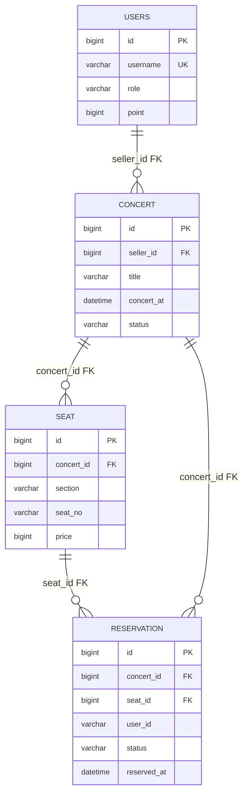
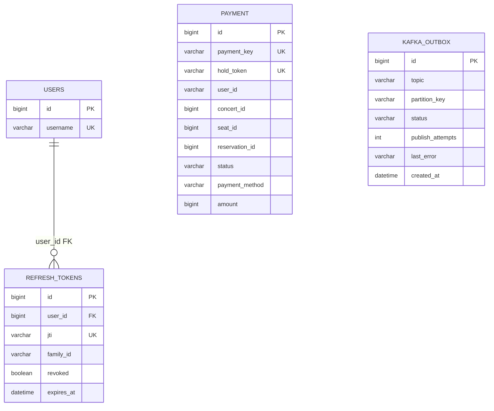
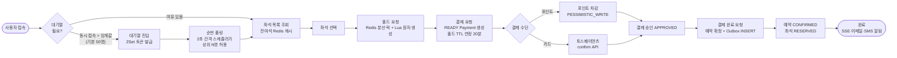
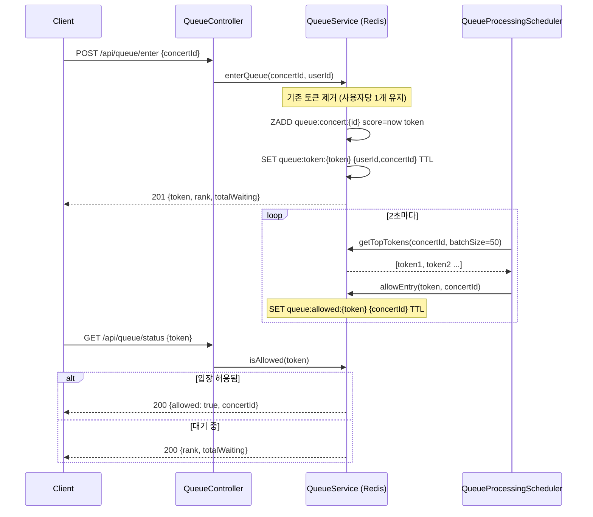
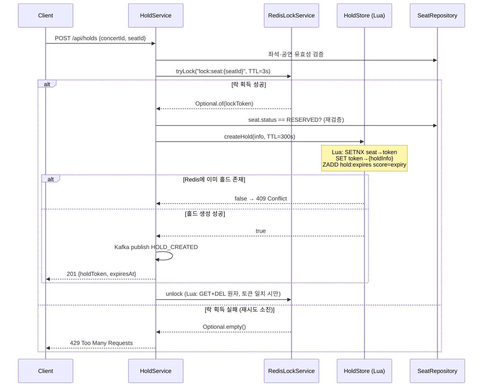
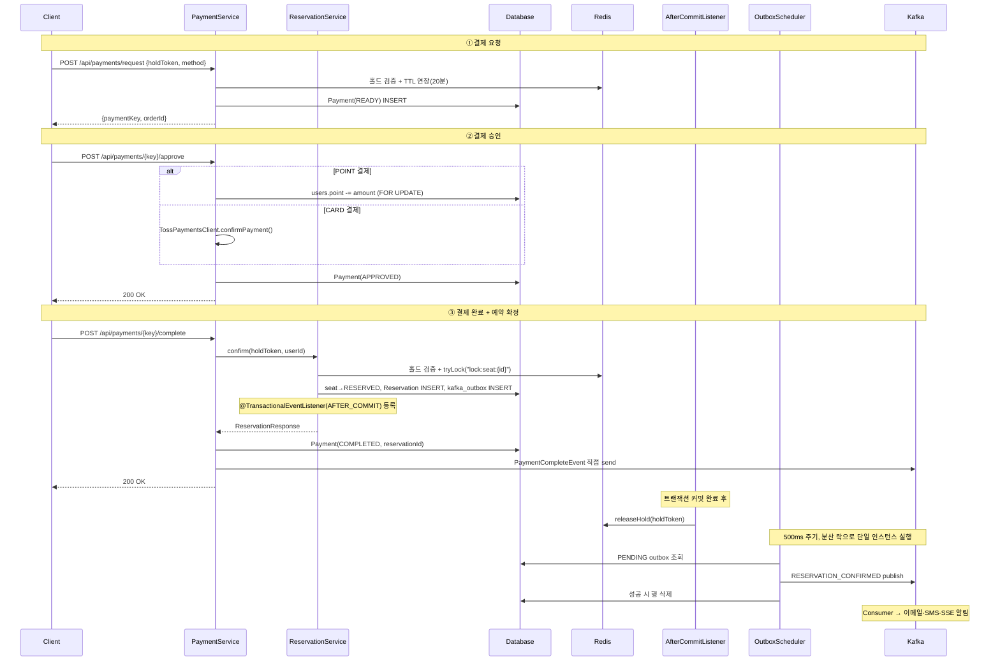
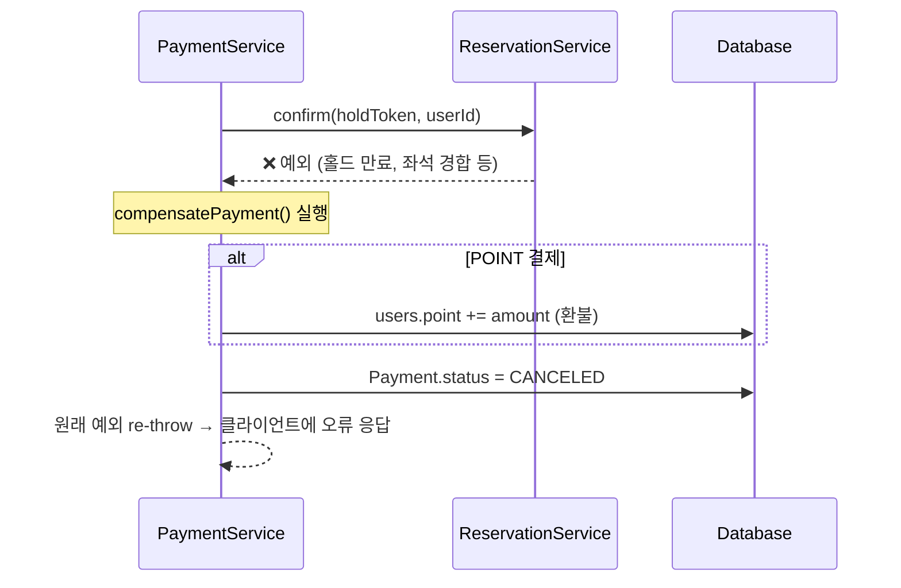
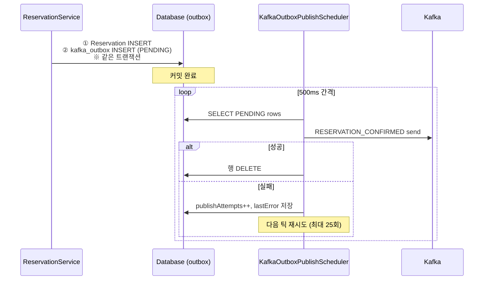

# 콘서트 티켓 예매 시스템 — 백엔드 포트폴리오

> **한 줄 요약**: 대규모 동시 접속 환경에서 중복 예약 없이 선착순을 보장하는 콘서트 예매 백엔드.  
> Redis 분산 락·대기열·Kafka 이벤트·Transactional Outbox·Saga 보상 패턴까지 실무 수준의 설계를 직접 구현했습니다.

---

## 목차

1. [프로젝트 개요](#1-프로젝트-개요)
2. [기술 스택](#2-기술-스택)
   - [2-1. Flyway 마이그레이션 전략](#2-1-flyway-마이그레이션-전략)
   - [2-2. DB ERD](#2-2-db-erd)
3. [시스템 아키텍처](#3-시스템-아키텍처)
4. [핵심 도메인 흐름](#4-핵심-도메인-흐름)
   - [4-1. 전체 예매 플로우](#4-1-전체-예매-플로우)
   - [4-2. Redis 대기열](#4-2-redis-대기열)
   - [4-3. 좌석 선점 — 분산 락 + Lua 원자 연산](#4-3-좌석-선점--분산-락--lua-원자-연산)
   - [4-4. 결제 + 예약 확정 (Saga 보상 패턴)](#4-4-결제--예약-확정-saga-보상-패턴)
   - [4-5. Transactional Outbox](#4-5-transactional-outbox)
5. [기술적 의사결정 (ADR 요약)](#5-기술적-의사결정-adr-요약)
6. [부하 테스트 결과 (k6 × Grafana)](#6-부하-테스트-결과-k6--grafana)
7. [관측성 — Prometheus · Grafana](#7-관측성--prometheus--grafana)
8. [장애 대응 설계](#8-장애-대응-설계)
9. [프로젝트 구조](#9-프로젝트-구조)

---

## 1. 프로젝트 개요

| 항목 | 내용 |
|------|------|
| **목적** | 실무에 가까운 백엔드 포트폴리오 — 설계·구현·운영 관점 전반 커버 |
| **핵심 문제** | ① 동시 수천 명 접속 시 서버 포화 방지 ② 같은 좌석을 두 명이 동시에 잡는 경쟁 조건 제거 ③ 결제·예약 정합성 보장 |
| **인프라** | t3a.medium 1대(Redis/Kafka/Prometheus/Grafana) + t3.small 2대(Spring Boot 앱) |
| **부하 목표** | 동시 사용자 1,500 VU, HTTP 에러율 0% |

---

## 2. 기술 스택

| 구분 | 기술 | 선택 이유 |
|------|------|-----------|
| Language | **Java 21** | Virtual Thread(Loom)로 I/O 대기 스레드 비용 최소화 |
| Framework | **Spring Boot 3.4** | Security, Data JPA, Kafka, Session 통합 |
| Database | **MySQL 8.0** | 예약·결제 영속 데이터, 비관적 락으로 정합성 확보 |
| Cache / Lock | **Redis 7** | 분산 락, 좌석 홀드, 대기열(ZSet), JWT 블랙리스트, 캐시 |
| Message Queue | **Apache Kafka** | 결제 알림·홀드 이벤트 비동기 처리, DLT 재처리 |
| Migration | **Flyway** | DB 스키마 버전 관리 |
| Monitoring | **Prometheus + Grafana** | Golden Signals 기반 커스텀 대시보드 |
| Load Test | **k6** | Knee Point 측정, 스테이지 기반 시나리오 |
| API Docs | **SpringDoc (Swagger)** | OpenAPI 3.0 자동 문서화 |
| Resilience | **Resilience4j** | Redis 장애 시 서킷브레이커 |
| PG 연동 | **토스페이먼츠** | 주문서형 위젯 샌드박스 |

---

### 2-1. Flyway 마이그레이션 전략

이 프로젝트는 `ddl-auto=validate` + Flyway 조합으로 스키마를 관리합니다.  
즉, **DDL 변경은 코드가 아니라 버전 SQL로만 반영**하고, 애플리케이션은 실행 시점에 스키마 일치 여부만 검증합니다.

| 버전 | 파일 | 목적 |
|------|------|------|
| V1 | `V1__init_schema.sql` | 초기 도메인 테이블(`users`, `concert`, `seat`, `reservation`, `payment`) 생성 |
| V2 | `V2__add_performance_indexes.sql` | 조회/배치 성능용 복합 인덱스 추가 |
| V3 | `V3__add_audit_columns.sql` | `created_at`, `updated_at` 누락 보정 |
| V4 | `V4__kafka_outbox.sql` | Transactional Outbox용 `kafka_outbox` 테이블 추가 |
| V5 | `V5__jwt_refresh_tokens.sql` | JWT refresh token 저장 테이블 추가 |
| V6 | `V6__drop_users_oauth_columns.sql` | JWT 전환 이후 미사용 OAuth 컬럼 정리 |
| V7 | `V7__refresh_token_family.sql` | refresh token family 기반 회전/폐기 지원 |

운영 관점에서 Flyway를 선택한 이유:
- 스키마 변경 이력을 Git으로 추적 가능
- 환경별 스키마 드리프트 방지 (로컬/테스트/운영)
- 롤백/재배포 시 변경 이력 기반으로 원인 추적 용이

---

### 2-2. DB ERD



핵심 흐름(회원 → 콘서트/좌석 → 예약)에 필요한 **물리 FK만** ERD에 표시해 가독성을 높였습니다.

**보조 테이블(운영/인증/이벤트)**
- `payment`: 결제 상태 머신(READY → APPROVED → COMPLETED), `reservation_id`/`seat_id` 등은 서비스 계층 논리 참조
- `kafka_outbox`: 예약 확정 이벤트 발행 보장을 위한 Outbox 저장소
- `refresh_tokens`: JWT refresh 보관 및 family 단위 폐기

#### 운영/이벤트 보조 ERD



> `payment`와 `kafka_outbox`는 도메인 정합성과 이벤트 신뢰성을 위한 운영 테이블이며,  
> `payment`의 참조 키(`user_id`, `concert_id`, `seat_id`, `reservation_id`)는 DB FK가 아닌 서비스 계층 논리 참조입니다.

**검증 기준**
- Flyway `V1~V7` SQL
- JPA 엔티티 `Users`, `Concert`, `Seat`, `Reservation`, `Payment`, `RefreshToken`, `KafkaOutbox`
- `application.properties`의 `ddl-auto=validate` 정책

---

## 3. 시스템 아키텍처

```
┌──────────────────────────────────────────────────────────────────┐
│                          Client (Browser)                        │
└──────────────────────────┬───────────────────────────────────────┘
                           │  HTTPS  (JWT Bearer + X-Refresh-Token)
                           ▼
               ┌───────────────────────┐
               │    ALB  (예정)         │
               └──────────┬────────────┘
              ┌───────────┴────────────┐
              ▼                        ▼
   ┌─────────────────────┐  ┌─────────────────────┐
   │   App Server #1      │  │   App Server #2      │
   │   t3.small           │  │   t3.small           │
   │   Spring Boot 3.4    │  │   Spring Boot 3.4    │
   │   Java 21 (Loom VT)  │  │   Java 21 (Loom VT)  │
   └──────────┬───────────┘  └──────────┬───────────┘
              └──────────────┬───────────┘
                             │
          ┌──────────────────┼─────────────────────┐
          ▼                  ▼                     ▼
  ┌──────────────┐  ┌──────────────────┐   ┌──────────────┐
  │  MySQL 8.0   │  │    Redis 7       │   │    Kafka     │
  │  (RDS)       │  │  · 분산 락        │   │  · 홀드 이벤트│
  │  · 예약/결제  │  │  · 좌석 홀드      │   │  · 결제 완료  │
  │  · 아웃박스   │  │  · 대기열 ZSet    │   │  · DLT 재처리 │
  └──────────────┘  │  · JWT 블랙리스트 │    └──────────────┘
                    │  · 캐시          │
                    └──────────────────┘

          ┌──────────────┐  ┌──────────────┐
          │  Prometheus  │  │   Grafana    │
          │  (메트릭 수집) │  │  (대시보드)   │
          └──────────────┘  └──────────────┘
          ※ 인프라 서버 (t3a.medium) 1대에서 운영
```

---

## 4. 핵심 도메인 흐름

### 4-1. 전체 예매 플로우

사용자가 티켓을 예매하기까지의 전체 단계입니다.



---

### 4-2. Redis 대기열

**문제**: 공연 오픈 순간 수천 명이 동시에 몰릴 때 DB·앱 서버가 과부하됩니다.

**해결**: Redis ZSet 기반 대기열로 트래픽을 완충합니다. 스케줄러가 2초마다 상위 N명을 꺼내 입장을 허용합니다.



**설계 포인트**

| 항목 | 내용 |
|------|------|
| 자료구조 | ZSet — score=진입시각(ms), O(log N) rank 조회 |
| 토큰 TTL | 설정값(`token-ttl-seconds`) — 비활성 토큰 자동 만료 |
| 즉시 입장 | `immediate-allow-threshold`(기본 30) 이하 대기 시 바로 허용 |
| 잔여석 캐시 | `status` 폴링의 DB COUNT 쿼리를 Redis 캐시(TTL 2초)로 대체 → DB pending 급감 |

---

### 4-3. 좌석 선점 — 분산 락 + Lua 원자 연산

**문제**: 앱 서버 2대에서 동일 좌석에 대한 홀드 요청이 동시에 들어올 때 두 명이 모두 성공하면 안 됩니다.

**해결**: Redis SETNX 분산 락으로 좌석당 배타적 잠금을 획득한 뒤, Lua 스크립트로 홀드 데이터를 원자적으로 씁니다.



**핵심 구현 — Lua unlock 스크립트**

```lua
-- 토큰이 일치하는 경우에만 락 해제 (다른 소유자 락 오삭제 방지)
if redis.call('get', KEYS[1]) == ARGV[1] then
  return redis.call('del', KEYS[1])
else
  return 0
end
```

**동시성 시나리오별 결과**

| 시나리오 | 결과 |
|----------|------|
| 사용자 A·B가 동일 좌석 동시 요청 | A가 락 획득 → B는 재시도 후 429 또는 409 |
| A가 홀드 중 B가 같은 좌석 요청 | Lua `createHold` false → 409 |
| 락 TTL 만료 후 다른 소유자가 새 락 | 기존 Lua unlock은 토큰 불일치 → 0 반환, 새 락 안전 |
| 이미 DB에 RESERVED된 좌석 | 락 획득 후 상태 재검증 → 409 |

---

### 4-4. 결제 + 예약 확정 (Saga 보상 패턴)

**문제**: 결제 승인 후 예약 확정이 실패하면 돈은 빠졌지만 좌석은 없는 불일치가 발생합니다.

**해결**: Saga 보상 트랜잭션 — 예약 확정 예외 시 승인된 결제를 자동으로 되돌립니다.



**보상 트랜잭션 (예약 확정 실패 시)**



---

### 4-5. Transactional Outbox

**문제**: 예약 DB 커밋과 Kafka 발행이 분리되어 있으면 커밋 성공 후 Kafka 장애 시 이벤트가 유실됩니다.

**해결**: 예약 확정과 동일 트랜잭션에 `kafka_outbox` 행을 INSERT하고, 별도 스케줄러가 발행합니다.



| 상태 | 설명 |
|------|------|
| `PENDING` | 발행 대기 또는 재시도 중 |
| `FAILED` | `maxPublishAttempts`(25회) 초과 → 운영 수동 처리 |
| (삭제) | 발행 성공 |

---

## 5. 기술적 의사결정 (ADR 요약)

### ADR-1. Redis 분산 락 (SETNX + Lua)

- **왜 Redis 락인가**: DB 비관적 락만 쓰면 모든 좌석 요청이 DB를 직접 경쟁하여 느려집니다. Redis를 앞에 두어 경합을 최소화했습니다.
- **왜 Redisson을 안 썼는가**: 단일 Redis 인스턴스에서 Redlock은 과도한 복잡도입니다. UUID 토큰 + Lua 해제로 충분합니다.
- **TTL은 왜 짧게 설정하는가**: 락 보유자가 죽어도 다음 요청이 빠르게 들어올 수 있도록 3초로 설정했습니다.

### ADR-2. Kafka 이벤트 드리븐

- 결제·알림은 외부 I/O(이메일, SMS)가 길어 결제 API 응답에 포함하기 부적절합니다.
- `acks=all`, `idempotence=true`, `retries=3` — 일시 장애에도 메시지를 보존합니다.
- `RESERVATION_CONFIRMED`는 Outbox 패턴으로 DB 정합성을 강화했습니다.

### ADR-3. DB 비관적 락 (결제·포인트)

- 금전 이중 차감 방지: `SELECT ... FOR UPDATE`로 Payment, Users, Reservation 핵심 갱신 구간을 보호했습니다.
- 좌석 선점은 Redis 락 담당, 결제 정합성은 DB 락 담당으로 역할을 분리했습니다.

### ADR-4. 멱등성 키 (AOP)

- 네트워크 재전송 시 결제 API가 두 번 실행되면 이중 결제가 발생합니다.
- `Idempotency-Key` 헤더 + Redis TTL 저장 + `@Idempotent` AOP로 투명하게 처리했습니다.

### ADR-5. Java 21 Virtual Thread

- Tomcat 요청 스레드를 Virtual Thread로 전환 → Platform Thread 200개 상한 제거.
- I/O 대기(Redis/DB/Kafka) 중 OS 스레드를 점유하지 않아 동시 처리량이 향상됩니다.
- 결과: JVM live threads가 기존 ~225개 → ~30개로 감소 (동일 부하 기준).

---

## 6. 부하 테스트 결과 (k6 × Grafana)

부하 테스트 상세(k6 시나리오, 환경 변수, 실측 표, Grafana 해석)는 아래 문서로 분리했습니다.

- 바로가기: [`docs/load-test-portfolio.md`](load-test-portfolio.md)

---

## 7. 관측성 — Prometheus · Grafana

### 커스텀 비즈니스 메트릭

| 메트릭 | 설명 |
|--------|------|
| `ticketing_hold_created_total` | 좌석 홀드 생성 성공 수 |
| `ticketing_lock_acquire_failures_total` | 락 획득 실패 수 (경합 감지) |
| `ticketing_hold_conflict_total` | 홀드 충돌 수 (좌석 이미 선점됨) |
| `ticketing_payment_completed_total` | 결제 완료 수 |
| `ticketing_payment_complete_duration_seconds` | 결제 완료 소요 시간 (Timer) |
| `ticketing_queue_waiting_count` | 콘서트별 대기열 인원 |

### 헬스체크

- `GET /actuator/health` → `ticketingDatastores` 커스텀 인디케이터 (Redis PING + DB `isValid`)
- Kafka 헬스체크 **비활성화** — 부하 시 60초 타임아웃 유발 방지

---

## 8. 장애 대응 설계

### 정합성 실패 시나리오별 처리

| 시나리오 | 처리 방법 |
|----------|-----------|
| Kafka 일시 장애 | Outbox PENDING 유지 → 스케줄러 재시도(최대 25회) |
| Kafka 장기 장애 | Outbox FAILED → 모니터링 알림 + 운영 수동 처리 |
| Redis `releaseHold` 실패 | DB는 이미 커밋됨, Redis 홀드는 TTL까지만 잔존 후 자동 만료 |
| 예약 확정 중 예외 | Saga 보상 트랜잭션 실행 (포인트 환불 + 결제 CANCELED) |
| 결제 API 중복 요청 | `Idempotency-Key` + AOP로 동일 응답 재사용 |
| Redis 장애 | Resilience4j 서킷브레이커 (10회 실패 시 30초 차단) |
| 락 경합 과다 | Rate Limit (Sliding Window, 1초당 10 req/user) + 429 응답 |

### 서킷브레이커 설정

```
sliding-window-size=10
failure-rate-threshold=50%
wait-duration-in-open-state=30s
permitted-calls-in-half-open=3
```

---

## 9. 프로젝트 구조

```
src/main/java/com/inyoung/ticketing/
├── auth/          # JWT 인증 (Access 30분 + Refresh 14일, 블랙리스트)
├── concert/       # 콘서트 도메인 (목록·상세·캐시)
├── seat/          # 좌석 도메인 (AVAILABLE / RESERVED)
├── hold/          # 좌석 선점 (Redis Lua 원자 연산)
├── queue/         # 대기열 (Redis ZSet 기반)
├── reservation/   # 예약 확정 (DB 트랜잭션 + Outbox)
├── payment/       # 결제 흐름 (READY→APPROVED→COMPLETED, Saga)
├── notification/  # 알림 (Kafka→이메일/SMS/SSE)
├── outbox/        # Transactional Outbox 패턴
├── lock/          # Redis 분산 락 (SETNX + Lua)
├── scheduler/     # 홀드 만료 정리, 대기열 처리, Outbox 발행, 공연 취소 환불
├── metrics/       # Prometheus 커스텀 메트릭
├── common/        # AOP (멱등성·Rate Limit), 예외 처리, 공통 응답
└── config/        # Spring Security, Redis, Kafka, Resilience4j 설정
```

### API 엔드포인트 (주요)

| 메서드 | 경로 | 설명 |
|--------|------|------|
| POST | `/api/queue/enter` | 대기열 진입 (토큰 발급) |
| GET | `/api/queue/status` | 대기 순번·입장 여부 조회 |
| GET | `/api/seats/{concertId}` | 좌석 목록 (잔여석 캐시) |
| POST | `/api/holds` | 좌석 선점 (분산 락 + Lua) |
| POST | `/api/payments/request` | 결제 요청 (READY) |
| POST | `/api/payments/{key}/approve` | 결제 승인 (포인트/카드) |
| POST | `/api/payments/{key}/complete` | 결제 완료 + 예약 확정 |
| GET | `/api/reservations` | 내 예약 목록 |
| GET | `/api/notifications` | 알림 내역 |

---

> 상세 시퀀스 다이어그램: [`sequence-diagrams.md`](sequence-diagrams.md)  
> 부하 테스트 상세: [`load-test-portfolio.md`](load-test-portfolio.md)  
> 아키텍처 결정: [`decisions.md`](decisions.md)
