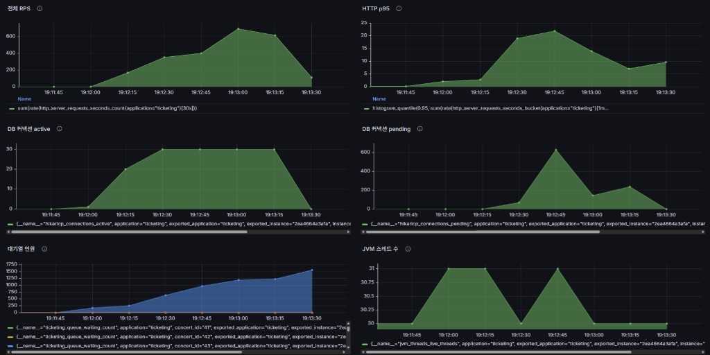
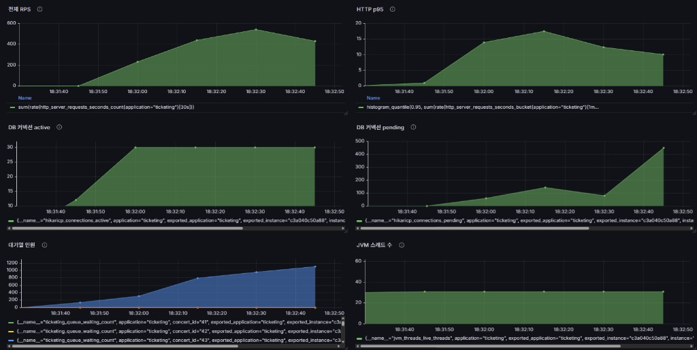
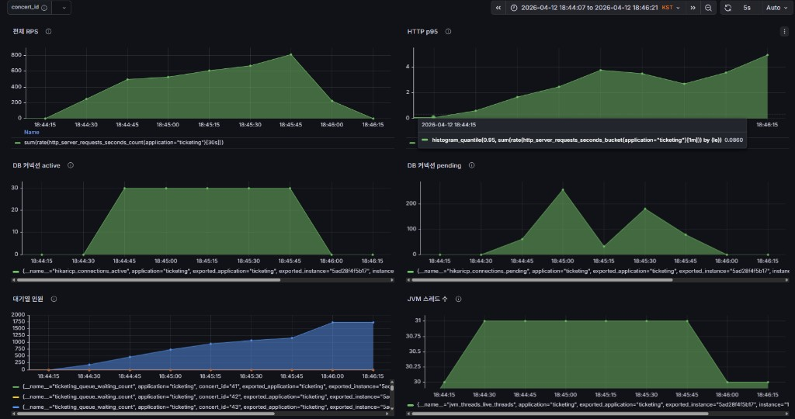
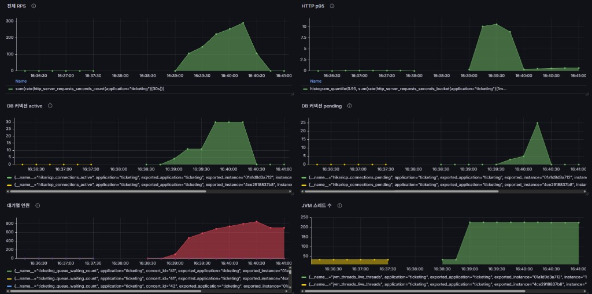
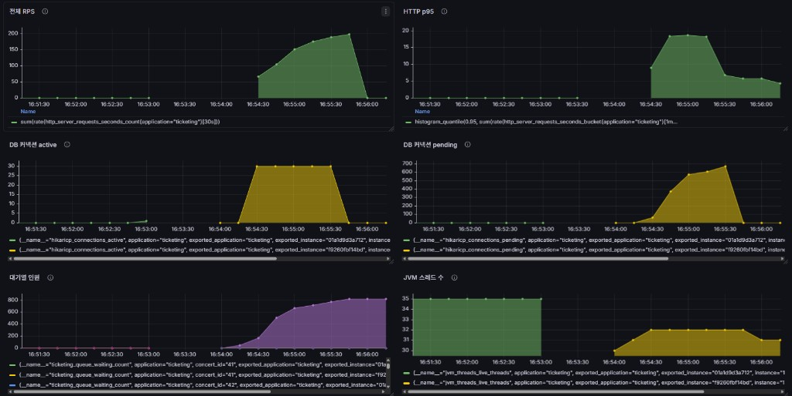
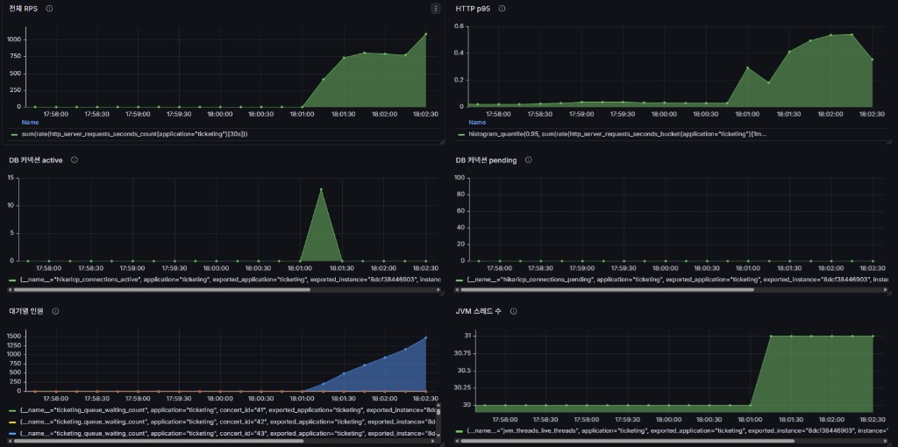

# 부하 테스트 · 용량 검증

부하 설계, 실행, 실측 결과와 해석을 한 문서에 모은다.

---

## 0. 요약

| 질문 | 한 줄 답 |
|------|----------|
| 무슨 부하? | `queue-flow.js`: 대기열 진입과 `status` 고빈도 폴링. k6 동일, Hikari 풀 10·30 비교 포함 |
| 무슨 지표? | Grafana **6패널**(RPS, HTTP p95, Hikari active/pending, 대기열 인원, JVM 스레드) + k6 요약 |
| 풀 10에서 본 것? | **active=10 고정 + pending 150+** → **커넥션 풀 포화**가 지연과 맞물림 |
| 풀 30에서 본 것? | **pending ~25로 급감** → “풀에서 기다리는 병목”은 완화. 그러나 **HTTP p95는 악화** → 병목이 **DB/처리량/큐** 쪽으로 이동했을 가능성 |
| “성능 개선?” | **연결 대기(pending) 관점에서는 개선**. **종단 p95만 놓고 보면 이번 A/B에서는 개선 아님** — 풀만 키우면 끝이 아님을 보여 주는 사례 |
| **Virtual Thread (캐시 없이)?** | **Hikari 30 + VT ON**만 적용 시: JVM **~32**인데 **pending ~700**·**p95 ~16 s**·**에러 2.62%** → **스레드가 아니라 DB 풀 큐**가 벽. **§9** 참고. |
| **VT + 잔여석 Redis 캐시?** | k6 p95 **453 ms**, 에러 **0%**, **~853 req/s**, Grafana pending **0**, active 피크 **~13**, RPS **~1000/s** 부근, JVM **~31**. §4·§10, `queue-flow-pool30-vt-cache-run-grafana-6panel.png`. |
| **stress+ PEAK 1500 (batch 50)?** | 풀 30·**batch 50**·VT·캐시, VU **1500**. **에러 0%**, 체크 전부 통과. k6 p95 **8.28 s**, 합성 **~391/s**. Grafana: RPS 피크 **~700/s**, HTTP p95 **~20 s** 구간, Hikari active **30**, pending 피크 **600+**, 대기열 **~1500**, JVM **~30–31**. §4.1·§0.1, `queue-flow-stress-plus-1500vu-grafana-6panel.png`. 동일 프로필의 **다른 회차**에서는 k6 p95 **~781 ms**, **~808/s**까지 관측된 적이 있어, 스테이지 종료·캐시 상태에 따라 p95·RPS는 변동할 수 있다. |
| **stress+ batch 70?** | 풀 30 유지, batch **70** 단일 런. k6 p95 **6.03 s**, 에러 **0.18%**, `enter` 타임아웃, pending 피크 **~400+**, **~447/s**. batch가 중간이라도 지표가 선형으로 끼는 것은 아님. §4.2. |
| **stress+ batch 100?** | 풀 30 유지, `queue.batch-size`만 **100**. k6 p95 **2.79 s**, 에러 **0.14%**, `enter` 타임아웃, pending 피크 **~250**, **~590/s**. §4.4, `queue-flow-pool30-batch100-1500vu-grafana-6panel.png`. |
| **stress+ 풀 50?** | 설정은 Hikari **50**이나 Grafana active는 **30**에서 멈춤. 배포·설정과의 정합 확인 필요. k6 p95 **9.86 s**, 에러 **0.05%**, pending 피크 **~500**, 대기열 **1000+**. §4.3, `queue-flow-pool50-1500vu-grafana-6panel.png`. |

---

## 0.1 부하 견디는 범위 (`queue-flow.js` 실측 기준)

아래 **동시 사용자 수**는 k6 **가상 사용자(VU)**이며, `queue-flow.js`의 스테이지·`K6_PEAK_VU`·폴링 간격(`K6_QUEUE_POLL_SLEEP_SEC`)이 같을 때만 서로 비교한다. 좌석 홀드·멀티 인스턴스·ALB는 이 표에 포함하지 않는다.

| 구간 | 대략적 의미 |
|------|-------------|
| **PEAK 800**, 풀 30 + VT + **잔여석 캐시** | HTTP 에러 **0%**, k6 p95 **~453 ms**, RPS **~850/s** 부근, Hikari pending **거의 0**. 이 구성에서 **동시 800 VU**까지는 대기열·status 폴링 부하를 **비교적 여유 있게** 처리한다. |
| **PEAK 1500**, 동일 스택 + **`ticketing.queue.batch-size=50`** | **HTTP 실패 0%**, 대기열 진입·순번 조회 체크 **전부 통과**. 즉 **동시 1500 VU** 램프까지도 **응답 실패 없이** 버틴다. 다만 Hikari **active 30**에 붙고 **pending이 수백**까지 올라가며, k6 **p95는 수 초**(최신 런 **8.28 s**), Grafana HTTP p95는 **~20 s**까지 튀는 구간이 있다. **에러 없음**과 **지연이 작음**은 별개다. |
| **PEAK 1500**, batch **70** (단일 런) | **0.18%** 실패, `POST /api/queue/enter` 타임아웃. batch 50보다 SLO가 나쁘다. |
| **PEAK 1500**, batch **100** | **0.14%** 실패, 타임아웃·pending 악화. **50이 이 프로필에서 더 안전**하다. |
| **PEAK 1500**, Hikari **50 의도** (메트릭상 active 30) | **0.05%** 실패, p95·pending이 batch 50보다 나쁜 회차가 있었다. 풀 숫자만으로 해결되지 않음을 보여 준다. |
| **풀 10**, PEAK 800 | active **10** 포화, pending **150+**. 커넥션 풀이 먼저 벽이다. |
| **풀 30 + VT**, 캐시 **없음**, PEAK 800 | **2.62%** HTTP 실패, p95 **~16 s**. VT만으로는 DB 풀 한도를 넘기지 못한다. |

**한 줄 요약**: 잔여석 캐시·풀 30·VT·**batch 50**을 두면 **동시 1500 VU**까지도 **에러율 0%**로 견딜 수 있다. 그 위의 “더 빨라짐”은 아니며, **DB 커넥션 풀 30**과 스케줄·배치 설정이 **지연과 처리량의 상한**을 만든다. 운영 목표가 “몇 VU까지 0%”인지, “p95 몇 초 이하”인지에 따라 한계를 따로 잡는다.

---

## 1. 목적 · 비범위

**목적**: 동일 워크로드에서 **Hikari max pool 10 vs 30**만 바꿔, **어느 층이 포화되는지**와 **지표가 어떻게 엮이는지**를 Prometheus/Grafana + k6로 남긴다.

**비범위**: 좌석 홀드·락 경합 중심 스트레스(`seats-hold.js`), 멀티 앱+ALB 스케일아웃 검증은 별도 문서/런으로 둔다.

---

## 2. 재현 조건

| 항목 | 값 |
|------|-----|
| 스크립트 | `load-tests/queue-flow.js` |
| `K6_PEAK_VU` | **1200**. stress+ 기본. §4 구 표와 맞출 때는 **800** |
| `K6_QUEUE_POLL_SLEEP_SEC` | **0.002**. stress+ 기본. §4 구 표와 맞출 때는 **0.005** |
| `K6_PROFILE` | stress |
| Stage | `5s + 5s + 10s + 35s + 5s` (합 ~60s 램프·피크 구간) |
| 앱 변경 | **Hikari max pool만** 10 → 30 (그 외 동일 가정) |

§4의 pool 10·30, VT, 캐시 표는 **PEAK 800**, **poll 0.005** 기준이다. stress+ 결과와 비교할 때는 env를 한 줄로 적어 구분한다. §4.1의 1500 VU 런은 아래 명령에서 **`K6_PEAK_VU=1500`** 만 바꾼 실측이다.

```bash
k6 run -e BASE_URL=<앱>:8080 -e CONCERT_ID=<id> \
  -e K6_PEAK_VU=1200 \
  -e K6_QUEUE_POLL_SLEEP_SEC=0.002 \
  -e K6_PROFILE=stress \
  -e K6_WARM_DURATION=5s -e K6_MID_DURATION=5s -e K6_CLIMB_DURATION=10s \
  -e K6_PEAK_HOLD=35s -e K6_RAMP_DOWN=5s \
  load-tests/queue-flow.js
```

곡선·변수: `load-tests/lib/stages.js`, `load-tests/README.md`.

---

## 3. Grafana 6패널 (PromQL)

| # | 패널 | PromQL |
|---|------|--------|
| 1 | 전체 RPS | `sum(rate(http_server_requests_seconds_count{application="ticketing"}[30s]))` |
| 2 | HTTP P95 | `histogram_quantile(0.95, sum(rate(http_server_requests_seconds_bucket{application="ticketing"}[1m])) by (le))` |
| 3 | DB active | `hikaricp_connections_active{application="ticketing"}` |
| 4 | DB pending | `hikaricp_connections_pending{application="ticketing"}` |
| 5 | 대기열 인원 | `ticketing_queue_waiting_count{application="ticketing"}` |
| 6 | JVM 스레드 | `jvm_threads_live_threads{application="ticketing"}` |

**Golden Signals 대응**: Traffic→①, Latency→②+k6, Errors→k6 `http_req_failed`, Saturation→③④⑤⑥.

---

## 4. 기록 표 — `queue-flow.js` (실측)

Grafana 캡처는 `docs/` 기준 `../portfolio/images/` 아래 파일명으로 고정한다.

| 파일 | 쓰는 곳 |
|------|---------|
| `queue-flow-pool10-800vu-grafana-6panel.png` | §5 Run A |
| `queue-flow-pool30-800vu-grafana-6panel.png` | §6 Run B |
| `queue-flow-pool30-vt-on-grafana-6panel.png` | §9 Virtual Thread 런 (**캐시 없음**) |
| `queue-flow-pool30-vt-cache-run-grafana-6panel.png` | §10 **잔여석 캐시 적용** 런 (pool 30 + VT + Redis `availableSeatCount`) |
| `queue-flow-stress-plus-1500vu-grafana-6panel.png` | §4.1 **stress+ PEAK 1500 VU** (풀 30·**batch 50**·VT·캐시). **최신** Grafana 6패널 캡처(2026-04 재현) |
| `queue-flow-pool30-batch100-1500vu-grafana-6panel.png` | §4.4 **stress+ 1500 + `queue.batch-size=100`** (풀 30·§4.1과 동일 k6) |
| `queue-flow-pool50-1500vu-grafana-6panel.png` | §4.3 Hikari 풀 50 의도, stress+ 1500 VU. §4.1과 동일 k6. 메트릭상 active 30이면 설정 반영 여부를 확인한다 |

| 설정 | VU | k6 p95 | 에러 | RPS(참고) | 커넥션·큐 요약 |
|------|-----|--------|------|-----------|----------------|
| **pool 10** | 800 | **3.06 s** | **0%** | Grafana 피크 **~320/s**, k6 합성 **~241/s** | active **10** 포화, **pending 150+**, 대기열 **~800**, JVM **~225** |
| **pool 30** | 800 | **5.37 s** | **0%** | Grafana 피크 **~300/s**, k6 **~187/s** | active **30** 포화 구간, **pending 피크 ~25**, Grafana p95 **~10.5 s**, 대기열 **~850** 피크·이후 **700~800** 잔존, JVM **~230** |
| **pool 30 + VT ON** | 800 | **16.02 s** | **2.62%** | Grafana 피크 **~200/s**, k6 **~145/s** | active **30** 고정, **pending ~700** 근방, Grafana HTTP p95 **~19 s** 구간, 대기열 **~800**, JVM **~30–32** |
| **pool 30 + VT ON + status 잔여석 캐시** | 800 | **453 ms** (k6 p95) | **0%** | Grafana 피크 **~1000/s**, k6 **~853/s** | **pending 0**, active **피크 ~13**, Grafana HTTP p95 **~0.55 s** 피크, 대기열 **~1500**, JVM **~31** |
| **stress+ PEAK 1500** (풀30·**batch 50**·캐시) **최신** | **1500** | **8.28 s** (k6 p95) | **0%** | Grafana 피크 **~700/s**, k6 **~391/s** | active **30** 포화, **pending 피크 600+**, Grafana HTTP p95 **~20 s** 구간, 대기열 **~1500**, JVM **~30–31**. 동일 프로필 이전 회차: k6 p95 **~781 ms**, **~808/s**, pending **~35**, 대기열 **~2250** |
| **stress+ PEAK 1500** (풀30·**batch 70**·캐시, 단일 런) | **1500** | **6.03 s** | **0.18%** | k6 **~447/s** | active **30**, pending **~400+**, `enter` 타임아웃 |
| **stress+ PEAK 1500** (풀30·**batch 100**·캐시) | **1500** | **2.79 s** (k6 p95) | **0.14%** | Grafana **~800/s**, k6 **~590/s** | active **30** 포화, **pending 피크 ~250**·**~180**, Grafana HTTP p95 **~5 s** 근방, 대기열 **~1750**, **`/api/queue/enter` 타임아웃** 다수, JVM **~31** |
| **stress+ PEAK 1500 + Hikari 풀 50 의도** | **1500** | **9.86 s** (k6 p95) | **0.05%** | Grafana 피크 **~550/s**, k6 **~430/s** | active 피크 **30**, pending 피크 **~500**, HTTP p95 **~10–18 s**, 대기열 **1000+**, JVM **~30**. 설정 50과 불일치 시 배포·Actuator로 확인 |

표의 pool 30 행은 VT 전 이전에 돌린 k6 런이다. pool 30과 VT ON을 직접 비교할 때는 커밋·쿨다운·시드를 맞춘다. 잔여석 캐시 행은 `GET /api/queue/status`에 Redis 캐시 TTL 2초와 evict를 적용한 뒤의 실측이며, Grafana 파일은 `queue-flow-pool30-vt-cache-run-grafana-6panel.png`와 동일 런이다. 문서상 중간에만 적었던 p95 2.37 s 런은 동일 조건 재실행으로 453 ms 쪽으로 갱신했다.

### k6 상세 (동일 스크립트)

| 항목 | pool 10 | pool 30 | pool 30 + VT ON | pool 30 + VT + 잔여석 캐시 |
|------|---------|---------|-----------------|---------------------------|
| `http_reqs` | 21,720 | 16,839 | 13,045 | **75,303** |
| `checks` | 100% | 100% | **97.37%** (순번 조회 실패 343) | **100%** |
| iteration 완료 | 74 (interrupted 776) | 50 | 67 | **1440** (interrupted **158**) |
| `vus_max` | 800 | 800 | 800 | 800 |
| `http_req_duration` p(95) | 3.06 s | 5.37 s | 16.02 s | **452.61 ms** |

**stress+ PEAK 1500 VU, batch 50** (§4.1, 앱은 캐시·풀30·VT·`ticketing.queue.batch-size=50` / k6 `K6_PEAK_VU=1500`, §2 stress+ 폴링·스테이지) — **최신 k6 출력(문서 갱신 시점)**:

| 항목 | 값 |
|------|-----|
| `http_reqs` | **35,200** (합성 **~391/s**, 90s 런 기준) |
| `checks` | **100%** (`대기열 진입 201`, `순번 조회 200`) |
| iteration | **191** 완료, **1372** interrupted |
| `vus_max` | **1500** |
| `http_req_failed` | **0%** |
| `http_req_duration` p(95) / max | **8.28 s** / **53.59 s** |

동일 스크립트·동일 PEAK에서 **이전 회차** 예: `http_reqs` **72,657** (**~808/s**), p(95) **781.14 ms**, iteration **1377** 완료·**889** interrupted. p95·처리량은 런마다 달라질 수 있으니 **에러율·pending·큐 길이**를 함께 본다.

**stress+ PEAK 1500 VU, `ticketing.queue.batch-size=100`** (§4.4, §4.1과 동일 k6·풀30·캐시·VT / **배치만 50→100**):

| 항목 | 값 |
|------|-----|
| `http_reqs` | **53,125** (합성 **~590/s**) |
| `checks` | **99.85%** (`대기열 진입 201` 실패 **78**) |
| iteration | **954** 완료 (k6 출력 기준) |
| `vus_max` | **1500** |
| `http_req_duration` p(95) / max | **2.79 s** / **~60 s** |
| 기타 | k6 **`request timeout`** on `POST /api/queue/enter` (로그 다수) |

**stress+ PEAK 1500 VU, Hikari max-pool 50(의도)** (§4.3, §4.1과 동일 k6·캐시·VT / 앱만 `spring.datasource.hikari.maximum-pool-size=50`으로 올린 실험):

| 항목 | 값 |
|------|-----|
| `http_reqs` | **38,665** (합성 **~430/s**) |
| `checks` | **99.94%** (`대기열 진입 201` 실패 **23**/38665) |
| iteration | **256** 완료 (k6 출력 기준) |
| `vus_max` | **1500** |
| `http_req_duration` p(95) / max | **9.86 s** / **~60 s** |

---

### 4.1 Run stress+ — **PEAK 1500 VU** (`queue-flow`, 캐시·풀30·**batch 50**·VT 동일)



**그래프 (위 캡처·최신 런)**  
RPS는 램프에 맞춰 오르다 **~700/s** 부근에서 피크를 찍고, 부하가 내려가며 곧바로 수렴한다. k6 합성 **~391/s**는 같은 구간의 요청 총량과 집계 방식 차이로 Grafana 피크보다 낮게 보일 수 있다. VU **1500**인데 800 VU 캐시 런의 **~1000/s**보다 낮다. **동시 접속을 키운다고 RPS가 비례해 오르지는 않는다.**

Hikari active **30**에 붙은 뒤 플랫하게 유지된다. pending은 **600+**까지 치솟았다가 RPS 하강과 함께 풀린다. 캐시로 줄었던 DB 풀 큐잉이 **VU 1500**에서 다시 두드러진다. `status` 잔여석 캐시는 폴링 경로의 DB 압력을 줄이지만, **풀 슬롯 30**과 스케줄·다른 SQL이 남는 한 **포화와 대기**는 다시 나타난다.

대기열 인원은 **~1500**까지 거의 선형으로 올라간다(k6 `vus_max`와 맞물림). 최신 k6 런에서는 **HTTP·체크 실패 0%**로, batch **100·70**에서 보이던 `enter` 타임아웃은 없었다.

HTTP p95(Grafana)는 부하 피크에서 **~20 s**까지 올라갔다가 이후 내려온다. k6 **p(95)=8.28 s**, **max 53.59 s**로, **에러 없이** 응답이 돌아와도 **꼬리 지연은 크다**. 동일 프로필의 다른 회차에서는 k6 p95가 **~781 ms**까지 낮게 나온 적이 있어, **p95만으로 한 번에 “용량 한 줄”을 고정하기 어렵다**는 점을 문서에 남긴다.

JVM live threads **~30–31**은 VT 적용 시 기대 범위에 가깝다. 스레드 수 폭주보다는 **DB 풀 대기** 쪽이 지표에 더 잘 보인다.

k6 iteration **191** 완료·**1372** interrupted는 이터레이션이 폴링 루프로 길고 스테이지 길이가 짧아 **끝에서 끊긴 시도**가 많다는 뜻으로 본다. §5와 같이 **완료 iteration 수만으로 성공을 판단하지 않는다**.

---

### 4.2 튜닝 메모 — **`ticketing.queue.batch-size`(50)** 과 **Hikari 풀 확대**

**batch-size가 하는 일**  
`QueueProcessingScheduler`는 `processing-interval-ms`(기본 2초)마다 공연별로 **상위 N명**(`getTopTokens(..., batchSize)`)을 꺼내, `min(batchSize, 예매가능좌석)` 범위에서 `allowEntry`를 호출한다. 입장 허용 자체는 **Redis** 위주이고, 틱마다 공연당 **좌석 COUNT 쿼리 2회**는 **공연 수**에 비례한다.

batch를 키우면 같은 2초 안에 더 많은 토큰에 대해 입장 허용을 시도할 수 있어, 대기열 ZSET 기준 허용 레이트 상한은 올라간다. 다만 `status` 폴링, DB, 풀, 다른 API가 같은 자원을 쓰므로 batch만 키우면 스케줄 한 틱이 길어지거나 Redis·락 경합이 늘 수 있다.

§4.4 실측: stress+ 1500, 풀 30 고정에서 batch **50→100**이면 p95, pending, RPS, 타임아웃이 모두 악화된다. batch **70** 단일 런에서는 **0.18%** 실패와 `enter` 타임아웃이 있었다. batch를 키우면 항상 좋아진다는 가설은 이 데이터로 기각되며, **중간값이 항상 50과 100 사이 지표**라는 가정도 성립하지 않는다.

**왜 `batch-size`를 50으로 두는가**  
- 코드 기본값: `TicketingProperties`의 큐 설정에서 `batchSize` 기본이 **50**이다(`application.properties`의 `ticketing.queue.batch-size`와 동일).  
- **`ticketing.queue.activation-threshold`(몇 명부터 대기열 모드를 쓸지)**도 기본 **50**이라 숫자가 같을 뿐, **배치 한도**와 **활성화 기준**은 서로 다른 키다. 도메인에서 “인원 = 배치”로 계산된 값은 아니다.  
- 부하 근거: 동일 stress+·풀 30·VT·캐시에서 **50**은 **HTTP·체크 실패 0%**로 관측됐고, **70·100**에서는 `enter` 타임아웃·실패율이 생겼다(§0·§4 표). 즉 **이 프로필에서는 50이 SLO 측면에서 더 안전**하다고 문서에 고정한다. 트래픽·폴링 간격·스케줄 주기가 바뀌면 다시 측정한다.

Hikari 풀을 50으로 올리면 pending 완화에 도움이 될 수 있다. 다만 RDS `max_connections`, 인스턴스 수×풀, MySQL CPU·락을 넘기면 병목이 다음 층으로 옮겨 간다. §6·§9와 같이 한 축만 바꾼 뒤 Grafana와 슬로우 쿼리를 함께 본다.

---

### 4.3 Run stress+ — **PEAK 1500 VU**, **Hikari 풀 50(의도)** (`queue-flow`)



stress+ 1500 VU를 유지한 채 §4.1 대비 처리량·지연·에러가 크게 악화된다. 풀만 키우면 개선된다는 가설은 이 데이터로는 지지되지 않는다.

그래프와 k6: RPS **~550/s**, k6 **~430/s**로 §4.1 batch 50 최신(**~391/s**)·이전 회차(**~808/s**) 모두와 비교하면 낮은 편이다. HTTP p95는 Grafana **~10–18 s**, k6 **9.86 s**로 §4.1 batch 50에서 관측한 k6 p95(**8.28 s** 또는 **~781 ms** 런)보다 크게 나쁜 편이다. Hikari pending 피크 **~500**은 §4.1 batch 50 최신의 **600+**와 같이 큰 큐잉이다. 대기열은 **1000+**로 유입 대비 소진이 더 느리다. `대기열 진입 201` 23건 실패, `http_req_failed` **0.05%**로 SLO 균열이 보인다.

검증 포인트: Grafana DB active가 **30**에서 더 오르지 않으면, 실행 앱에 `maximum-pool-size=50`이 반영되지 않았거나 다른 DataSource가 30으로 묶였거나 RDS·프록시 쪽 세션 한도일 수 있다. Actuator `hikaricp.connections.max`와 설정 로그로 실효 풀 상한을 먼저 확인한 뒤 풀 50 실험으로 해석한다. 메트릭만으로는 풀 50 효과를 분리해 말하기 어렵다.

같은 k6 곡선에서 지연·pending·처리량이 동시에 나빠지면 원인을 풀 숫자 하나에만 두지 않는다. 배포 상태, DB 경합, 캐시 적중, 런 타이밍을 함께 본다. 한 축을 바꾼 뒤에는 설정이 메트릭에 반영됐는지 확인하는 절차를 문서에 남긴다.

---

### 4.4 Run stress+ — **`queue.batch-size=100`** (풀 30·§4.1과 동일 k6)



§4.1과 동일 부하·풀 30에서 `ticketing.queue.batch-size`만 **100**으로 올리면 지연, pending, 처리량, 에러가 모두 악화된다. 배치를 키우면 대기열이 빨리 비워진다는 가설은 이 데이터로는 지지되지 않는다.

| 지표 | §4.1 batch 50 (최신) | §4.4 batch 100 |
|------|----------------------|----------------|
| k6 p95 | **8.28 s** | **~2.79 s** |
| `http_req_failed` | **0%** | **0.14%** |
| 합성 RPS | **~391/s** | **~590/s** |
| Hikari pending 피크 | **600+** | **~250**, **~180** |
| 대기열 인원 | **~1500** | **~1750** |

§4.1 batch 50 **이전 회차**와 비교할 때는 k6 p95 **~781 ms**, RPS **~808/s**, pending **~35**, 대기열 **~2250**이었다. active **30**은 유지되는데 batch **100**에서는 pending이 **~250** 근방으로 튄다. 풀 슬롯은 같고 연결 대기 쪽이 폭증한 형태다. HTTP p95는 **~5 s** 부근까지 올라가며 k6 max **~60 s**와 맞물린다. RPS는 batch 50 최신보다는 높지만 **실패율·타임아웃**이 생겨 SLO 관점에서는 나쁘다.

k6에서 `POST /api/queue/enter`에 `request timeout`이 다수 발생한다. 스케줄러는 입장 허용 루프, `enter`는 별 HTTP이지만 동일 DB 풀과 프로세스를 공유한다. 한 틱에 처리하는 토큰 수가 늘면 `processQueue()` 시간이 길어지고 그동안 다른 요청의 커넥션 대기가 길어져 `enter`가 타임아웃에 이를 수 있다는 가설은 프로파일링 전까지 참고용으로 둔다.

batch **50→100**은 이 환경에서는 개선이 아니라 악화다. 입장 처리량 상한만 보지 말고 풀 pending, HTTP tail, 타임아웃을 함께 본다.

---

## 5. Run A — Hikari **pool 10** (해석)


**그래프**  
RPS가 오른 뒤 Hikari active가 **10**에 붙어 더 이상 오르지 않는다. DB 커넥션 풀 슬롯이 모두 사용된 상태다. pending이 **150+**로 튄다. SQL 실행을 위해 풀에서 커넥션을 받지 못한 요청이 큐에 쌓인다. RPS와 연결 획득 대기가 같은 시간축에서 악화되는 풀 포화, 큐잉, 지연 패턴이다.

HTTP P95가 **~7 s**까지 튀는 구간은 서버 히스토그램 기준 tail이 한꺼번에 나빠진 것으로 읽힌다. k6 p95 3.06 s와 숫자가 다른 것은 집계 윈도, 클라이언트 경로, 요청 믹스 차이로 흔하다. 서버와 클라이언트 지표를 같은 시간축에 두고 방향을 비교한다.

대기열 인원 **~800**은 k6 VU 스케일과 맞물려 큐 부하가 게이지로 드러난다. JVM 스레드 **~225**는 동시 처리 부하의 신호이며, 스레드 풀 한계만 의미하지는 않는다.

k6 에러 **0%**는 HTTP 대량 실패가 없었다는 뜻이지 SLO 충족을 뜻하지는 않는다. 체감은 p95와 대기 시간에서 이미 나빠져 있다.

iteration 74, interrupted 776은 피크 홀드가 짧고 폴링 루프가 길어 스테이지 종료 시 끊긴 시도가 많다는 뜻으로 본다. SLO는 완료 iteration 수보다 http p95, pending, 에러로 잡는 편이 안전하다.

---

## 6. Run B — Hikari **pool 30** (해석)



**pending**  
풀 10에서 보이던 pending 폭증이 **~25** 수준의 짧은 스파이크로 줄었다. 애플리케이션 커넥션 풀 앞 대기 병목이 줄었다는 근거가 된다.

**HTTP P95 ~10.5 s**  
풀을 키웠다고 모든 지표가 좋아졌다고 쓰면 데이터와 맞지 않는다. 동시 DB 세션은 늘어 풀 큐 대기는 줄지만 MySQL CPU·락·`Threads_running`이나 앱의 다른 임계가 다음 병목으로 드러날 수 있다. 병목이 풀에서 DB·비즈니스 처리 쪽으로 옮겨 간 그림으로 읽는다.

대기열 **~850**까지 올라간 뒤 RPS가 떨어져도 **700–800**대가 잠깐 남는다. HTTP 처리 속도와 큐 인원이 같은 속도로 비워지지 않는다. 부하 종료 후에도 게이지가 따라오는 백로그 소진 구간이 보이면 RPS만으로 성공을 판단하기 어렵다는 근거가 된다.

k6 요청 수 **16,839**는 풀 10의 **21,720**보다 적다. 같은 VU라도 서버가 느려지면 이터레이션당 처리량이 줄어든다고 읽을 수 있다. p95 **5.37 s**는 풀 10보다 악화다.

---

## 7. 10 vs 30 — 한 덩어리로 정리

| 관점 | pool 10 | pool 30 |
|------|---------|---------|
| **연결 풀 대기** | pending **150+** | pending **~25** |
| **체감 지연 p95** | k6 **3.06 s**, Grafana **~7 s** | k6 **5.37 s**, Grafana **~10.5 s** |
| **해석** | 풀이 1차 병목 | DB 동시 실행·큐 백로그 쪽 병목 전이 |

풀 10 대비 30에서 Hikari pending으로 보이는 연결 대기 병목은 줄일 수 있다. 반면 풀만 키워 p95가 자동으로 내려간다는 가설은 이 데이터로는 지지되지 않는다. 다음 관측 축은 RDS CPU, 슬로우 쿼리, `max_connections`, 대기열 처리 주기다.

---

## 8. 런북 체크 (요약)

- 한 번에 **한 축**(풀 / JVM 등)만 변경한다.
- 동일 시나리오를 **여러 번** 돌릴 때는 **완전 콜드**(Redis·캐시·큐를 매번 비운 뒤 시작)를 목표로 하지 않는다. **운영에 가까운 웜 상태**에서 연속 실행하거나 짧은 간격을 두고, 분산만 줄이는 전제로 본다. 필요하면 런 사이 **대기열 인원이 거의 내려갔는지**만 Grafana로 확인한다.
- 부하 전후 **쿨다운**을 두고, 가능하면 **Git 커밋·인스턴스 타입**을 표에 적는다.
- 새 런 결과는 **§4 표 + §5~7 스타일 해석**을 이 파일에 이어 붙인다.
- **Virtual Thread** 전후 비교는 **§9**에만 추가한다(풀 10/30 표와 **섞지 말고** 비교 전제를 한 줄로 명시).
- **`queue/status` 잔여석 캐시** 전후 수치는 **§10** 표에만 적어, §9(VT만)와 **커밋 전제**를 섞지 않는다.

---

## 9. Virtual Thread — Hikari **pool 30** + **VT ON** (`queue-flow`)

전제: 동일 `queue-flow.js`, VU **800**, 동일 stage env. 앱은 Hikari max pool **30**과 Virtual Thread 활성화. 같은 pool 30이나 VT 이전에 측정한 런은 §4 표의 pool 30 행이다.

### 9.1 재현 조건

| 항목 | 값 |
|------|-----|
| VT | **ON** |
| Hikari max pool | **30** |
| 스크립트·k6 | 본 런: `queue-flow`, **PEAK 800**, **poll 0.005**, stress (§2 stress+와 **다름**) |
| Grafana 구간(대략) | **16:54~16:56** |

### 9.2 k6 요약 (본 런)

| 항목 | 값 |
|------|-----|
| `http_req_duration` p(95) | **16.02 s** |
| `http_req_failed` | **2.62%** (343 / 13,045) |
| `checks_succeeded` | **97.37%** — `순번 조회 200`에서 실패 다수 |
| `http_reqs` | **13,045** (합성 **~145/s**) |
| iteration 완료 | **67** |
| `vus_max` | **800** |

### 9.3 Grafana 6패널



**그래프가 말하는 것 (한 줄씩)**  
- **RPS**: 피크 **~200/s** 부근 — 같은 VU인데 **pool 30(VT 미명시) ~300/s**보다 낮다. 처리량이 **지연·실패·큐잉**으로 깎인 상태로 읽을 수 있다.  
- **HTTP p95**: **~19 s**까지 붙는 구간 — tail latency가 매우 나쁘다.  
- **Hikari active = 30** 플랫: 풀 **전부 사용 중**.  
- **Hikari pending ~700**: 풀 큐에 커넥션을 받지 못한 요청이 대량 적체된다. pool 30에서 VT 이전 런의 pending **~25**와 단계가 다르다.  
- **대기열 ~800**: 부하 모델과 맞물린 업무 게이지.  
- **JVM live threads ~30–32**: 800 VU에도 플랫폼 스레드가 거의 늘지 않는다. VT가 스레드 수 관점에서 기대대로 동작한 것으로 본다.

### 9.4 해석

이 런은 “VT 때문에 더 빨라졌다”보다 한계가 어디로 옮겨졌는지 드러난다는 점에서 의미가 있다.

1. **VT 효과**  
   800명 분 시나리오에서 `jvm_threads_live_threads`가 **~32**에 머문다. OS 스레드 포화로 요청을 못 받는 그림은 아니다. 가상 스레드가 I/O 대기를 겹쳐 쌓는다는 설명과 그래프가 맞물린다.

2. **VT가 해결하지 못한 부분**  
   DB 커넥션은 여전히 **30**이다. 논리 동시성이 늘면 같은 30슬롯을 두고 경쟁이 몰릴 수 있고, `pending`이 **~700**까지 치솟는 패턴은 스레드 한계보다 DB 풀 큐가 병목으로 부각된 것으로 읽는다.

3. **지연·에러**  
   p95 **16 s**, HTTP 실패 **2.62%**, 순번 조회 체크 실패는 5xx·타임아웃·클라이언트 끊김과 연결해 볼 수 있다. 풀 30에서 VT 이전 런은 에러 **0%**였으므로 VT ON만으로 SLO가 개선됐다고 쓰기는 어렵다. VT 이후 DB 풀 큐잉이 메트릭에 크게 드러났다고 쓰는 편이 데이터와 맞다.

4. **요약**  
   Virtual Thread는 플랫폼 스레드 수를 억제했지만 Hikari max 30인 한 DB 커넥션은 물리 상한이라 `pending`이 폭증했고 p95·에러율이 악화됐다. 다음 튜닝은 풀 크기만이 아니라 RDS 용량·쿼리·인스턴스 수와 함께 본다.

### 9.5 다음 실험(선택)

- **같은 커밋·같은 데이터**에서 **VT OFF ↔ ON**을 **연속**으로 돌려 표를 맞춘다.  
- **MySQL `Threads_running` / CPU** 스크랩을 같은 대시보드에 올린다.

---

## 10. 코드 변경 — `queue/status` 잔여석 집계 캐시 (실측)

**현재 저장소:** VU 800에서 pool 10 / 30 / 30+VT를 다시 맞추기 위해 **`availableSeatCount` Redis 캐시와 evict 호출은 제거된 상태**다. 이 절의 표·설명은 **캐시가 있던 시점의 실측·설계 기록**이다. 캐시를 다시 켜면 `RedisConfig`·`SeatService`·무효화 지점을 이 절과 같이 복구하면 된다.

**문제**: `GET /api/queue/status`가 폴링마다 `SeatService`로 **DB 3회 + Redis** 잔여석 집계를 반복해, k6 고빈도 폴링 시 **Hikari `pending`**이 커지는 직접 원인이었다.

**조치** (동일 부하 k6로 **전·후** 비교):

| 구분 | 내용 |
|------|------|
| 캐시 | **Redis** `availableSeatCount`, TTL **2초** (`RedisConfig` + `spring.cache.type=redis`) |
| 적용 경로 | `countAvailableSeatsForQueueStatus(concertId)` — **`QueueController.status`만** |
| 비적용 | `POST /api/queue/enter`의 즉시 입장 판단은 **`countAvailableSeatsForDecision`** (캐시 없음) |
| 무효화 | 홀드 생성/취소(`HoldService`), 예약 확정 커밋 후(`ReservationConfirmedEventListener`), 홀드 만료 배치(`HoldCleanupScheduler`), 환불로 좌석 복구(`ReservationService.cancelReservationForRefund`)에서 `evictAvailableSeatCount(concertId)` |

**실측 비교** (동일 `queue-flow.js`, **pool 30 + VT ON**, VU 800 — **캐시 적용 커밋 전후**):

| 지표 | 변경 전 (§9.2, 캐시 없음) | 변경 후 (최신 런, §4·아래 Grafana) |
|------|---------------------------|-------------------------------------|
| k6 `http_req_duration` p(95) | **16.02 s** | **452.61 ms** |
| k6 `http_req_failed` | **2.62%** | **0.00%** |
| k6 `http_reqs` 합성 RPS | **~145/s** | **~853/s** |
| Hikari `pending` 피크 (Grafana) | **~700** 근방 | **0** (구간 전체 0에 가깝게 유지) |
| Hikari `active` 피크 (Grafana) | **30** (풀 포화) | **~13** 근방 |
| JVM live threads (Grafana) | **~30–32** | **~31** |
| Grafana HTTP p95 (서버 히스토그램) | **~19 s** 구간 | **~0.55 s** 피크 근방 |
| 체크 | 순번 조회 다수 실패 | **대기열 진입 201 / 순번 조회 200**, checks **100%** |

동일 런에서 `http_req_duration` max **~33 s** 같은 tail이 있을 수 있으므로 p95·에러율과 함께 꼬리 지연을 본다.

`GET /api/queue/status`만 잔여석 집계를 짧은 TTL Redis 캐시로 두고, 좌석 변동 시 evict로 맞추면 동일 풀·동일 VT에서도 Hikari pending, p95, 처리량이 함께 개선될 수 있다. 캐시 없이 VT만 켰을 때 `pending`이 폭주하던 런과 대비된다.

### Grafana 6패널 (캐시 적용 런)

`../portfolio/images/queue-flow-pool30-vt-cache-run-grafana-6panel.png` — 위 §4 마지막 행·k6 요약과 **동일 런** 캡처.



---

## 11. `db-read.js` (미실행)

`queue-flow.js`와 별도 스크립트다. 실행 후 아래 표를 §4와 동일 형식으로 채운다.

| 설정 | VU | k6 p95 | 에러 | 메모 |
|------|-----|--------|------|------|
|  |  |  |  |  |

---

## 부록 — 도메인 knee

좌석 **홀드·락**은 `load-tests/seats-hold.js`와 락 관련 메트릭(`docs/monitoring.md`)으로 별도 한 페이지를 권장한다.

---

## 관련 파일

- `load-tests/README.md` — k6 env 전체
- `my-docs/load-test-guide.md` — 실행 커맨드 요약
