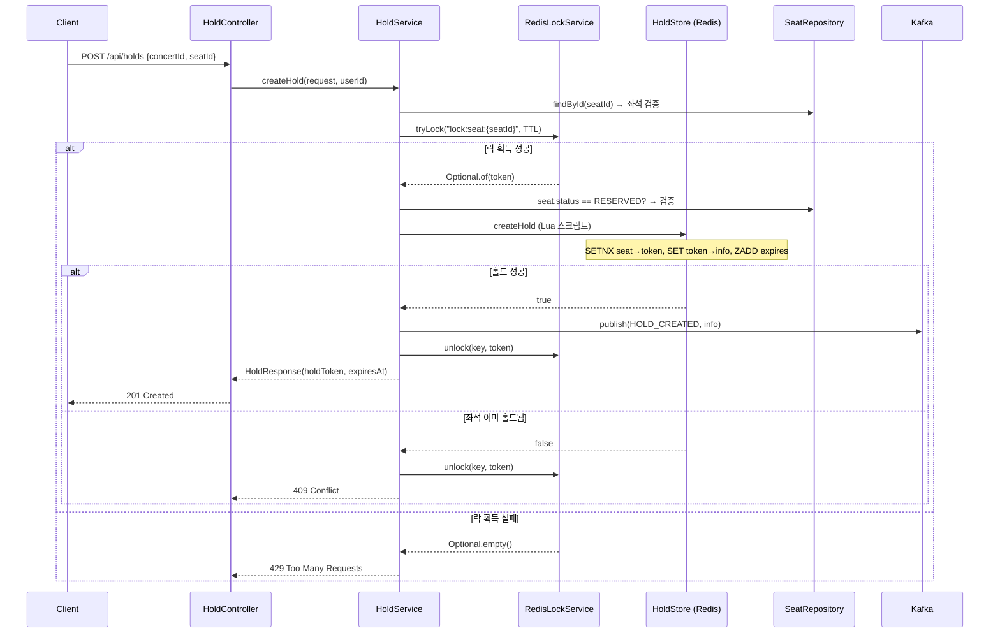
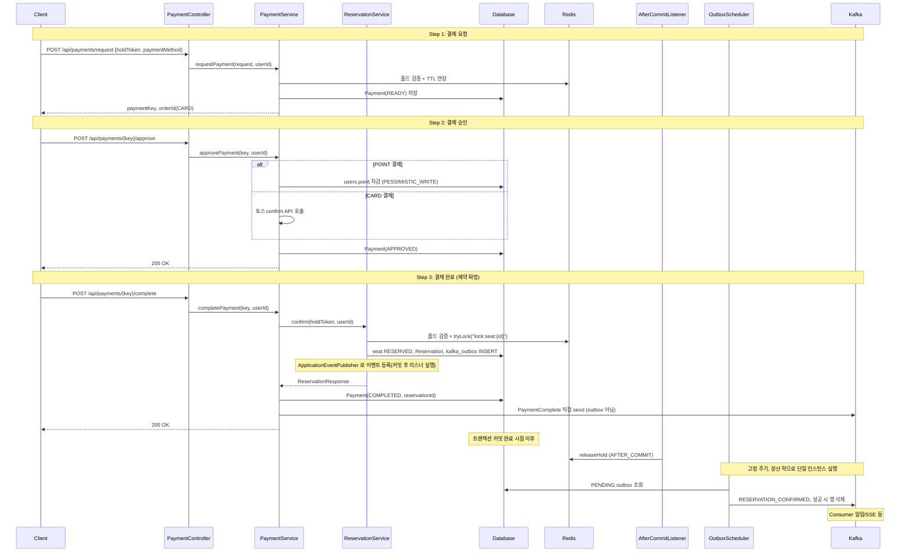
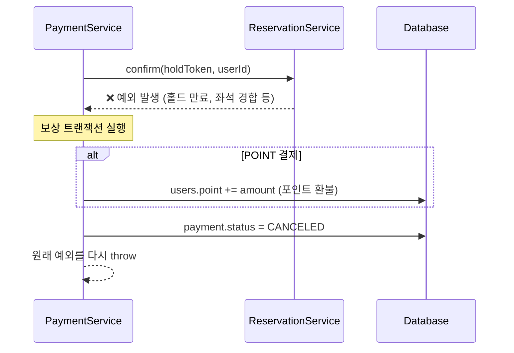
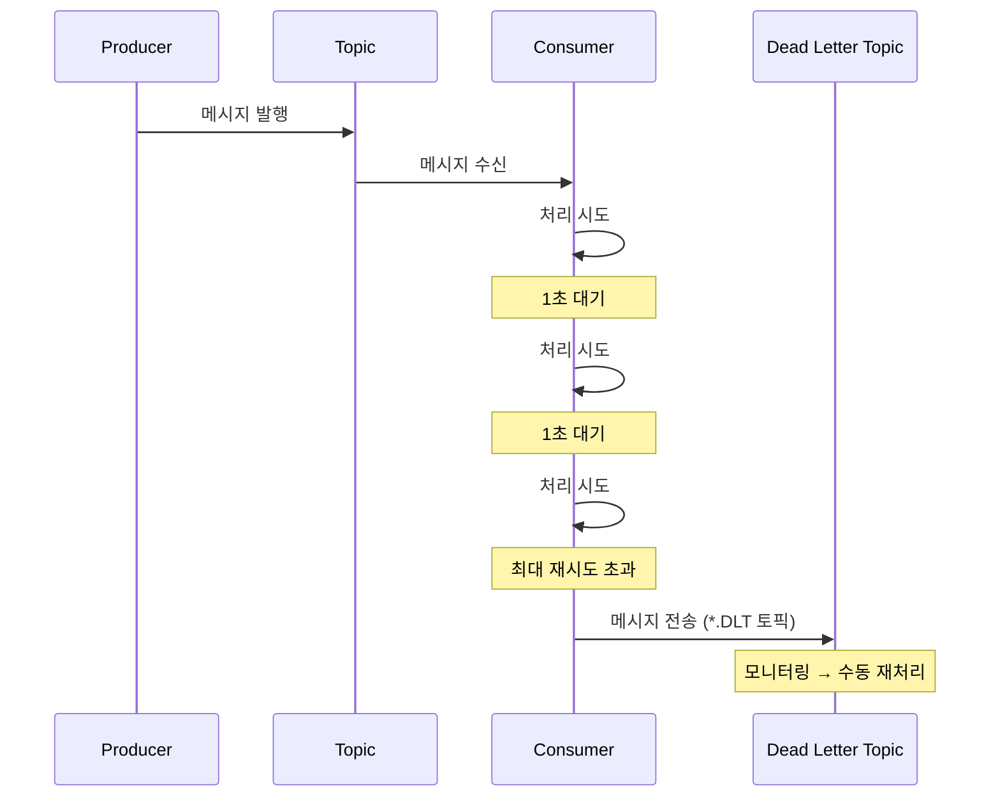
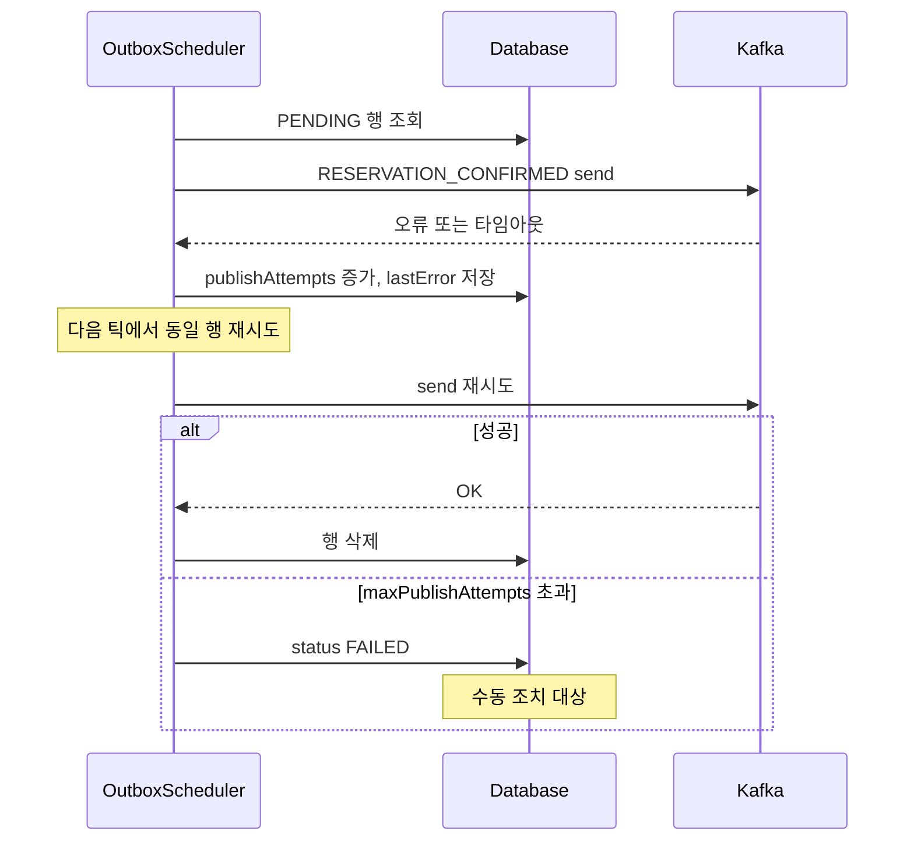
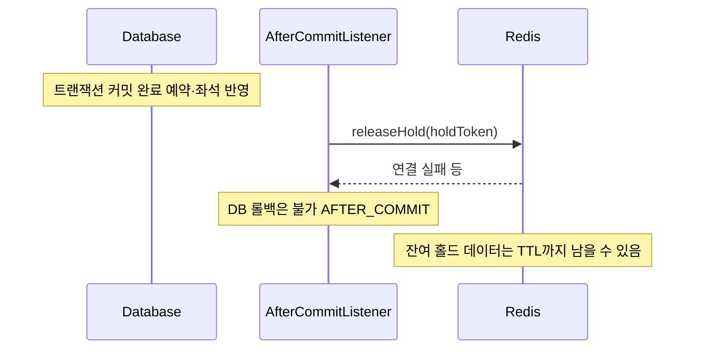
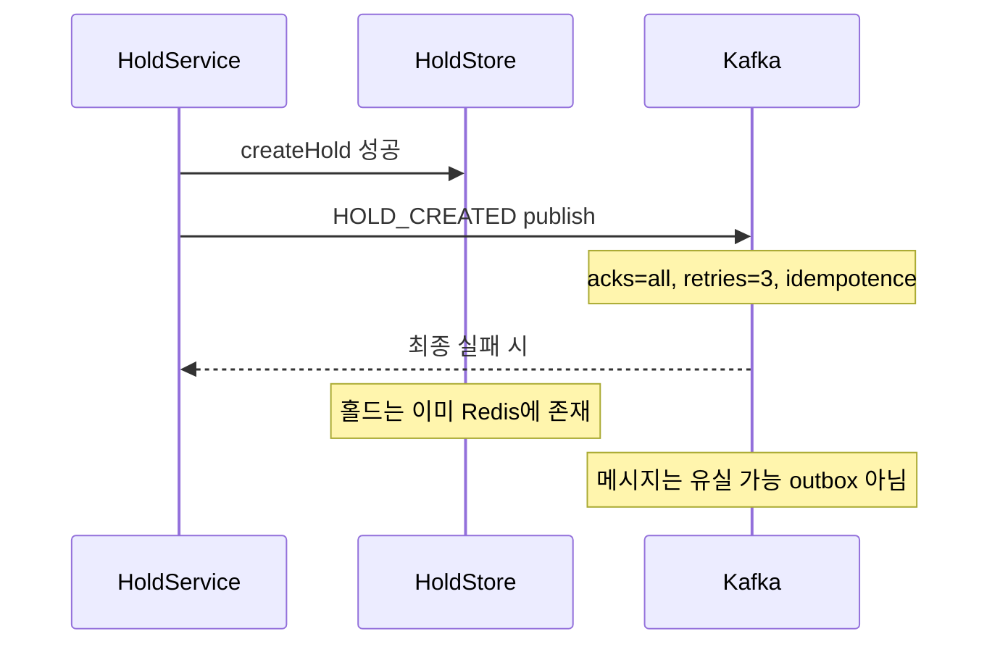

# 핵심 플로우 시퀀스 다이어그램

## 1. 좌석 홀드 (선점) 플로우

## 2. 결제 + 예약 확정 플로우

## 3. 보상 트랜잭션 (Saga)

## 4. Kafka DLQ 흐름

## 5. 정합성·실패 시나리오 (DB / Redis / Kafka)

예약 확정 이후 `RESERVATION_CONFIRMED` 는 **DB transactional outbox** 로 발행하고, 그 외 다수 이벤트는 **KafkaTemplate 직접 send** 입니다. 아래 표는 **코드 기준으로 남는 상태**를 정리한 것이며, 운영에서는 `kafka_outbox`·로그·DLT·메트릭을 함께 보면 됩니다.

### 5.1 예약 확정(`ReservationService.confirm`) 이후

| 시나리오 | DB | Redis 홀드 | Kafka `RESERVATION_CONFIRMED` | 사용자·알림 관점 |
|---------|----|------------|-------------------------------|------------------|
| 정상 | 예약 `CONFIRMED`, 좌석 `RESERVED` | 커밋 후 리스너에서 해제 | outbox → 전송 후 행 삭제 | 정상 |
| Kafka 일시 장애 | 동일 | 동일 | outbox `PENDING` 유지 → 스케줄러 재시도 | DB 예약은 됨, 알림·소비는 **지연** |
| Kafka 장기 장애·재시도 초과 | 동일 | 동일 | outbox `FAILED` (`lastError` 남음) | 예약은 DB에 있음, **이벤트만 영구 미전달 가능** → 운영 수동 |
| Redis `releaseHold` 실패(AFTER_COMMIT) | 이미 커밋됨 | **해제 실패 시 잔여 가능**(TTL까지) | outbox와 별개 | 좌석은 DB상 예약됨. Redis 잔여는 **엣지** |

#### Outbox 발행 재시도·최종 실패 (시퀀스)

#### 커밋 후 Redis 홀드 해제만 실패한 경우 (시퀀스)

### 5.2 홀드 생성(`HoldService.createHold`) — outbox 없음

| 시나리오 | Redis 홀드 | DB 좌석 | Kafka `HOLD_CREATED` | 비고 |
|---------|------------|---------|----------------------|------|
| 정상 | 생성됨 | 보통 `AVAILABLE` 유지 | 발행 | 정상 |
| Redis 생성 후 Kafka만 실패(프로듀서 재시도 소진) | 생성됨 | 동일 | **유실 가능** | 선점은 Redis 유지, **알림/SSE 등 비동기만** 어긋날 수 있음 |

### 5.3 홀드 취소·만료 스케줄 — Kafka 직접 send

| 시나리오 | Redis | Kafka (`HOLD_CANCELED` / `HOLD_EXPIRED`) | 비고 |
|---------|-------|------------------------------------------|------|
| 정상 | 해제·정리됨 | 발행 | 정상 |
| Redis 처리 후 Kafka 실패 | 이미 정리 | **유실 가능** | **사실**은 Redis 기준 반영, 알림만 누락 가능 |

### 5.4 결제 완료 후 `PaymentCompleteEvent`

| 시나리오 | 결제 DB | 예약 DB | Kafka `PaymentCompleteEvent` | 비고 |
|---------|---------|---------|------------------------------|------|
| 정상 | `COMPLETED` | 있음 | 직접 send 성공 | 정상 |
| 예약·결제 반영 후 이벤트만 실패 | `COMPLETED` | 있음 | **유실 가능** | DB 정합성 유지, **후속 비동기**만 불완전할 수 있음 |

### 5.5 결제 완료 중 예약 확정만 실패

| 시나리오 | 결제 DB | 예약 DB | Redis 홀드 | 사용자 응답 |
|---------|---------|---------|------------|-------------|
| `confirm` 예외 → `compensatePayment` 성공 | `CANCELED`(포인트 환불) | 없음(미커밋) | 확정 전이면 **홀드 유지** 가능 | HTTP 오류 + `ResponseStatusException` 메시지 |
| 보상 실패 | 불일치 위험 | - | - | 로그 수동 확인, 클라이언트는 실패 응답 가능 |

보상 흐름 시퀀스는 위 **§3 보상 트랜잭션** 참고.

### 5.6 재시도·멱등 (요약)

| 구분 | 어디서 재시도 | 비고 |
|------|----------------|------|
| HTTP | 서버가 자동 재호출하지 않음 | 클라이언트·프록시·LB |
| 결제 API 중복 | `Idempotency-Key` + `@Idempotent` | 동일 키 재전송 완화 |
| Kafka 프로듀서 | `retries=3`, `idempotence=true` | 일시 오류 완화, 무한 보장 아님 |
| `RESERVATION_CONFIRMED` | `KafkaOutboxPublishScheduler` + `maxPublishAttempts` | 초과 시 `FAILED` 고정 |
| 좌석 락 | `ticketing.lock.retry-*` | 홀드 생성 시 락 재시도 |

### 5.7 사용자에게 실패를 알리는 경로

서비스는 주로 `ResponseStatusException` / `BusinessException` 을 던지고, `GlobalExceptionHandler` 가 HTTP 상태와 JSON `ErrorResponse`(메시지·경로·시각 등)로 응답합니다. 프론트는 상태 코드와 `message` 를 매핑해 화면 문구를 구성하면 됩니다.
