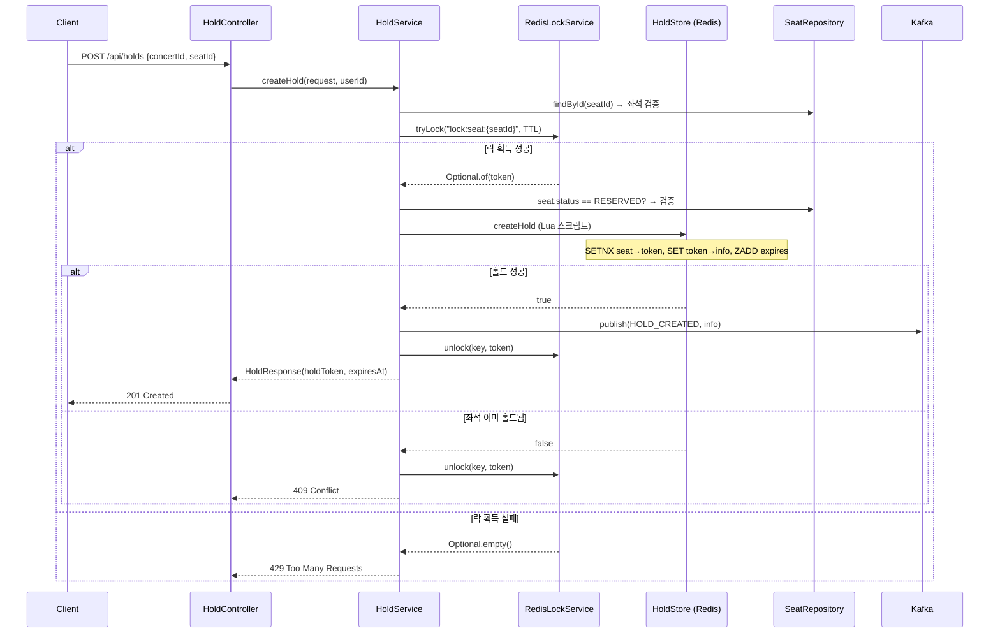
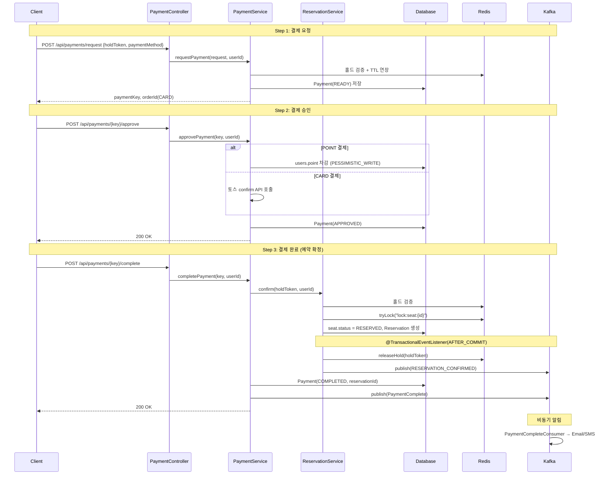
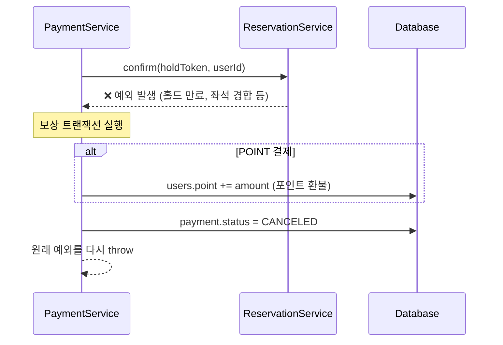
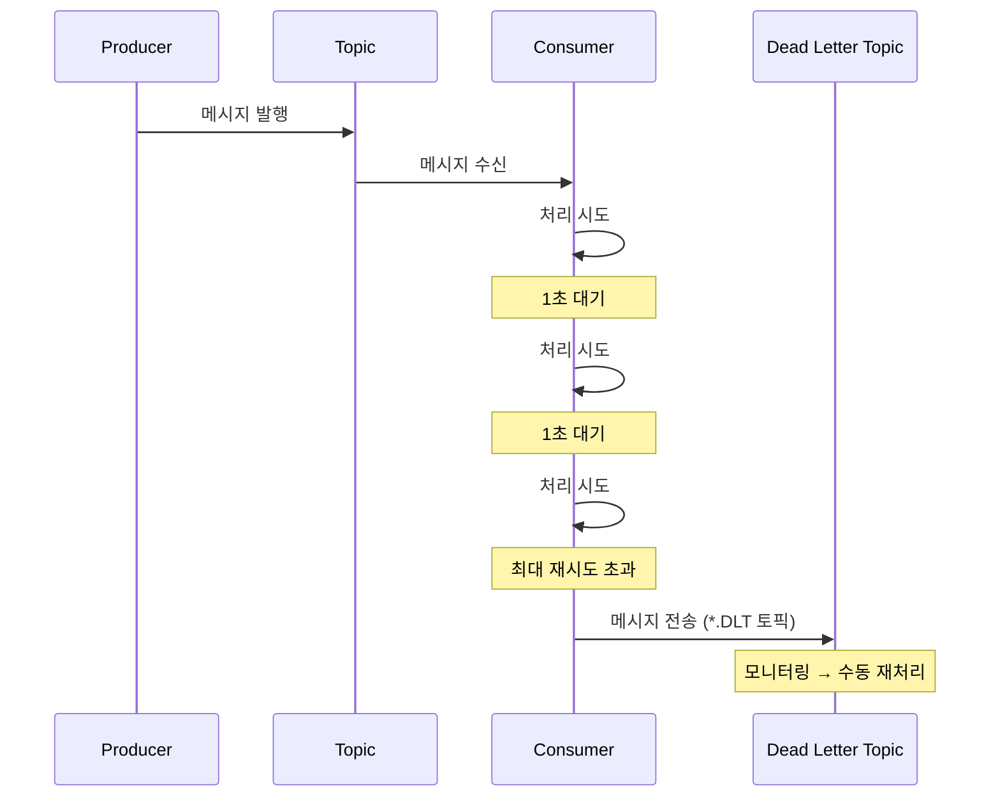

# 핵심 플로우 시퀀스 다이어그램

## 1. 좌석 홀드 (선점) 플로우

```mermaid
sequenceDiagram
    participant C as Client
    participant API as HoldController
    participant HS as HoldService
    participant Lock as RedisLockService
    participant Store as HoldStore (Redis)
    participant DB as SeatRepository
    participant K as Kafka

    C->>API: POST /api/holds {concertId, seatId}
    API->>HS: createHold(request, userId)
    HS->>DB: findById(seatId) → 좌석 검증
    HS->>Lock: tryLock("lock:seat:{seatId}", TTL)
    alt 락 획득 성공
        Lock-->>HS: Optional.of(token)
        HS->>DB: seat.status == RESERVED? → 검증
        HS->>Store: createHold (Lua 스크립트)
        Note over Store: SETNX seat→token, SET token→info, ZADD expires
        alt 홀드 성공
            Store-->>HS: true
            HS->>K: publish(HOLD_CREATED, info)
            HS->>Lock: unlock(key, token)
            HS-->>API: HoldResponse(holdToken, expiresAt)
            API-->>C: 201 Created
        else 좌석 이미 홀드됨
            Store-->>HS: false
            HS->>Lock: unlock(key, token)
            HS-->>API: 409 Conflict
        end
    else 락 획득 실패
        Lock-->>HS: Optional.empty()
        HS-->>API: 429 Too Many Requests
    end
```

## 2. 결제 + 예약 확정 플로우

```mermaid
sequenceDiagram
    participant C as Client
    participant PC as PaymentController
    participant PS as PaymentService
    participant RS as ReservationService
    participant DB as Database
    participant Redis as Redis
    participant K as Kafka

    Note over C,K: Step 1: 결제 요청
    C->>PC: POST /api/payments/request {holdToken, paymentMethod}
    PC->>PS: requestPayment(request, userId)
    PS->>Redis: 홀드 검증 + TTL 연장
    PS->>DB: Payment(READY) 저장
    PS-->>C: paymentKey, orderId(CARD)

    Note over C,K: Step 2: 결제 승인
    C->>PC: POST /api/payments/{key}/approve
    PC->>PS: approvePayment(key, userId)
    alt POINT 결제
        PS->>DB: users.point 차감 (PESSIMISTIC_WRITE)
    else CARD 결제
        PS->>PS: 토스 confirm API 호출
    end
    PS->>DB: Payment(APPROVED)
    PS-->>C: 200 OK

    Note over C,K: Step 3: 결제 완료 (예약 확정)
    C->>PC: POST /api/payments/{key}/complete
    PC->>PS: completePayment(key, userId)
    PS->>RS: confirm(holdToken, userId)
    RS->>Redis: 홀드 검증
    RS->>Redis: tryLock("lock:seat:{id}")
    RS->>DB: seat.status = RESERVED, Reservation 생성
    
    Note over RS,K: @TransactionalEventListener(AFTER_COMMIT)
    RS->>Redis: releaseHold(holdToken)
    RS->>K: publish(RESERVATION_CONFIRMED)
    
    PS->>DB: Payment(COMPLETED, reservationId)
    PS->>K: publish(PaymentComplete)
    PS-->>C: 200 OK

    Note over K: 비동기 알림
    K->>K: PaymentCompleteConsumer → Email/SMS
```

## 3. 보상 트랜잭션 (Saga)

```mermaid
sequenceDiagram
    participant PS as PaymentService
    participant RS as ReservationService
    participant DB as Database

    PS->>RS: confirm(holdToken, userId)
    RS-->>PS: ❌ 예외 발생 (홀드 만료, 좌석 경합 등)
    
    Note over PS: 보상 트랜잭션 실행
    alt POINT 결제
        PS->>DB: users.point += amount (포인트 환불)
    end
    PS->>DB: payment.status = CANCELED
    PS-->>PS: 원래 예외를 다시 throw
```

## 4. Kafka DLQ 흐름

```mermaid
sequenceDiagram
    participant P as Producer
    participant T as Topic
    participant C as Consumer
    participant DLT as Dead Letter Topic

    P->>T: 메시지 발행
    T->>C: 메시지 수신
    C->>C: 처리 시도 #1 실패
    Note over C: 1초 대기
    C->>C: 처리 시도 #2 실패
    Note over C: 1초 대기
    C->>C: 처리 시도 #3 실패
    Note over C: 최대 재시도 초과
    C->>DLT: 메시지 전송 (*.DLT 토픽)
    Note over DLT: 모니터링 → 수동 재처리
```
