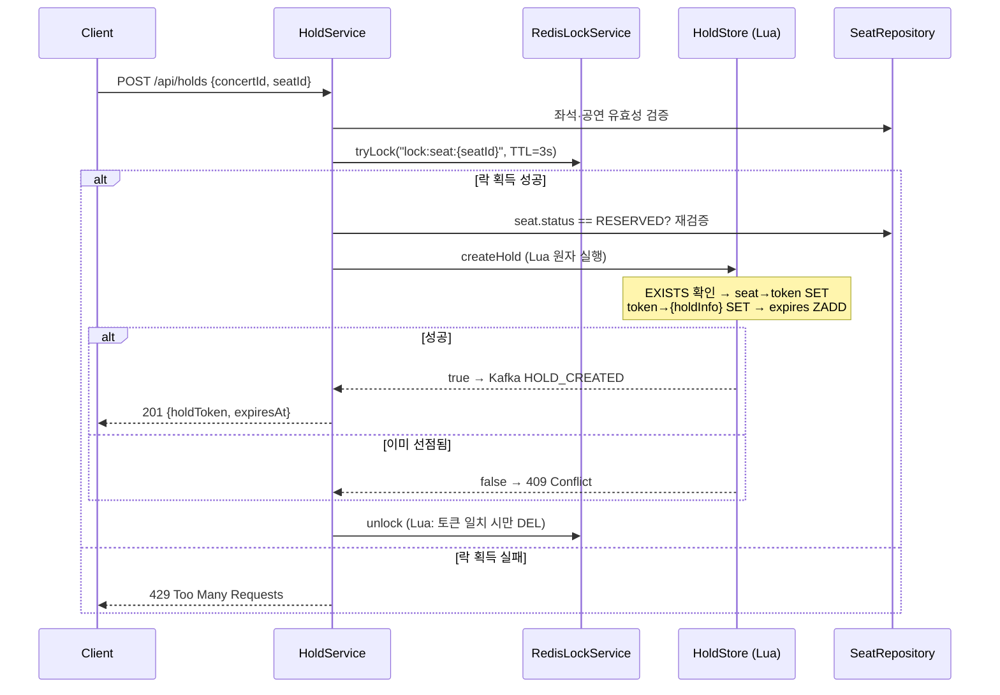
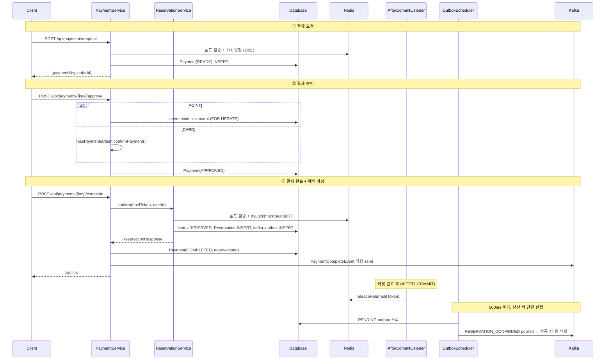
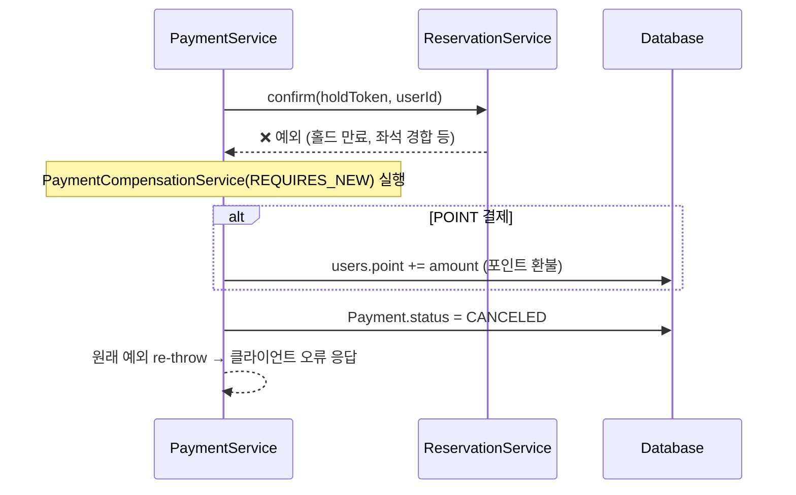

# 핵심 플로우 시퀀스 다이어그램

## 1. 좌석 선점 (Hold)

```mermaid
sequenceDiagram
    participant C as Client
    participant HS as HoldService
    participant Lock as RedisLockService
    participant Store as HoldStore (Lua)
    participant DB as SeatRepository

    C->>HS: POST /api/holds {concertId, seatId}
    HS->>DB: 좌석·공연 유효성 검증
    HS->>Lock: tryLock("lock:seat:{seatId}", TTL=3s)
    alt 락 획득 성공
        HS->>DB: seat.status == RESERVED? 재검증
        HS->>Store: createHold (Lua 원자 실행)
        Note over Store: EXISTS 확인 → seat→token SET<br/>token→{holdInfo} SET → expires ZADD
        alt 성공
            Store-->>HS: true → Kafka HOLD_CREATED
            HS-->>C: 201 {holdToken, expiresAt}
        else 이미 선점됨
            Store-->>HS: false → 409 Conflict
        end
        HS->>Lock: unlock (Lua: 토큰 일치 시만 DEL)
    else 락 획득 실패
        HS-->>C: 429 Too Many Requests
    end
```

## 2. 결제 + 예약 확정

```mermaid
sequenceDiagram
    participant C as Client
    participant PS as PaymentService
    participant RS as ReservationService
    participant DB as Database
    participant Redis as Redis
    participant L as AfterCommitListener
    participant Sched as OutboxScheduler
    participant K as Kafka

    Note over C,K: ① 결제 요청
    C->>PS: POST /api/payments/request
    PS->>Redis: 홀드 검증 + TTL 연장 (20분)
    PS->>DB: Payment(READY) INSERT
    PS-->>C: {paymentKey, orderId}

    Note over C,K: ② 결제 승인
    C->>PS: POST /api/payments/{key}/approve
    alt POINT
        PS->>DB: users.point -= amount (FOR UPDATE)
    else CARD
        PS->>PS: TossPaymentsClient.confirmPayment()
    end
    PS->>DB: Payment(APPROVED)

    Note over C,K: ③ 결제 완료 + 예약 확정
    C->>PS: POST /api/payments/{key}/complete
    PS->>RS: confirm(holdToken, userId)
    RS->>Redis: 홀드 검증 + tryLock("lock:seat:{id}")
    RS->>DB: seat→RESERVED, Reservation INSERT, kafka_outbox INSERT
    RS-->>PS: ReservationResponse
    PS->>DB: Payment(COMPLETED, reservationId)
    PS->>K: PaymentCompleteEvent 직접 send
    PS-->>C: 200 OK

    Note over L: 커밋 완료 후 (AFTER_COMMIT)
    L->>Redis: releaseHold(holdToken)

    Note over Sched,K: 500ms 주기, 분산 락 단일 실행
    Sched->>DB: PENDING outbox 조회
    Sched->>K: RESERVATION_CONFIRMED publish → 성공 시 행 삭제
```

## 3. Saga 보상 트랜잭션 (예약 확정 실패 시)

```mermaid
sequenceDiagram
    participant PS as PaymentService
    participant RS as ReservationService
    participant DB as Database

    PS->>RS: confirm(holdToken, userId)
    RS-->>PS: ❌ 예외 (홀드 만료, 좌석 경합 등)

    Note over PS: PaymentCompensationService(REQUIRES_NEW) 실행
    alt POINT 결제
        PS->>DB: users.point += amount (포인트 환불)
    end
    PS->>DB: Payment.status = CANCELED
    PS-->>PS: 원래 예외 re-throw → 클라이언트 오류 응답
```
