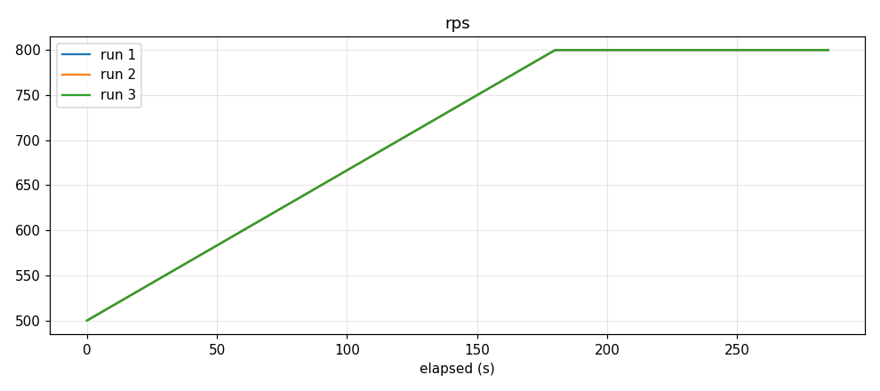
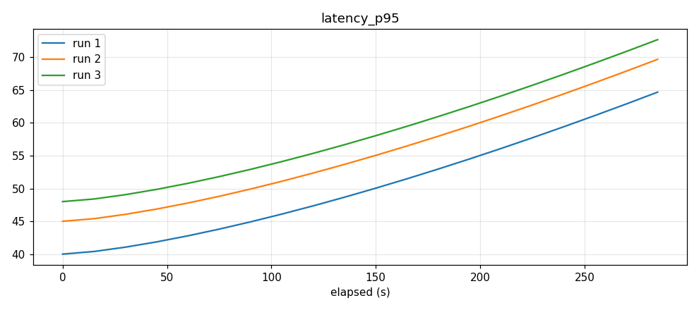
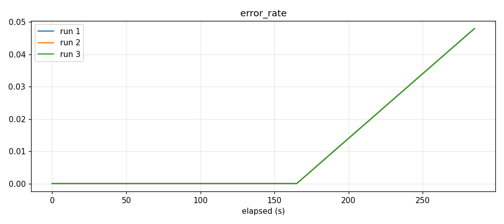
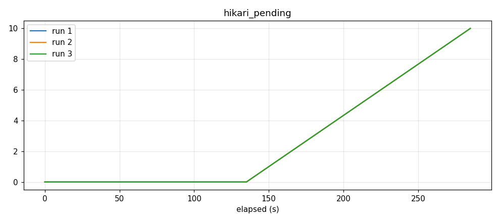

# ⚠️ 합성 예시 리포트 (SAMPLE — 실측 아님)

> 이 파일은 하네스의 출력 **형식**을 보여주기 위한 합성 데이터 결과입니다.
> 실제 측정값이 아닙니다. `samples/generate_sample.py`로 재생성됩니다.

---

# 부하 테스트 리포트 — knee-point

생성: 2026-06-06T13:35:16  |  회차: 3회

> ⚠️ 아래 'AI 보조 분석'은 참고용 진단이며, 판단 근거는 원본 메트릭 표/차트입니다.

## 회차별 요약 (k6 클라이언트 측정)
| 지표 | 1회차 | 2회차 | 3회차 | 평균±표준편차 |
|------|------|------|------|------|
| 평균 RPS | 820.50 | 810.10 | 805.90 | 812.17 ± 6.14 |
| p95 지연(ms) | 95.20 | 102.70 | 110.30 | 102.73 ± 6.16 |
| max 지연(ms) | 410.00 | 520.00 | 600.00 | 510.00 ± 77.89 |
| 실패율(%) | 0.00 | 1.02 | 3.41 | 1.48 ± 1.43 |

## 서버측 메트릭 차트 (회차 겹쳐보기)

### rps

### latency_p95

### error_rate

### hikari_pending

## AI 보조 분석 (Claude)
_(예시) 실제 실행 시 이 자리에 Claude의 knee point/bottleneck 보조 분석이 채워집니다._

## Knee Point 판단
VU 1200 부근에서 RPS 증가가 둔화되고 p95가 급상승 — knee point 후보.

## 병목(Bottleneck) 진단
hikari_pending 동반 상승 → DB 커넥션 풀 포화가 1차 의심 지점.

## 회차 간 일관성
실패율 0.00→1.02→3.41%로 회차마다 증가 — 워밍업/캐시 상태 영향 가능.

## 다음 액션 제안
풀 사이즈 상향 후 동일 시나리오 재측정으로 knee point 이동 여부 확인.

## 부록 — 원본 데이터
- k6 원본 summary JSON: `reports/_raw/` 참조
  - 1회차: `sample1.json` (rc=0)
  - 2회차: `sample2.json` (rc=0)
  - 3회차: `sample3.json` (rc=0)