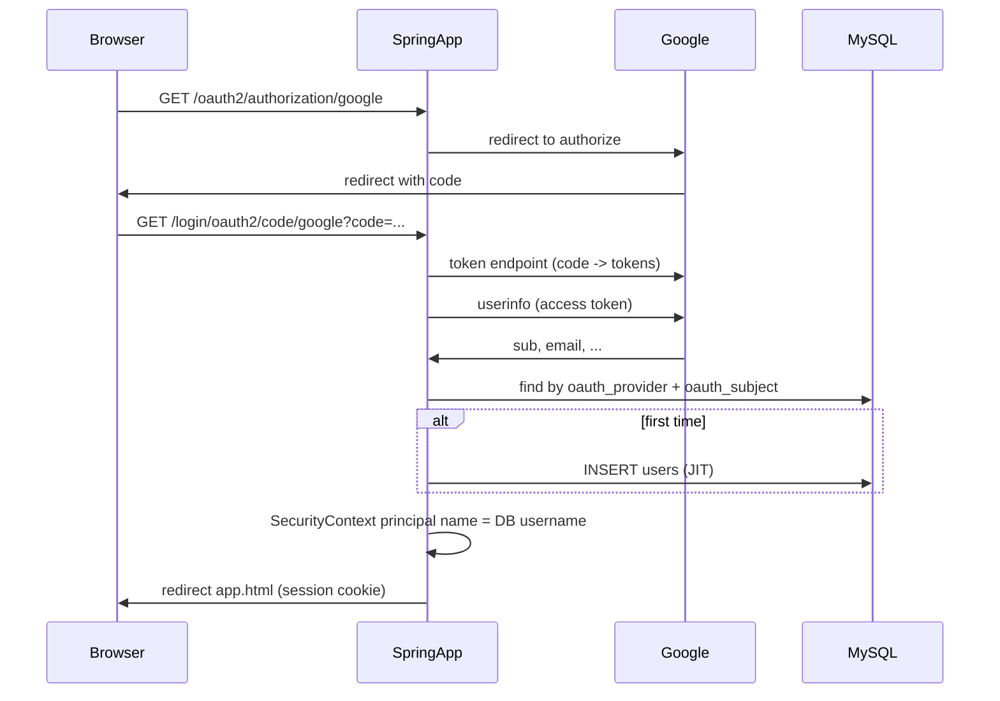

# 07. OAuth2 로그인 (Google) — 원리·흐름·코드

OAuth2를 **처음** 접할 때 읽기 좋게, 이 프로젝트에서 **무엇이 어디서 일어나는지** 정리했다. 면접용 한 페이지 요약은 [docs/architecture.md](../docs/architecture.md#oauth2-google) § 인증을 본다.

---

## 1. OAuth2가 푸는 문제

- 사용자는 **Google 비밀번호를 우리 서버에 저장·전달하지 않는다.**
- “이 사람이 Google이 인정한 동일인이다”라는 사실만 **Google이 서명한 흐름(코드·토큰)** 으로 확인한다.
- 우리 서비스는 그 다음 **자체 `users` 테이블**의 계정과 연결해, 예매·알림처럼 **이미 `username` 문자열**을 쓰는 도메인 로직을 그대로 쓴다.

---

## 2. 용어 짧게

| 용어 | 의미 |
|------|------|
| **IdP (Identity Provider)** | 여기서는 **Google** — 로그인·동의·토큰 발급 주체 |
| **Authorization Code** | 브라우저가 콜백 URL로 넘겨주는 **일회용 코드**. 서버만 이 코드로 토큰을 바꿀 수 있음 |
| **Access Token** | Google API(예: userinfo) 호출에 쓰는 토큰. **브라우저에 장기 보관하지 않는** 서버 사이드 플로에서 주로 서버가 소유 |
| **subject (`sub`)** | IdP가 부여한 **계정 불변 식별자**. 이메일이 바뀌어도 보통 `sub`은 동일 |
| **JIT (Just-In-Time) 가입** | “로그인 시도 시 DB에 없으면 그 자리에서 INSERT” |

---

## 3. 이 프로젝트에서의 플로 (서버 사이드)

Spring Security의 **OAuth2 Login**을 쓰면, 리다이렉트·콜백·토큰 교환·`userinfo` 호출 대부분이 필터 체인 안에서 처리된다. 우리가 추가한 것은 **콜백 이후** “Google이 준 `sub` → 우리 `Users` 행” 매핑과, principal의 **이름을 DB `username`으로 통일**하는 부분이다.

---

## 4. 왜 `DefaultOAuth2User`에 `internal_username`을 넣었나

도메인 전반에서 `Authentication.getName()` 또는 `Principal#getName()`이 **로그인 아이디(username 문자열)** 라고 가정한다. 예: `HoldService`, `ReservationService`의 `userId` 인자.

Google이 주는 기본 name은 보통 **`sub`** 이라서, 그대로 두면 DB의 `username`과 불일치한다.

그래서 [TicketingOAuth2UserService](../src/main/java/com/inyoung/ticketing/auth/oauth/TicketingOAuth2UserService.java)에서:

1. `DefaultOAuth2UserService`로 Google `userinfo` 결과를 받고
2. [UsersService#provisionOAuthUser](../src/main/java/com/inyoung/ticketing/auth/service/UsersService.java)로 **행 조회 또는 JIT 생성**
3. 속성 맵에 `OAuth2UserAttributeNames.INTERNAL_USERNAME` 키로 **우리 DB의 `username`** 을 넣고
4. `DefaultOAuth2User`의 **nameAttributeKey**를 그 키로 지정

이렇게 하면 `OAuth2AuthenticationToken#getName()`이 **항상 내부 `username`** 이 된다.

---

## 5. JIT 가입 시 무엇이 저장되나

[UsersService#createOAuthUser](../src/main/java/com/inyoung/ticketing/auth/service/UsersService.java) 요약:

| 필드 | 값 |
|------|-----|
| `username` | `google`이면 `g` + `sub` (최대 50자, 충돌 시 접미사) |
| `pw` | `UUID`를 BCrypt — **폼 로그인 불가** |
| `email` | Google에서 오면 사용, 없으면 placeholder |
| `phone` | null |
| `oauth_provider` / `oauth_subject` | `google` + `sub` |
| `notiType` | `email` |
| `point` | 일반 가입과 동일 보너스 정책 |

기존 행이 있으면 `findByOauthProviderAndOauthSubject`로만 조회하고 INSERT 하지 않는다.

---

## 6. 보안·운영에서 자주 나오는 질문

**Q. 클라이언트 시크릿이 서버에만 있으면 되나?**  
이 구조(서버 콜백)에서는 시크릿이 **백엔드 설정**에만 두는 것이 맞고, 프론트에 내리지 않는다.

**Q. CSRF는?**  
이 프로젝트는 데모 편의상 CSRF를 끈 설정이 있다. OAuth2 쪽은 Spring이 **state** 등으로 보완하는 영역이 있으나, 운영·공개 서비스에서는 CSRF 정책을 별도로 재검토하는 것이 좋다.

**Q. `users` 행만 삭제하면?**  
다음 Google 로그인 시 `(oauth_provider, oauth_subject)` 매칭이 없어 **다시 JIT** 로 새 행이 생긴다. 예약 등은 `userId`에 **username 문자열**을 쓰는데, `sub`가 같으면 새 행의 `username`도 같은 패턴(`g`+sub)이 될 수 있어 **남아 있는 예약 데이터와 이어져 보일 수 있다**. 연관 데이터 정리 정책은 운영 요구에 맞게 별도 설계가 필요하다.

**Q. 폼 가입 계정과 같은 이메일이면?**  
현재는 **계정 연동(링크)** 을 하지 않는다. 이메일이 겹쳐도 별도 행이 될 수 있다(정책은 단순화).

---

## 7. 코드 위치 빠른 색인

| 역할 | 위치 |
|------|------|
| OAuth2 로그인·성공 핸들러·permit 경로 | [SecurityConfig.java](../src/main/java/com/inyoung/ticketing/config/SecurityConfig.java) |
| userinfo 이후 매핑·`DefaultOAuth2User` 구성 | [TicketingOAuth2UserService.java](../src/main/java/com/inyoung/ticketing/auth/oauth/TicketingOAuth2UserService.java) |
| nameAttributeKey 상수 | [OAuth2UserAttributeNames.java](../src/main/java/com/inyoung/ticketing/auth/oauth/OAuth2UserAttributeNames.java) |
| JIT 생성·username 생성 | [UsersService.java](../src/main/java/com/inyoung/ticketing/auth/service/UsersService.java) |
| 엔티티·유니크 | [Users.java](../src/main/java/com/inyoung/ticketing/auth/domain/Users.java) |
| 로그인 UI | [login.html](../src/main/resources/static/login.html) |
| 설정 키 | `application.properties` 의 `spring.security.oauth2.client.registration.google.*` |

---

## 8. 순환 참조를 피한 이유

`SecurityConfig`가 `PasswordEncoder` 빈을 같이 정의하고, `TicketingOAuth2UserService`가 `UsersService`를 참조하는 과정에서 빈 초기화 순서 이슈가 생길 수 있어, `SecurityConfig`에 `TicketingOAuth2UserService`는 **`@Lazy`** 로 주입한다.
