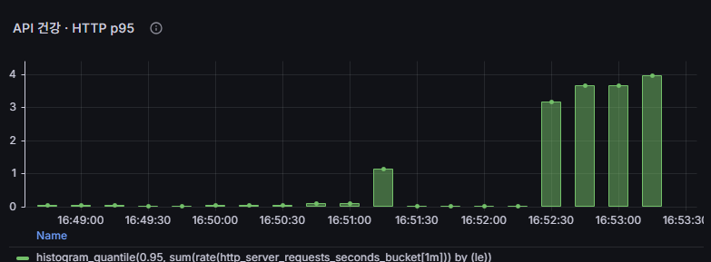
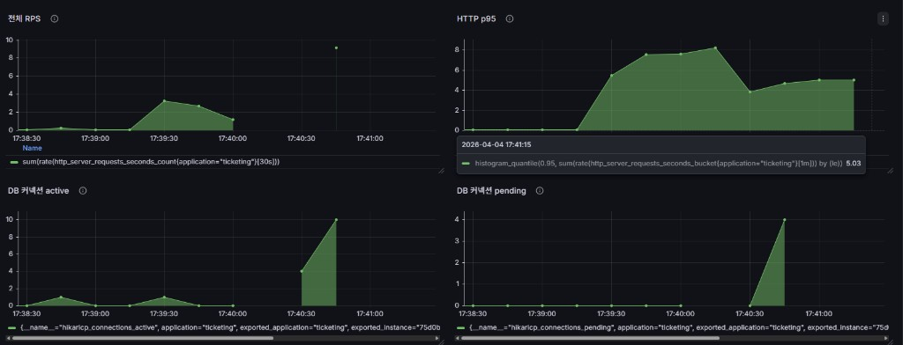
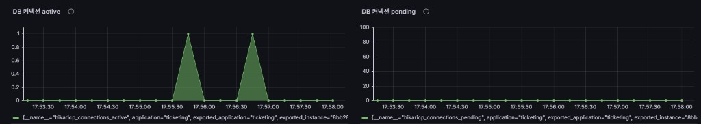
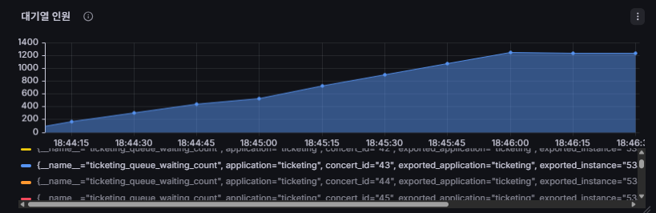

# 부하 테스트 리포트

## 테스트 환경

| 항목 | 스펙 |
|------|------|
| App Server | EC2 t3.small × 1대 (vCPU 2, RAM 2GB) |
| Infra Server | EC2 t3a.medium × 1대 (Redis, Kafka, Prometheus, Grafana) |
| k6 Server | EC2 t3a.small × 1대 |
| Java | 21 (Virtual Thread 적용) |
| DB | MySQL 8.4 (RDS) |
| Redis | 7 |
| 컨테이너 | Docker Compose |

## Grafana 모니터링 패널 구성

| 패널 | PromQL |
|------|--------|
| RPS (초당 요청 수) | `sum(rate(http_server_requests_seconds_count{application="ticketing"}[30s]))` |
| HTTP p95 (응답 시간) | `histogram_quantile(0.95, sum(rate(http_server_requests_seconds_bucket{application="ticketing"}[1m])) by (le))` |
| DB 커넥션 active | `hikaricp_connections_active{application="ticketing"}` |
| DB 커넥션 pending | `hikaricp_connections_pending{application="ticketing"}` |
| JVM 스레드 수 | `jvm_threads_live_threads{application="ticketing"}` |
| 락 실패율 | `rate(ticketing_lock_acquire_failures_total{application="ticketing"}[30s])` |
| 대기열 인원 | `ticketing_queue_waiting_count{application="ticketing"}` |

---

## 1. API Health 테스트 (`api-health.js`)

**목적**: 서버 기본 가용성 확인 (actuator/health + queue/required)

### 1차 결과 — 문제 발견



| 지표 | 값 |
|------|-----|
| VU | 50 |
| p95 | **16초** |
| 에러율 | **41.79%** |
| health 성공률 | 18% |
| queue/required 성공률 | 95% |

### 원인 분석



- `/actuator/health`가 **매 요청마다 DB·Redis·Kafka·Disk를 전부 확인** (`show-details=always`)
- Kafka health indicator가 응답 지연 → 전체 health 응답 **60초 타임아웃**
- VU 50이 동시에 health를 호출하면 **DB 커넥션 풀(10개) 포화**
- DB 커넥션 active가 **10(최대치)** 도달, pending **4개** 대기 발생

### 해결 — 2단계로 진행

**1차 수정**: `show-details=when-authorized`

```properties
management.endpoint.health.show-details=when-authorized
```

| 지표 | 수정 전 | 1차 수정 후 |
|------|---------|------------|
| p95 | 60초 (타임아웃) | **10초** |
| health 성공률 | 18% | **42%** |
| 에러율 | 44% | **28%** |

개선되었지만 여전히 느림. `when-authorized`는 응답에서 상세 정보를 숨길 뿐, **내부적으로 Kafka health indicator는 여전히 실행**된다.

**2차 수정**: Kafka health indicator 비활성화

```properties
management.endpoint.health.show-details=when-authorized
management.health.kafka.enabled=false
```

Kafka 연결 확인이 부하 시 타임아웃을 유발하므로, health check에서 제외하고 Kafka 상태는 별도 모니터링(Grafana)으로 확인한다.

### 교훈

1. 모니터링 엔드포인트도 부하 테스트 대상이다
2. `show-details` 설정은 **응답 포맷만** 제어하고, health indicator 실행 자체를 막지 않는다
3. 무거운 indicator(Kafka)는 `management.health.{name}.enabled=false`로 개별 비활성화해야 한다

---

## 2. DB 읽기 테스트 (`db-read.js`)

**목적**: SELECT 위주 API의 DB 커넥션 풀 병목 확인

### VU 120 결과

| 지표 | 값 |
|------|-----|
| VU | 120 |
| p95 | **67ms** |
| 에러율 | **0%** |
| RPS | **969** |
| DB 커넥션 active 최대 | **1개** |
| DB 커넥션 pending | **0** |



DB 읽기는 커넥션을 잡았다가 즉시 반환하므로 동시 점유가 거의 없다.

### VU 500 결과 — Knee Point 확인

| 지표 | VU 120 | VU 500 | 변화 |
|------|--------|--------|------|
| p95 | 67ms | **455ms** | 7배 상승 |
| RPS | 969 | **1111** | 15%만 증가 |
| 에러율 | 0% | 0% | 동일 |
| max | 406ms | **912ms** | 2배 |

**VU를 4배 올렸는데 RPS는 15%만 증가.** 처리량이 포화 상태에 접근하고 있다. 에러는 발생하지 않지만 응답 시간이 급격히 느려지는 구간 — 이 지점이 DB 읽기의 **Knee Point**이다.

### 결론

DB 읽기(SELECT)는 VU 120까지 병목 없음. VU 500에서 응답 시간 상승 시작. 병목은 쓰기(락 경합) 쪽에서 발생할 것으로 예상.

---

## 3. 좌석 홀드 테스트 (`seats-hold.js`)

**목적**: Redis 분산 락 경합 하에서의 동시 좌석 선점 성능 (좌석 999개)

### VU별 비교

| 지표 | VU 60 | VU 300 | VU 1000 |
|------|-------|--------|---------|
| p95 | **7.5ms** | **21ms** | **1.5초** |
| 에러율 | 0% | 0% | **0.09%** |
| RPS | 60 | 304 | **430** |
| 홀드 성공률 | 100% | 100% | **96%** |
| max | 260ms | 260ms | **31초** |

### Knee Point

**VU 300 → 1000 구간에서 p95가 21ms → 1.5초로 급등.** VU를 3배 올렸지만 RPS는 30%만 증가하여 처리량 포화를 확인.

### 락 실패율

좌석 999개 환경에서 VU 1000까지 락 실패율 ~0. 좌석 수 대비 동시 접속자가 충분히 분산되어 경합이 발생하지 않음. 실제 인기 콘서트(좌석 50~100개, 동시 접속 수천 명)에서는 이 지표가 핵심 모니터링 대상.

### JVM 스레드 수

VU 1000에서도 JVM 스레드 수 **32개 고정** — Virtual Thread가 Platform Thread를 소비하지 않고 I/O 대기를 처리하고 있음을 확인. (Platform Thread 모드였다면 ~200까지 증가했을 것)

---

## 4. 대기열 테스트 (`queue-flow.js`)

**목적**: 대기열 진입·폴링의 Redis ZSET 처리량

### VU별 비교

| 지표 | VU 1000 | VU 3000 |
|------|---------|---------|
| p95 | **1.8초** | **60초 (타임아웃)** |
| 에러율 | 0.84% | **23.8%** |
| 대기열 진입 성공률 | 100% | **19%** |
| RPS | 303 | **110 (오히려 감소)** |
| 에러 유형 | 없음 | **dial: i/o timeout** |

### Knee Point

**VU 1000 ~ 3000 사이.** VU 1000에서 안정적이던 시스템이 VU 3000에서 TCP 연결 한계에 도달하여 붕괴.



대기열 인원이 0 → 1200 → 1550까지 올랐다가, 서버가 TCP 연결을 더 이상 수용하지 못하면서 진입 자체가 실패하기 시작.

### 병목

`dial: i/o timeout` — 앱 서버(t3.small)가 TCP 연결을 더 이상 받지 못하는 상태. Redis나 Kafka가 아닌 **앱 서버 자체의 네트워크/연결 한계**가 병목.

---

## 5. 인프라 한계: t3.small CPU 크레딧 고갈

VU 3000 부하 테스트 후 **앱 서버에 SSH 접속 불가** 현상 발생.

### 원인

t3 인스턴스는 **버스트 기반** CPU 크레딧 모델을 사용한다:
- 기본 성능: CPU 20%
- 평소 20% 이하 사용 시 크레딧이 쌓임
- 필요 시 100%까지 버스트 가능 (크레딧 소비)
- **크레딧 소진 시 CPU가 20%로 제한 → SSH조차 응답 불가**

VU 3000이 동시에 TCP 연결을 맺으면서 CPU가 100%를 지속적으로 찍고, 크레딧이 순식간에 소진됨.

### 교훈

1. **부하 테스트 시 t3 인스턴스의 CPU 크레딧을 모니터링**해야 한다
2. 크레딧 고갈 = 과금이 아님. 시간이 지나면 자연 복구되거나 AWS 콘솔에서 재부팅
3. 지속적 부하 테스트가 필요하면 **t3.unlimited** 활성화 또는 **고정 성능 인스턴스(m5 등)** 검토
4. 이것이 바로 "앱 서버 1대 → 2대 + ALB" 스케일아웃이 필요한 이유

---

## 6. E2E 전체 흐름 (`full-flow.js`)

**목적**: 대기열 → 좌석 → 홀드 → 결제 전체 파이프라인의 Knee Point

(서버 복구 후 테스트 예정)

---

## 종합 Knee Point 요약

| 테스트 | Knee Point (VU) | 병목 |
|--------|----------------|------|
| DB 읽기 | **~500** | 응답 시간 상승 (에러 없음) |
| 좌석 홀드 | **300~1000** | p95 급등, 에러 발생 시작 |
| 대기열 | **1000~3000** | TCP 연결 한계, 서버 다운 |
| E2E | (테스트 예정) | |

**최종 병목**: 앱 서버(t3.small) 자체의 CPU/네트워크 한계. Redis·Kafka·DB는 여유 있으나, 단일 앱 서버가 동시 연결 수천 개를 감당하지 못 함. → **스케일아웃(2대 + ALB)으로 해결 가능.**

---

## Virtual Thread 효과

| 관측 | 내용 |
|------|------|
| JVM 스레드 수 | VU 1000에서도 **32개 고정** (Platform Thread 모드라면 ~200) |
| 의미 | 요청 처리가 OS 스레드를 점유하지 않음 → 스레드 풀이 병목이 아님 |
| 실제 병목 | 스레드 풀이 아닌 **TCP 연결 / CPU 크레딧**으로 이동 |

Virtual Thread 적용으로 Tomcat 스레드 풀 200개 한계를 제거했으며, 병목이 "스레드 고갈"에서 "인프라 자원 한계"로 이동한 것을 확인.

(Virtual Thread OFF 비교 테스트는 서버 복구 후 진행 예정)
