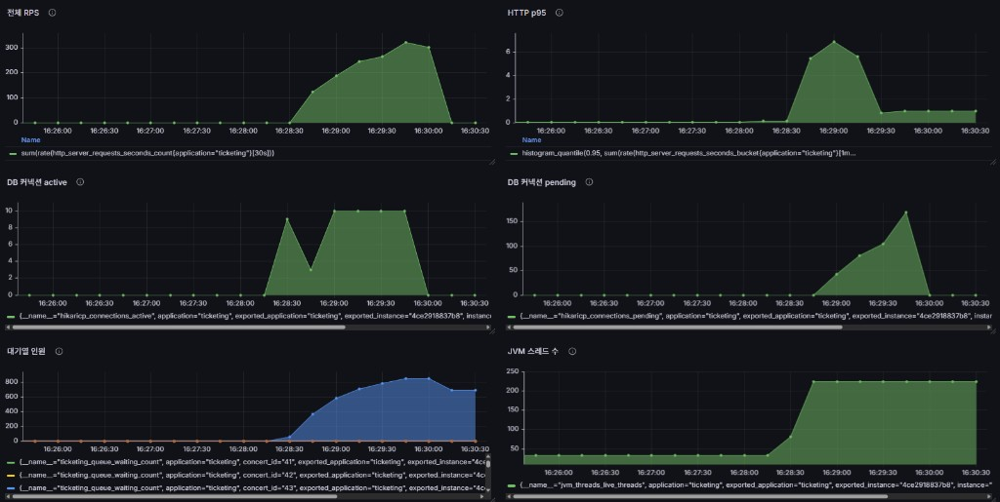

# 부하 테스트 리포트 (요약)

> 방법론: **`docs/load-test-portfolio.md`**

## 환경

| 항목 | 값 |
|------|-----|
| 일시 | 2026-04-12 (Grafana 구간 약 16:26~16:30) |
| 대상 | `BASE_URL` 앱, `CONCERT_ID=43` |
| Hikari | **max pool 10** |
| k6 | `queue-flow.js`, 피크 **800** VU, `K6_QUEUE_POLL_SLEEP_SEC=0.005`, `K6_PROFILE=stress` |

## 핵심 결론 (3줄)

1. **Hikari active=10(풀 상한) 고정** 구간에 **pending 150+**가 겹치며, **HTTP P95가 ~7 s까지 급등**하는 패턴이 관측됐다.
2. k6 기준 **HTTP 실패 0%**, **p(95)=3.06 s**, 처리량 **피크 RPS ~320**(Grafana) / 요청 합성 **~241/s**(k6).
3. **병목은 DB 커넥션 풀 포화**로 귀속 가능 → **pool 30** 등으로 동일 부하 재현해 효과를 수치화하는 것이 다음 단계다.

## `queue-flow.js` (pool 10)

| K6_PEAK_VU | k6 p95 | 에러% | 비고 |
|------------|--------|-------|------|
| 800 | 3.06 s | 0 | iter 74 완료 / 776 interrupted; checks 100% |

## Grafana 6패널

## Knee · 병목

| 시나리오 | Knee (VU·RPS) | 병목 층 |
|----------|---------------|---------|
| queue-flow (pool 10) | 피크 **800** VU, RPS **~320/s** | **HikariCP** (active 10, pending 폭증) |
| db-read | (미실행) | — |
